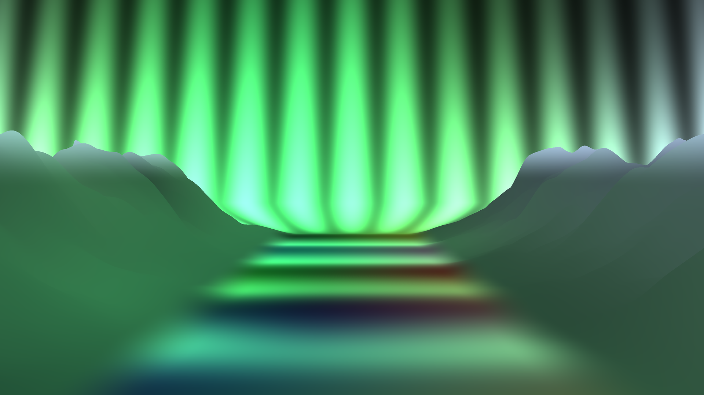

# Kaleidoscope Enhanced — Music Visualizer

[](LICENSE)


<br clear="left">

A real-time, audio-reactive kaleidoscope / tunnel visualizer for Windows. It
listens to whatever is playing on the system (Spotify, browser, foobar2000,
a live mic, …), analyses it in real time, and drives a huge library of GLSL
shaders whose motion, colour and structure follow the music's rhythm, timbre
and mood — beat-driven Rock/Pop/EDM and beatless ambient/drone alike, calming
down automatically for speech.

**[⬇ Download the latest release](https://github.com/reneweller-coding/KaleidoscopeEnhanced/releases/latest)**
— no Qt / Visual Studio needed, just run the installer or unzip the portable
build. See [Quick start](#quick-start).

|  |  |
|---|---|
|  |  |
|  |  |

*Four of the 593 scenes in the [scene catalogue](docs/Catalog/Katalog.md) —
a classic kaleidoscope fold, a compute-driven prism-shatter, a volumetric
feather storm with real 3D geometry and shadows, and a hardware-tessellated
arctic fjord under the northern lights.*

**Highlights**
- 593 scenes + 29 overlay effects + 83 scene transitions, all audio-reactive
  and image-driven — see the [scene catalogue](docs/Catalog/Katalog.md).
- Real signal analysis (beat/onset detection, key & mood, song-structure
  tracking) drives the visuals, not a generic FFT bar graph — see
  [how it listens to the music](docs/engine-internals.md).
- Synced lyrics, artist photos, and the official music video (auto-fetched
  from YouTube) can all play alongside the visuals — see
  [Optional online features](#optional-online-features).
- Control it from a phone: a built-in web remote with zero-config LAN
  pairing, plus a dedicated Android app — see [Remote control](#remote-control).
- A small Setup tool switches every optional extra on or off; the UI itself
  speaks German or English — see [Setup tool](#setup-tool) and
  [Language](#language).
- Stereo-3D output, MIDI control, Spout output for OBS/VJ software, and an
  unattended kiosk mode with a crash watchdog.

---

## Contents

- [Quick start](#quick-start)
- [Photo pack](#photo-pack)
- [3D model pack](#3d-model-pack)
- [Controls](#controls)
- [Configurations and presets](#configurations-and-presets)
  - [Reviewing the shader library](#reviewing-the-shader-library)
- [Recording](#recording)
- [Setup tool](#setup-tool)
- [Remote control](#remote-control)
- [Optional online features](#optional-online-features)
- [Language](#language)
- [Build](#build)
- [Deployment](#deployment)
- [Project layout](#project-layout)
- [Credits and license](#credits-and-license)
- [Further reading](#further-reading)

---

## Quick start

[Download the latest release](https://github.com/reneweller-coding/KaleidoscopeEnhanced/releases/latest):
- **`KaleidoscopeVisualizer-Setup.exe`** — regular installer, Start-menu
  shortcuts for the visualizer, the Preset editor and the Setup tool.
- **`KaleidoscopeVisualizer-portable.zip`** — unzip anywhere, double-click
  `Kaleidoscope-starten.bat`. No installation, nothing written outside the
  folder.

Either way, add pictures: the scenes that fold, mirror and fly through
photographs read them from the program's `Images` folder. Drop the
[photo pack](#photo-pack) in there, or point the visualizer at your own
folder under **Photo folder** in the Setup tool (`Setup-starten.bat` /
Start-menu **Setup** — see [Setup tool](#setup-tool)). With no pictures at
all a procedural fallback texture stands in, so a first launch never fails.
Press **`h`** any time for the full keyboard reference in-app.

---

## Photo pack

Kaleidoscopes need something to fold. A set of **1000 licence-free
1024×1024 textures** is published alongside the program — agate, rust,
pigment, soap film, sediment, aurora, craquelure, woven fibre — generated for
this purpose, so there are no rights questions and no faces or subjects to be
mangled by a mirror.

They are published as their own release,
[Photo Pack v1](https://github.com/reneweller-coding/KaleidoscopeEnhanced/releases/tag/images-v1):

| | |
|---|---|
| `KaleidoscopeImages.zip` | 1000 images, 734 MB |

Square and edge-to-edge is the point: the engine fills a 1024×1024 texture
without preserving aspect ratio, so a picture with a subject in the middle and
dead space around it loses the subject and folds the dead space. These have
detail everywhere and no border to betray the seam.

What makes a picture suit this program — format, tone, contrast, composition —
is written down in **[docs/photo-set-spec.md](docs/photo-set-spec.md)**, with a
checker that scores a folder against it (`Tools/check_image_set.py`). Useful
for pointing the visualizer at your own library, and required reading before
generating a new one.

**Install:** the installer offers it as a ticked option and puts it in place
for you; the same goes for the model packs. To do it by hand, unpack the
`.jpg` files into the program's `Images` folder and restart — or use
**Download extra content** in the Setup tool, which is also how the portable
build gets them. Nothing breaks without them: the photo scenes fall back to a
procedurally generated texture, and the startup log says which folder it
looked in.

**Your own pictures instead:** open the Setup tool and set **Photo folder**.
That writes `imageDirectory` into `kaleidoscope_settings.ini`, which outranks
the presets — the right place for it, since `Configurations\*.xml` are
regenerated by `Tools/make_genre_configs.py` and would lose the change.
Subfolders are searched too, and `.jpg`, `.jpeg` and `.png` are recognised.
For one run only, `Kaleidoscope.exe -f <folder>` beats both.

---

## 3D model pack

Some scenes place a **real 3D model** in the shot — a station turning against
a nebula, a capital ship making a slow pass, a shuttle coming alongside a
drydock, a jellyfish in a lit water column. Those models are **optional extra
content** and are **not** part of the installer, the portable zip or the git
repository: together they come to roughly two gigabytes, many times the size
of the program itself, and most of that is of no use to someone who only wants
the classic visualizer.

They are published as their own release, [3D Model Pack v2](https://github.com/reneweller-coding/KaleidoscopeEnhanced/releases/tag/models-v2),
split by theme so you can take only what you want:

| Pack | Size | Contains |
|---|---|---|
| `KaleidoscopeModels-ships.zip` | 79 models, 715 MB | capital ships, freighters, couriers, drones — fly-bys, docking approaches, atmospheric entries, formations, holograms |
| `KaleidoscopeModels-stations.zip` | 30 models, 259 MB | space stations — the six station families |
| `KaleidoscopeModels-objects.zip` | 48 models, 384 MB | everything else: museum sculptures, hi-fi gear, sea creatures, eroded rock, gongs and bells, polished forms, pierced lattices |

The installer offers the three packs as ticked options and unpacks them for
you; **Download extra content** in the Setup tool does the same afterwards, or
for the portable build. By hand, unpack the `.glb` files straight into the
program's `Models` folder and restart. **Nothing breaks without them**: every scene that needs a model it
cannot find is skipped when the catalogue is read, and the startup log says
how many. You simply get a smaller rotation.

The scenes that use them are spread through the normal presets by mood, the
way every other scene is. There is also a **`Modelle`** preset that is nothing
but these scenes, back to back, for when you want the models themselves rather
than a mixed rotation. It appears in the preset list once the pack is
installed, and is left out of it entirely when it is not.

Many of the models were generated FOR the scene family that uses them, which is
why the fit is close: the resonant bodies are thin-walled because
`ModalVibration` displaces along a plate's thickness, and the pierced lattices
exist because a shadow play wants a complicated shadow.

Building the packs yourself, from a `Models` folder you have filled:

```powershell
.\Tools\make_model_pack.ps1
```

---

## Controls

| Key        | Action                                                        |
|------------|-----------------------------------------------------------------|
| `Esc`, `Q` | Quit                                                          |
| `h`        | Toggle the on-screen **help** (keyboard reference)            |
| `0`        | Open/close the preset menu (see below)                        |
| `↑` `↓`    | Move the cursor in whichever overlay menu is open             |
| `Enter`    | Take the highlighted entry (cross-fades)                      |
| type       | Narrow an open menu to matching entries                       |
| wheel      | Scroll an open menu; click picks, click outside closes        |
| `i`        | Toggle the live audio-feature overlay (incl. **FPS**)         |
| `d`        | Choose the **audio source** (output / microphone) — overlay   |
| `↑` `↓`    | Also drive the audio-source cursor while that overlay is open |
| `p`        | Toggle the **now-playing** track title display                |
| `w`        | **Lyrics** (Internet): off / credits scroll / karaoke — on by default |
| `Shift+w`  | Toggle the karaoke **kinetic line-slam** pop-in (off by default) |
| `o`        | **Artist images** (Internet): rotating inset + colour grade — on by default |
| `n`        | Manually advance to the next effect (musical scene change)    |
| `v`        | Show the active shader names (debug overlay)                  |
| `l`        | Toggle the **stage lamps / light show** (corner cones etc.)   |
| `[` / `]`  | Reactivity — less / more audio-driven motion                  |
| `,` / `.`  | Trails — shorter / longer feedback trails                     |
| `-` / `=`  | Mood — weaker / stronger colour grading                       |
| `;` / `'`  | Latency — visuals earlier / later vs. the heard beat          |
| `b`        | **Blackout** — soft fade to black and back (VJ)               |
| `e`        | **Freeze** — hold the picture (VJ)                             |
| `t`        | **Tap tempo** — tap the beat to override tempo detection      |
| `u`        | **Pin** — hold the current effect (no automatic switches)     |
| `f`        | **Favourite** the current effect (persistent selection bonus) |
| `Space`    | **Mark** / unmark the current scene (shortlist for review)     |
| `Shift+Space` | Save all marked scenes as the **Marked** preset             |
| `z`        | **Stereo 3D** — cycle off / side-by-side / top-bottom / anaglyph |
| `c` / `m`  | Stereo depth — weaker / stronger                              |
| `a`        | Toggle **auto-config-by-mood** (auto-switch configs)          |
| `g`        | Toggle **adaptive render scale** (auto-FPS)                   |
| `j`        | **MIDI learn** — bind knobs/pads to the controls              |
| `r`        | Toggle **recording** (full render resolution → mp4)           |
| `y` / `x`  | Arm the **instant replay** ring / save it as an mp4           |
| `k`        | Save the current look **and** UI state as the startup default |
| `s`        | Save a PNG screenshot of the window                           |
| mouse drag | (when not fullscreen) trackball / interaction                 |

**Both overlay menus** — the preset picker (`0`) and the audio-source picker
(`d`) — scroll, so they reach entries the digit keys cannot. Anything past
the ninth used to be unselectable, and in the audio menu it was not even
drawn: the hidden-preset debug switch and a saved `Marked` preset both push
the preset list past nine, and a machine with a few virtual audio cables has
well over nine sources. Each opens on the entry that is currently in use, `↑`/`↓` (plus `PgUp`/`PgDn`/`Home`/`End`) move the cursor,
`Enter` selects, and `Esc` (or `0` / `d`) closes without changing anything.
The highlight bar is where `Enter` would take you; the marker shows what is
actually in use.

Typing narrows a menu to entries containing what you typed — useful once the
device list runs past twenty. `Backspace` takes a character back, `Esc` clears
the filter first and closes on the second press. The mouse works too: the wheel
scrolls, a click takes an entry, a click outside closes.

`1`–`9` used to jump straight to a preset and are now unbound: the menu reaches
every entry, so nine keys no longer have to be spent on a shortcut that only
covered part of the list.

**Double-click** toggles fullscreen. It used to quit the app outright, which
made a slip of the hand end the show; quitting is `Esc` or `q`.

Press **`k`** to persist the tuning keys (plus render scale) to
`kaleidoscope_settings.ini`, so they're restored next launch. The `i`
overlay shows the current FPS — handy for tuning render scale on a target
machine.

---

## Mood detection, and OSC output for VJ tools

The analyzer estimates the music's mood on Russell's two axes — valence
(positive/negative) and arousal (calm/energetic) — and uses it everywhere:
scene selection is biased toward matching mood tags, pacing follows arousal,
and a global colour grade follows the empirically grounded mapping canon
(happy = warm and vivid, sad = bluish and muted, dissonant = harder edges).
Every ingredient was measured against an 80-track corpus rather than guessed.

Other software can consume the analysis live: set `oscPort` in the settings
(or the Setup tool) and the visualizer streams OSC/UDP — `/mood/valence`,
`/mood/arousal`, `/mood/quadrant`, `/beat`, `/audio/bands`, `/tempo/bpm` and
more — to TouchDesigner, Resolume, Max/MSP or anything else that speaks OSC.

The full story, with the literature and the measurements, is in
[docs/mood-and-mapping.md](docs/mood-and-mapping.md).

## Configurations and presets

### Reviewing the shader library

Two pieces that work together when you want to look *at* the shaders rather
than enjoy them:

* **`TestPlain`** — a generated preset containing every scene, 5 s each, in
  **alphabetical order**, with `FxPlain` as the only overlay so nothing paints
  over the picture. Regenerate it after adding shaders:

  ```bash
  python Tools/make_test_preset.py
  ```

  The alphabetical walk comes from the preset's `Test` name prefix, which
  switches the engine into review mode — keep the prefix or it silently goes
  back to random selection.

* **Marking** — press `Space` while a scene is up to shortlist it, and
  `Shift+Space` to write every marked scene to `Configurations\Marked.xml` as
  a playable preset. Both are on the [remote](#remote-control) too, so you can
  mark from a phone while the show runs on a TV. Marks live in
  `kaleidoscope_settings.ini` and survive restarts, so an inspection pass can
  span several sessions. The `v` overlay shows whether the current scene is
  marked.

So: run `TestPlain`, tap `Space` on anything that looks wrong, then
`Shift+Space` and switch to `Marked` to work through the shortlist.

`Configurations\*.xml` define which shaders are in rotation, their
probabilities, mood tags, and the photo folder (`ImageDirectory`, shipping as
`..\Images`) they draw on. These files are GENERATED, so change the folder in
the Setup tool rather than in here — see [Photo pack](#photo-pack). Switch between them with the number keys. Included presets:

- **Allround** — the full modern arsenal, balanced; a safe default
- **Club** — aggressive & bright: tunnels, godrays, lattices, analyzers
- **Ambient** — calm drift: fluid ink, lava, drones, liquid light shows
- **SpaceAmbient** — sci-fi & deep space: starships, planets, space
  stations, nebulae, black holes, alien worlds
- **Galerie** — the *photos* star: kaleidoscopes, image tunnels, gentle folds
- **Psychedelic** — breathing fractals, pills, chrome, plasma, mushrooms
- **Noir** — dark, high-contrast: noir fractals, dark tunnels, deep drones
- **Komplett** — every scene and overlay in one rotation, mainly used as the
  master reference the other presets and the editor start from

Every scene re-rolls its own parameters each time it's picked, so one
shader yields many different looks over a session rather than repeating
itself identically.

**[Browse the full scene catalogue](docs/Catalog/Katalog.md)** — all 593
scenes, 29 overlay effects and 83 transitions, each with a description and
three example frames. A printable `Katalog.pdf` ships with every release.

**Building your own presets:** `PresetEditor.exe` (its own small Qt app,
bundled with every release) edits `Configurations\*.xml` with a live shader
preview — browse every scene, add it to a preset with its timing/probability,
tune per-parameter ranges against a real preview, and save. It also carries
the project's self-tests (`--validate`, `--roundtrip`, `--transcheck`,
`--render`) used to catch broken presets and transitions before they ship.
Build it with `msbuild PresetEditor\PresetEditor.vcxproj /p:Configuration=Release /p:Platform=x64`.

A handful of shaders (`ChromeDreams`, `DiscoGodrays`, `FlowingWires`,
`FractalBloom`, `InsideSystem`, `NeonTubes`, `PsychedelicPills`, `SphereGrid`,
`TheCore`, `Vortex`, `Voyager`) are adapted from community shaders by
[kishimisu](https://www.shadertoy.com/user/kishimisu) on Shadertoy, CC
BY-NC-SA 4.0 — see [Credits and license](#credits-and-license).

---

## Recording

Recording captures at the **full render resolution** (not a fixed 720p) and
encodes once, in hardware where available: raw frames are piped straight into
a running `ffmpeg`, and on stop the video is copied into the container beside
the audio rather than re-encoded. `ffmpeg` must be on the `PATH`; without it
the recorder falls back to writing JPEG frames plus a `make_video.bat` you can
run by hand.

The encoder is probed at runtime, preferring the discrete GPU's block, then
Intel Quick Sync, then software. The output codec defaults to **H.264** —
the one every player and editor opens — and can be changed in the Setup tool
or via the `videoCodec` key in `kaleidoscope_settings.ini`:

| `videoCodec` | Notes |
|---|---|
| `h264` (default) | Plays everywhere |
| `hevc` | Roughly 2.5–3× smaller at the same quality; needs the HEVC extension on Windows |
| `av1` | Smallest in principle, but on NVIDIA hardware HEVC beat it on both size and quality in our measurements |

If the requested codec has no working encoder on the machine, it says so and
falls back to H.264 rather than failing the recording. `KALEIDO_VIDEO_CODEC`
overrides the setting for one run, `KALEIDO_VIDEO_ENCODER` forces one specific
encoder (still verified before use).

---

## Setup tool

`KaleidoscopeSetup.exe` (Start-menu shortcut **Setup**, or
`Setup-starten.bat` in the portable build) is a small standalone editor for
`kaleidoscope_settings.ini` — the optional extras have grown numerous enough
(lyrics, artist images, music video, language, web-remote port, render
tuning, …) to deserve a proper on/off panel instead of hunting through
keyboard shortcuts. Changes are saved to the same settings file the main app
reads on startup and take effect the next time it launches, except the
language dropdown, which retranslates the Setup tool's own form immediately
so you can see the result before saving.

**Download extra content** lives here: tick the photo pack and whichever model
packs you want, and it fetches them from the release page and unpacks them
into `Images\` and `Models\`. Packs already on disk show as installed and are
unticked, so a second visit does not propose re-downloading two gigabytes.
This is the portable build's route to them, since it has no installer.

**Photo folder** lives here too, and this is the only sensible home for it:
the presets carry a default (`..\Images`) but they are regenerated from the
catalogue, so a path typed into them would not survive. Leave the field empty
for the bundled images.

Build it with `msbuild SetupTool\SetupTool.vcxproj /p:Configuration=Release /p:Platform=x64`
(no GL/audio dependency — a plain Qt Widgets app).

---

## Remote control

A phone-friendly **web remote** (`-t <port>`, on by default at
`http://<pc>:8080/`) gives you a live preview image, preset buttons,
next-effect, blackout, favourite, mark/save-marked, replay, a scene browser you can tap
straight into, and sliders for reactivity/trails/mood/latency — plus all the
toggles from the Setup tool (lyrics mode, artist images, music video,
auto-preset, auto-scale, …). LAN convenience only — no auth, don't expose it
to the internet.

**Zero-touch pairing:** the running instance broadcasts itself on the LAN
(UDP discovery), so a client never needs the PC's IP typed in by hand.
Several PCs or several instances on one PC show up as a picker.

**Android app** (`AndroidRemote\`, [build instructions](AndroidRemote/build-apk.ps1))
wraps the same remote in a fullscreen WebView with its own icon and
auto-discovery — no typing an address, and it never needs updating when the
remote grows new controls, since all the logic lives on the PC. Requires
Android 8.0+; allow `Kaleidoscope.exe` through the Windows firewall
(private networks) the first time so the phone can reach it.

---

## Optional online features

All on by default, all individually switchable from the [Setup tool](#setup-tool)
or the web remote, all cached locally so a repeat play needs no network:

- **Now playing (`p`):** the track title/artist is woven through the picture
  with one of 24 reveal styles, matched to the music's mood. Reads the
  Windows system media session (Spotify, browsers, most modern players);
  foobar2000 needs its free *Media Controls* component; VLC is read from its
  window title as a fallback.
- **Lyrics (`w`):** synced lyrics fetched from a fallback chain of free
  services (no API key), shown as a scrolling credits band or karaoke-style
  with the active line highlighted.
- **Artist images (`o`):** photos of the current artist, fetched and
  deduplicated from a few free services, rotating as a small inset with a
  colour grade pulled from the image.
- **Music video:** for tracks under 20 minutes, the official video is
  searched on YouTube (matched by duration and channel, official-video
  scoring) and, if found, downloaded once via [`yt-dlp`](https://github.com/yt-dlp/yt-dlp)
  and played in sync in the same corner artist images use. Needs `yt-dlp` on
  `PATH`; the app runs normally without it, it just skips this one feature.

---

## Language

The UI (on-screen overlays, the web remote page, and the Setup tool) speaks
German or English, switchable from a dropdown in the Setup tool — German is
the default. The Android app isn't part of that switch; it follows the
phone's own system language, the standard Android behaviour.

---

## Build

**Requirements**
- **Qt 6.11** (kit `msvc2022_64`), installed at `C:\Qt\6.11.1\msvc2022_64`
- **Visual Studio 2026** (or 2022) — platform toolset **v145**, target **x64**

**Visual Studio:** open `Kaleidoscope.sln`, select **Release | x64**, build.
`QTDIR` defaults to `C:\Qt\6.11.1\msvc2022_64` (set in the project); override
it if your Qt is elsewhere.

**Command line**
```powershell
$env:QTDIR = "C:\Qt\6.11.1\msvc2022_64"
cmd /c '"C:\Program Files\Microsoft Visual Studio\18\Community\VC\Auxiliary\Build\vcvars64.bat" && msbuild Kaleidoscope.vcxproj /p:Configuration=Release /p:Platform=x64'
```

**Qt Creator** — `Kaleidoscope.pro` mirrors the VS project, so the code can
also be browsed and built from Qt Creator with a Qt 6 / MSVC kit; the VS
project remains the primary build (it also runs the auto-deploy).

**Run** — the exe needs the Qt 6 DLLs on `PATH` (or run `windeployqt`):
```powershell
$env:Path = "C:\Qt\6.11.1\msvc2022_64\bin;" + $env:Path
.\Release\Kaleidoscope.exe                    # windowed 1920×1080
.\Release\Kaleidoscope.exe -b                 # fullscreen (2nd monitor if present)
.\Release\Kaleidoscope.exe -c darkambient -s 0.5   # named config, half render scale
```

**Command-line options**

| Option        | Meaning                                                            |
|---------------|---------------------------------------------------------------------|
| `-b`          | Start fullscreen (2nd monitor if present)                         |
| `-s <factor>` | Internal render scale 0.25–2.0 — lower for weak GPUs, adapts automatically at runtime (key `g`) |
| `-c <name>`   | Start with the named configuration (e.g. `darkambient`, `normal`) |
| `-m <index>`  | Fullscreen on monitor `<index>` (0-based; implies `-b`)            |
| `-l`          | Log to `kaleidoscope.log` instead of the console (kiosk)          |
| `-r`          | Start recording immediately on launch                             |
| `-w <wav>`    | Offline: analyze this WAV instead of capturing live audio (test)  |
| `-o`          | Spout output: publish the frame as sender "Kaleidoscope"           |
| `-t <port>`   | Web remote port (default 8080; `-t 0` disables it)                 |
| `-x <wav>`    | Batch render: record this WAV to an mp4, then exit                |
| `-i <sender>` | Spout input: a live sender replaces the photos                     |
| `-v <path>`   | Play a video (or folder of videos) as the image source              |
| `-3 <mode>`   | Stereo 3D: `sbs`, `tb` or `ana`(glyph)                              |
| `-f <dir>`    | Photo folder for this run (outranks the Setup tool's setting)      |
| `-h`          | Print usage and exit                                                |

For an unattended installation/kiosk, combine `-m`, `-c`, `-s` and `-l`; the
app suppresses the screensaver/standby while it runs, and the packaged
fullscreen launcher restarts it automatically after a crash (5 s delay, gives
up after 5 rapid crashes in a row). If the default output device changes
(headphones unplugged, outputs switched), audio capture reconnects on its
own — no manual restart needed. A missing image folder or `Configurations`
folder degrades gracefully (fallback texture / clear error) instead of
crashing.

> Shaders and `Configurations\*.xml` load from the exe's parent folder, so
> run it from `Debug\` / `Release\`.

---

## Deployment

`deploy.ps1` builds a fully self-contained package that runs on any 64-bit
Windows PC without Qt or Visual Studio installed:

```powershell
powershell -ExecutionPolicy Bypass -File .\deploy.ps1 -Build
```

This produces `dist\KaleidoscopeVisualizer\` (verified to run with Qt
removed from `PATH`) and `dist\KaleidoscopeVisualizer-portable.zip`. If
[Inno Setup](https://jrsoftware.org/isdl.php) is installed, it also compiles
`installer.iss` into `dist\KaleidoscopeVisualizer-Setup.exe`; otherwise build
that later with `ISCC.exe installer.iss`. Both the Preset editor and the
Setup tool are bundled automatically when their own Release builds exist.

---

## Project layout

Top-level folders:

- **`Source\`** — the C++ core: audio capture/analysis (`AudioAnalyzer`),
  now-playing/lyrics/artist-image/video fetching (`NowPlaying`,
  `TrackMedia`, `VideoPiP`), MIDI, the render pipeline (`RenderPipeline`,
  `EffectShader`), config loading, the web remote (`WebRemote`), Spout I/O,
  and the shared UI-string table (`Strings`).
- **`Scene2D\`** / **`Scene3D\`** — 352 + 241 scene shaders (fragment-only
  effects vs. real vertex/geometry/tessellation-shader 3D scenes).
- **`FX\`** — 29 full-time overlay passes (incl. `FxPlain`, the neutral
  pass-through most of the time uses).
- **`Transitions\`** — 83 shaders that blend outgoing → incoming scene on a
  scene change.
- **`Engine\`** — internal pipeline passes (mood grade, feedback trails,
  bloom, the GPU fluid/reaction-diffusion/smoke simulations, compute kernels).
- **`PresetEditor\`** and **`SetupTool\`** — the two standalone companion
  tools (see [above](#configurations-and-presets), [above](#setup-tool)).
- **`AndroidRemote\`** — the Android remote app (no Gradle; plain SDK tools).
- **`Configurations\*.xml`** — presets; **`ThirdParty\SpoutGL\`** — vendored
  Spout2 SDK; **`docs\`** — this repo's documentation and the scene catalogue;
  **`Tools\`** — `verify.ps1` (smoke/roundtrip/transition self-tests) and the
  catalogue/icon generators.

Full engine architecture and per-technique notes (OIT, shadow maps, compute →
indirect draw, tessellation, …): [docs/engine-internals.md](docs/engine-internals.md).

---

## Credits and license

[MIT](LICENSE), with one exception: the eleven adapted Shadertoy shaders
named in [Configurations and presets](#configurations-and-presets) remain
under kishimisu's original CC BY-NC-SA 4.0 (non-commercial, share-alike);
see `LICENSE` and each file's own header.

External services used by the optional online features: lyrics from
**LRCLIB**, **NetEase**, and **lyrics.ovh**; artist images from **Deezer**,
**TheAudioDB**, and **iTunes**; music videos via **yt-dlp** against YouTube;
Spout output/input via the vendored **Spout2 SDK** (BSD-2).

Built and tested on Qt 6.11.1 / Visual Studio 2026 (toolset v145), x64,
NVIDIA OpenGL 4.6. Rendering targets OpenGL 4.3 core; all shaders are GLSL
330 core.

---

## Further reading

- **[docs/engine-internals.md](docs/engine-internals.md)** — how the audio
  analysis actually works (beat/onset/key/mood/section detection, the
  mapping layer), and per-scene engineering notes (graphics techniques,
  debugging stories) for contributors and the curious.
- **[docs/Catalog/Katalog.md](docs/Catalog/Katalog.md)** — every scene,
  overlay and transition with a description and example frames.
