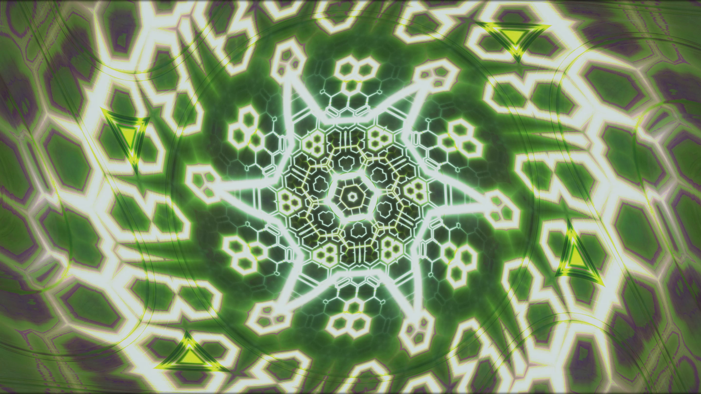
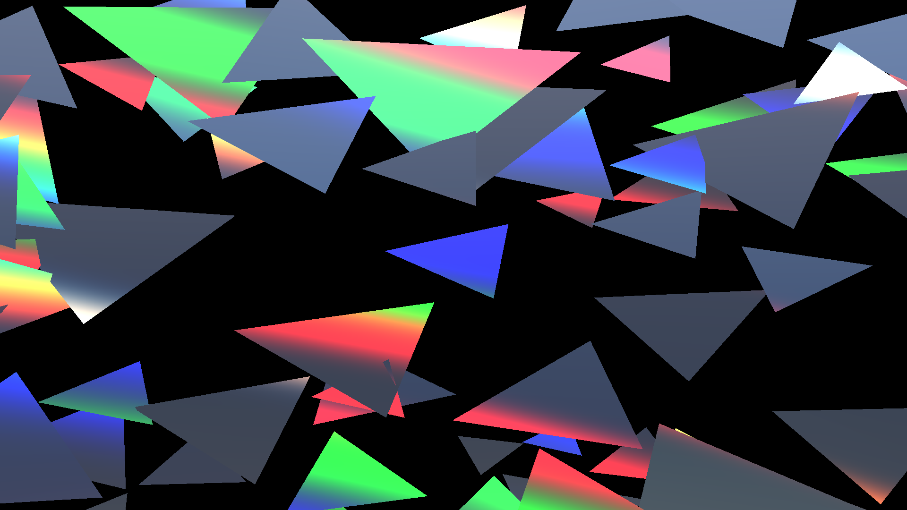
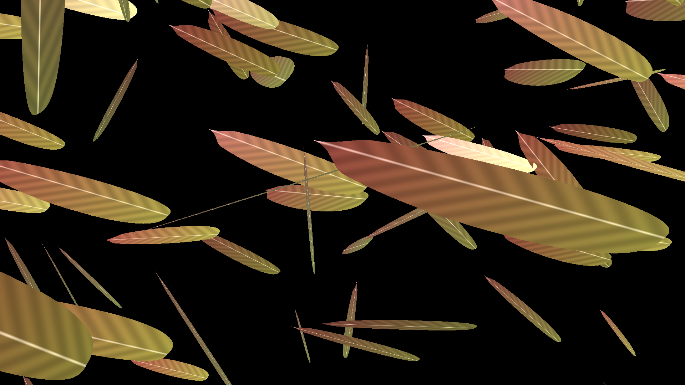
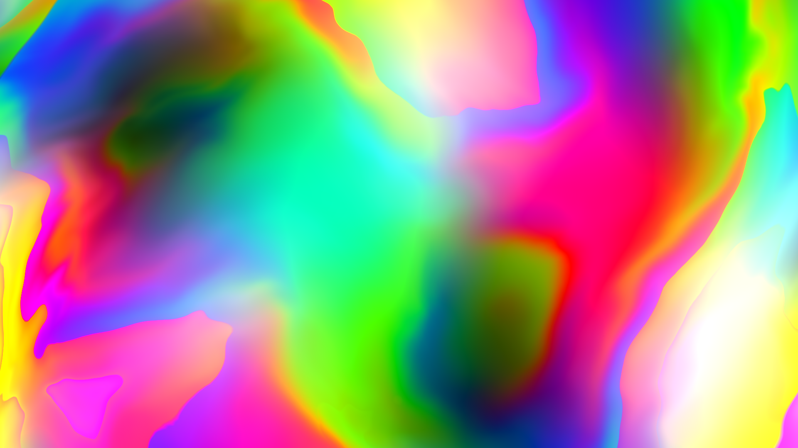

# Kaleidoscope Enhanced — Music Visualizer

[](LICENSE)


<br clear="left">


A real-time, audio-reactive kaleidoscope / tunnel visualizer for Windows. It
captures whatever is playing on the system (WASAPI loopback — Spotify, browser,
foobar2000, …), analyses it, and drives a chained GLSL shader pipeline whose
motion, colour and structure follow the music's rhythm, timbre and mood.

It works equally well for **beat-driven music** (Rock/Pop/EDM) and **beatless
ambient / drone**, and automatically calms down to a non-reactive mode for
**speech / video dialogue**.

**[⬇ Download the latest release](https://github.com/reneweller-coding/KaleidoscopeEnhanced/releases/latest)**
— no Qt / Visual Studio needed. Either run the installer (`KaleidoscopeVisualizer-Setup.exe`)
or grab the portable ZIP and just unzip-and-run; see
[Deployment](#deployment--standalone-package-no-qt--vs-on-the-target).

|  |  |
|---|---|
|  |  |
|  |  |

*Four of the 326 scenes + 84 FX overlays in the [scene catalogue](docs/Catalog/Katalog.md)
— a classic kaleidoscope fold, a compute-driven prism-shatter scene, a
volumetric feather storm (real 3D geometry + shadow map), and a domain-warped
fractal cloud. Renders like these are reproducible headlessly via
`PresetEditor.exe --render` (see [Preset editor](#preset-editor-standalone-tool)).*

---

## Contents

- [Build](#build)
- [Deployment — standalone package](#deployment--standalone-package-no-qt--vs-on-the-target)
- [Controls](#controls)
- [Configurations](#configurations)
  - [Preset editor (standalone tool)](#preset-editor-standalone-tool)
  - [Scene catalogue](#scene-catalogue)
- [Live control](#live-control)
- [How the audio reactivity works](#how-the-audio-reactivity-works)
- [GPU reaction-diffusion (live simulation effect)](#gpu-reaction-diffusion-live-simulation-effect)
- [Compute-shader effects (`ComputeFX`)](#compute-shader-effects-computefx)
- [GPU volumetric fire/smoke simulation](#gpu-volumetric-firesmoke-simulation)
- [Installation & robustness](#installation--robustness)
- [Project layout](#project-layout)
- [Notes](#notes)

---

## Build

**Requirements**
- **Qt 6.11** (kit `msvc2022_64`), installed at `C:\Qt\6.11.1\msvc2022_64`
- **Visual Studio 2026** (or 2022) — platform toolset **v145**, target **x64**

**Visual Studio**
1. Open `Kaleidoscope.sln`.
2. Select the **Release | x64** (or Debug | x64) configuration.
3. Build. `QTDIR` defaults to `C:\Qt\6.11.1\msvc2022_64` (set in the project);
   override it if your Qt is elsewhere.

**Command line**
```powershell
$env:QTDIR = "C:\Qt\6.11.1\msvc2022_64"
cmd /c '"C:\Program Files\Microsoft Visual Studio\18\Community\VC\Auxiliary\Build\vcvars64.bat" && msbuild Kaleidoscope.vcxproj /p:Configuration=Release /p:Platform=x64'
```

**Qt Creator** — `Kaleidoscope.pro` mirrors the VS project (same sources,
modules and defines), so the code can also be browsed and built from
Qt Creator with a Qt 6 / MSVC kit.  The VS project remains the primary
build (it also runs the moc/uic steps and the auto-deploy).

**Run** — the executable needs the Qt 6 DLLs on `PATH` (or run `windeployqt`):
```powershell
$env:Path = "C:\Qt\6.11.1\msvc2022_64\bin;" + $env:Path
.\Release\Kaleidoscope.exe                    # windowed 1920×1080
.\Release\Kaleidoscope.exe -b                 # fullscreen (2nd monitor if present)
.\Release\Kaleidoscope.exe -s 0.5             # render the pipeline at 50% internal resolution
.\Release\Kaleidoscope.exe -c darkambient     # start with a chosen configuration
.\Release\Kaleidoscope.exe -m 1 -c psychedelic -s 0.5   # kiosk: fullscreen on monitor 1
```

**Command-line options**

| Option        | Meaning                                                            |
|---------------|-------------------------------------------------------------------|
| `-b`          | Start fullscreen (2nd monitor if present)                         |
| `-s <factor>` | Internal render scale 0.25–2.0 (see below)                        |
| `-c <name>`   | Start with the named configuration (e.g. `darkambient`, `normal`)|
| `-m <index>`  | Fullscreen on monitor `<index>` (0-based; implies `-b`)          |
| `-l`          | Log to `kaleidoscope.log` instead of the console (kiosk)         |
| `-r`          | Start recording (frames + audio) immediately on launch            |
| `-w <wav>`    | Offline: analyze this WAV instead of capturing live audio (test)  |
| `-o`          | Spout output: publish the frame as sender "Kaleidoscope"          |
| `-t <port>`   | Web remote: phone control page at `http://<pc>:<port>/`           |
| `-x <wav>`    | **Batch render**: record this WAV to an mp4, then exit (see below)|
| `-i <sender>` | **Spout input**: a live sender replaces the photos (see below)    |
| `-3 <mode>`   | **Stereo 3D**: `sbs`, `tb` or `ana`(glyph) — see below            |
| `-h`          | Print usage and exit                                              |

For an unattended **installation / kiosk**, combine `-m`, `-c`, `-s` and `-l`.
While running, the app keeps the display awake and suppresses the screensaver
and system standby for as long as it is open.

**Adaptive render scale (key `g`, on by default):** the internal render scale is
nudged automatically to hold the frame rate near target — it drops below ~45 FPS
and recovers above ~57 — clamped to between 0.35 and whatever `-s` you launched
with. So `-s` sets the *maximum* quality and the app stays smooth on its own; the
live scale and the `g` state are shown in the `i` overlay.

**`-s <factor>` (internal render scale, 0.25–2.0):** the expensive effect passes
render at `factor × display resolution` and only the final pass upscales to the
display. Use `-s 0.5` (or lower) to run smoothly at 4K on weak GPUs (e.g. an Intel
NUC / HD Graphics iGPU); `-s 1.0` (default) is native; `> 1.0` supersamples.
Combine with a lightweight config and lower trails (`,`) for the weakest hardware.

> The shaders (`*.frag`) and `Configurations\*.xml` are loaded from the working
> directory's parent (`..\`), so run the exe from its `Debug\` / `Release\`
> folder. Set an **image directory** in the config (see below) — the kaleidoscope
> textures are built from those images.

---

## Deployment — standalone package (no Qt / VS on the target)

`deploy.ps1` builds a **fully self-contained** package that runs on any 64-bit
Windows PC without Qt or Visual Studio installed:

```powershell
powershell -ExecutionPolicy Bypass -File .\deploy.ps1 -Build
```

This produces `dist\KaleidoscopeVisualizer\` and a portable
`dist\KaleidoscopeVisualizer-portable.zip`. It runs `windeployqt` to bundle the
Qt 6 runtime + plugins, copies the MSVC runtime DLLs, and stages the shaders,
configs, an icon and two double-click launchers:

```
KaleidoscopeVisualizer\
    *.frag, *.vert                 shaders          (loaded from "..\")
    Configurations\*.xml           presets
    Kaleidoscope-starten.bat       launcher (windowed)
    Kaleidoscope-Vollbild.bat      launcher (fullscreen / kiosk, -b)
    LIESMICH.txt                   short end-user readme
    bin\  Kaleidoscope.exe + Qt6*.dll, platforms\, vcruntime140*.dll, ...
```

Copy the folder (or unzip the portable ZIP) anywhere and double-click a
launcher — the `.bat` sets the working directory to `bin\` so the app's `..\`
asset paths resolve. The package was verified to run with **Qt removed from
`PATH`**, i.e. purely from its bundled DLLs.

**Classic installer:** if [Inno Setup](https://jrsoftware.org/isdl.php) is
installed, `deploy.ps1` also compiles `installer.iss` into
`dist\KaleidoscopeVisualizer-Setup.exe` (Start-menu / desktop shortcuts with the
correct working directory). Otherwise build it later with `ISCC.exe installer.iss`.

> The bundled `Configurations\*.xml` still point `ImageDirectory` at a local
> path; edit it to your own photos on the target machine. If it's missing, the
> app uses a procedural fallback texture instead of crashing.

---

## Controls

| Key        | Action                                                        |
|------------|---------------------------------------------------------------|
| `Esc`, `Q` | Quit                                                          |
| `h`        | Toggle the on-screen **help** (keyboard reference)            |
| `0`        | Toggle the configuration-select menu                          |
| `1`–`9`    | Switch configuration (cross-fades)                            |
| `i`        | Toggle the live audio-feature overlay (incl. **FPS**)         |
| `d`        | Choose the **audio source** (output / microphone) — overlay   |
| `p`        | Toggle the **now-playing** track title display                |
| `w`        | **Lyrics** (Internet): off / credits scroll / karaoke — on by default |
| `Shift+w`  | Toggle the karaoke **kinetic line-slam** pop-in (off by default) |
| `o`        | **Artist images** (Internet): rotating inset + colour grade — on by default |
| `n`        | Manually advance to the next effect (musical scene change)    |
| `v`        | Show the active shader names (debug overlay)                  |
| `l`        | Toggle the **stage lamps / light show** (corner cones etc.)   |
| `[` / `]`  | Reactivity — less / more audio-driven motion                  |
| `,` / `.`  | Trails — shorter / longer feedback trails                     |
| `-` / `=`  | Mood — weaker / stronger colour grading                       |
| `;` / `'`  | Latency — visuals earlier / later vs. the heard beat          |
| `b`        | **Blackout** — soft fade to black and back (VJ)               |
| `e`        | **Freeze** — hold the picture (VJ)                            |
| `t`        | **Tap tempo** — tap the beat to override tempo detection      |
| `u`        | **Pin** — hold the current effect (no automatic switches)     |
| `f`        | **Favourite** the current effect (persistent selection bonus) |
| `z`        | **Stereo 3D** — cycle off / side-by-side / top-bottom / anaglyph |
| `c` / `m`  | Stereo depth — weaker / stronger                              |
| `a`        | Toggle **auto-config-by-mood** (auto-switch configs)          |
| `g`        | Toggle **adaptive render scale** (auto-FPS)                   |
| `j`        | **MIDI learn** — bind knobs/pads to the controls              |
| `r`        | Toggle **recording** (frames + audio → mp4)                   |
| `y` / `x`  | Arm the **instant replay** ring / save it as an mp4           |
| `k`        | Save the current look **and** UI state as the startup default |
| `s`        | Save a PNG screenshot of the window                           |
| mouse drag | (when not fullscreen) trackball / interaction                 |

The tuning keys (`[]`, `,.`, `-=`) change global look parameters shown in the
`i` overlay. Press **`k`** to persist them (plus the render scale) to
`..\kaleidoscope_settings.ini`, so they are restored on the next launch
(command-line flags such as `-s` still take precedence). The `i` overlay also
shows the current **FPS** — handy for tuning `-s` on a target machine.

---

## Configurations

`Configurations\*.xml` define which shaders are in rotation, their
parameters, probabilities and mood tags, plus the **`ImageDirectory`** used
for textures.  Switch between them with the number keys.  Included presets
(rebuilt 2026-07 around the music-driven engine — the old
normal/fast/slow/… set lives on in git history):

- **Allround** — the full modern arsenal, balanced; a safe default
- **Club** — aggressive & bright: tunnels, godrays, lattices, analyzers
- **Ambient** — calm drift: fluid ink, lava, drones, liquid light shows
- **Galerie** — the *photos* star: kaleidoscopes, image tunnels, gentle folds
- **Psychedelic** — breathing fractals, pills, chrome, plasma, mushrooms
- **Noir** — dark, high-contrast: noir fractals, dark tunnels, deep drones
- **Komplett** — EVERY effect and combine shader in one rotation (49 texture
  effects + 21 combines, incl. the legacy set and combines that never had a
  config entry before)

**Themed shader pack (2026-07):** four new scene effects, spread across the
matching presets: **`InkWater`** (coloured ink plumes sinking into water and
billowing into marbled clouds — the image IS the ink; Ambient/Psychedelic),
**`Aurora`** (waving northern-lights curtains over a starfield, reach and
brightness breathing with the music; Ambient/Noir), **`CityBokeh`** (layers
of defocused night-city lights drifting in parallax, every bokeh disc
coloured by the picture, kicks pulsing a hashed subset; Noir/Club) and
**`BauhausGeo`** (a rotating Kandinsky/Bauhaus poster grid — discs, arcs,
bars, triangles in posterised image colours, snare-accented; Club/
Psychedelic).  All follow the house rules: image-based, per-activation
parameters, mood tags, flicker-free integrated motion.

**Full-Screen Dynamic Shader Pack (2026-08):** five new 100% viewport-filling, high-energy scene effects:
- **`HyperWarpTunnel`**: infinite warp tunnel with dynamic polar coordinates, multi-frequency FBM domain warping, and kick FOV shockwave pulses (Allround/Club/Psychedelic/Noir/Ambient).
- **`VolumetricSupernova`**: raymarched 3D volumetric plasma field & explosion with 3D Curl Noise, light absorption, and sub-bass shockwaves (Allround/Club/Psychedelic/Noir/Ambient).
- **`CrystalMirrorGrid`**: raymarched 3D crystal mirror lattice refracting and reflecting the live photo/kaleidoscope with kick shatter impulses (Allround/Club/Psychedelic/Noir).
- **`FluidInkMarble`**: 100% full-canvas liquid hydrodynamics & reaction-diffusion surface where loaded photos act as vibrant floating inks in turbulent vorticity streams (Allround/Club/Psychedelic/Ambient).
- **`CosmicBoidsVortex`**: 3D particle swarm vortex in 3D space with near-plane lens explosions on beats (Allround/Club/Psychedelic/Noir/Ambient).

**Full-Screen & 3D Dynamic Visualizer Suite (2026-08 Expansion — 20 New Shaders):**
- **`CyberGridCity`** (`Scene2D/`): Raymarched infinite synthwave cyberpunk megalopolis with illuminated neon grid skyscrapers, reflective rain-slicked highway avenues, and holographic photo projection billboards (`tex0`/`tex1`).
- **`QuantumChromaField`** (`Scene2D/`): Multi-layered quantum wave interference lattice and Riemann surface vortex field with high-contrast iridescent diffraction fringes covering 100% of the viewport.
- **`AbyssalLuminescence`** (`Scene2D/`): Deep ocean bioluminescent ecosystem with undulating siphonophore tendrils, underwater caustic light shafts, and glowing marine snow.
- **`SolarFlareCorona`** (`Scene2D/`): Extreme close-up of a turbulent stellar photosphere, magnetic coronal loops, convection granules, and sub-bass coronal mass ejections.
- **`GlitchMatrixHypercube`** (`Scene2D/`): 4D tesseract rotating across 6 Euclidean planes, integrated with cyber data moshing, digital glitch slices, matrix rain, and multi-planar photo projection.
- **`BismuthLabyrinth`** (`Scene2D/`): Raymarched infinite 3D hopper crystal labyrinth of metallic elemental bismuth with stepped 90° terraces and thin-film rainbow oxidation layers.
- **`NeonFluidDynamics`** (`Scene2D/`): Multi-scale Navier-Stokes curl-noise vorticity advection with vibrant neon ink plumes, shockwave collisions, and liquid photo marbling.
- **`StargateWormhole`** (`Scene2D/`): Relativistic Einstein-Rosen bridge hyperspace tunnel with gravitational light lensing around a central singularity and Doppler color shifts.
- **`PrismaticKaleidoMandala`** (`Scene2D/`): Non-Euclidean Poincaré disk hyperbolic kaleidoscope with sacred geometry rosettes and infinite crystalline mirror reflections.
- **`ChromaAcidTrip`** (`Scene2D/`): Hypnotic psychedelic feedback loop with melting contour lines, reaction-diffusion spirals, liquid optical displacement, and chromatic solarization flashes.
- **`SuperconductorLevitation`** (`Scene3D/`, `geom="cubes"`): 4,900 quantum-locked superconducting tiles levitating and undulating over an active magnetic flux field driven by 32 spectrum bands.
- **`CyberRibbonHighway`** (`Scene3D/`, `geom="ribbon"`): 20 intertwined neon hyper-loop highway ribbons spiraling through 3D space with high-speed pulse packets and glowing lane markings.
- **`NeuroSynapseNetwork`** (`Scene3D/`, `geom="points"`): 60,000 synaptic nodes forming a 3D neural connectome with action potential electrical spikes racing across axons.
- **`CrystalMonoliths`** (`Scene3D/`, `geom="quads"`): 3,000 obsidian and prismatic glass monolith cards orbiting in 3D spiral formations, projecting photo textures with chromatic dispersion.
- **`PlasmaVortexGrid`** (`Scene3D/`, `geom="grid"`): 220x120 heightfield grid warped into a relativistic energy whirlpool with Bessel wave harmonics and stereo-friendly camera banking.
- **`LaserSpireArray`** (`Scene3D/`, `geom="scatter"` + `LaserSpireArray.geom`): Geometry Shader extrudes 3D point seeds into tall hexagonal crystalline spires with skyward laser beams.
- **`CrystalShatterBurst`** (`Scene3D/`, `geom="cubes"` + `CrystalShatterBurst.geom`): Geometry Shader shatters 3D cube primitives into tumbling tetrahedral crystal shards on beat kicks.
- **`BioluminescentSwarm`** (`Scene3D/`, `geom="indirect"` + `BioluminescentSwarm.comp`): GPU Compute Shader running a 12,000-organism boid murmuration simulation in 3D with spectrogram-reactive bioluminescent pulse waves.
- **`QuantumVortexField`** (`Scene3D/`, `geom="indirect"` + `QuantumVortexField.comp`): GPU Compute Shader generating dynamic 3D toroidal magnetic vortex filaments and Lorenz attractor streamlines with glowing ribbons.
- **`GlacierTessellation`** (`Scene3D/`, `geom="patches"` + `GlacierTessellation.tesc` + `.tese`): Distance-adaptive GPU hardware tessellation generating an arctic glacial ocean with subsurface blue scattering and glowing crevasses.

**Next-Gen Physics, Biology & Architecture Suite (2026-08 Expansion 2 — 15 New Shaders):**
- **`SupermassiveAccretionDisk`** (`Scene2D/`): Raymarched rotating Kerr black hole with relativistic frame dragging, Doppler photon sphere, and high-energy polar plasma jets.
- **`EscherRelativityMatrix`** (`Scene2D/`): Raymarched infinite 3D architectural labyrinth inspired by M.C. Escher's *Relativity* with 3 orthogonal gravity directions and neon staircases.
- **`MandelbulbHyperRealm`** (`Scene2D/`): Deep 3D dive into the Mandelbulb fractal $(z^N + c)$ with audio-reactive power $N$ morphing and iridescent metallic specular shading.
- **`HyperbolicHoneycombTessellation`** (`Scene2D/`): True 3D hyperbolic non-Euclidean space tessellation in the Poincaré ball with infinite Coxeter mirror reflections.
- **`VolcanicLightningPlume`** (`Scene2D/`): Volumetric explosive volcanic ash column billowing into the night sky with lava fountains and branched electrostatic volcanic lightning.
- **`PrismaticRainbowCloud`** (`Scene2D/`): Polar stratospheric nacreous mother-of-pearl clouds with pastel Mie diffraction iridescence and glowing crepuscular god rays.
- **`TokamakFusionCore`** (`Scene3D/`, `geom="indirect"` + `TokamakFusionCore.comp`): GPU Compute Shader simulating 4,096 magnetic D-T plasma filaments inside a toroidal vacuum vessel.
- **`QuantumWavepacketCollapse`** (`Scene3D/`, `geom="points"`): 60,000-particle 3D quantum probability density field in superposition with beat-triggered wavepacket collapse.
- **`HolographicMemoryCore`** (`Scene3D/`, `geom="quads"`): 3,000 hexagonal quartz holographic data crystals floating in an optical vault projecting photo textures.
- **`CyberVoxelTerraform`** (`Scene3D/`, `geom="cubes"`): 4,900 monolithic voxel cubes dynamically assembling into cybernetic equalizer cities and pyramids.
- **`DeepSeaVentsEcosystem`** (`Scene3D/`, `geom="indirect"` + `DeepSeaVentsEcosystem.comp`): GPU Compute Shader generating hydrothermal black smoker mineral plumes and bioluminescent organisms.
- **`MyceliumNeuralPulse`** (`Scene3D/`, `geom="indirect"` + `MyceliumNeuralPulse.comp`): GPU Compute Shader generating a 3D branching fungal mycelium network conducting bio-electric action potentials.
- **`CoralReefFluorescence`** (`Scene3D/`, `geom="grid"`): 220x120 heightfield fluorescent coral reef with undulating polyps and ultraviolet light response.
- **`HopfFibrationToruses`** (`Scene3D/`, `geom="ribbon"`): 20 stereographically projected 4D Hopf fibration Villarceau circles swirling seamlessly in 3D without intersecting.
- **`AuroraBorealisOverFjord`** (`Scene3D/`, `geom="patches"` + `AuroraBorealisOverFjord.tesc` + `.tese`): Hardware GPU tessellation of an arctic fjord with reflective water and volumetric northern lights.

**High-Energy & Optical Hypnosis Suite (2026-08 Expansion 3 — 15 New Shaders):**
- **`PrismaticLaserVault`** (`Scene2D/`): Volumetric 64-beam laser maze with dichroic prism cubes, optical smoke volume scattering, and beam-splitter refractions filling 100% of the viewport.
- **`CalabiYauManifold`** (`Scene2D/`): Raymarched 6D Calabi-Yau Kähler manifold projection with audio-reactive topological genus morphing and iridescent metallic highlights.
- **`CliffordTorusKleinBottle`** (`Scene2D/`): 4D non-orientable Klein bottle and Clifford torus rotating in 4D space with glass refraction, internal self-intersection, and chromatic dispersion.
- **`PulsarMagnetosphereJets`** (`Scene2D/`): Rapidly spinning millisecond pulsar with twisted dipole magnetic light cylinder and polar synchrotron lighthouse beams sweeping directly across the camera.
- **`FerrofluidSpikeForest`** (`Scene2D/`): 3D raymarched pool of magnetic liquid ferrofluid rising into sharp Rosensweig instability spikes with oily rainbow thin-film sheens.
- **`PlasmaLightningGlobe`** (`Scene2D/`): Dielectric breakdown plasma globe with dozens of snaking, branching high-voltage filament arcs striking the glass sphere.
- **`LargeHadronCollision`** (`Scene3D/`, `geom="points"`): 60,000 relativistic particle collision tracks spraying outwards along curved magnetic solenoid trajectories with Cherenkov radiation rings.
- **`SynchrotronRadiationRing`** (`Scene3D/`, `geom="ribbon"`): Electron storage ring undulating through periodic magnets, emitting forward-beamed X-ray and EUV synchrotron cones.
- **`KineticTesseractOrigami`** (`Scene3D/`, `geom="quads"`): 3,000-quad 4D Miura-ori kinetic origami tessellation blooming open and closed with music pacing and beat kicks.
- **`JellyfishBioluminescenceAbyss`** (`Scene3D/`, `geom="indirect"` + `JellyfishBioluminescenceAbyss.comp`): GPU Compute Shader simulating 32 giant deep-sea medusae with pulsating bells and trailing bioluminescent tentacle curtains.
- **`CyberspaceDNAHelix`** (`Scene3D/`, `geom="ribbon"`): Double-helix DNA macromolecule unzipping and transcribing with floating nucleotide base-pair streams.
- **`BioluminescentForestCanopy`** (`Scene3D/`, `geom="indirect"` + `BioluminescentForestCanopy.comp`): GPU Compute Shader generating 4,096 bioluminescent alien rainforest fronds and glowing airborne spores.
- **`DysonSwarmSolarHarvester`** (`Scene3D/`, `geom="quads"`): Thousands of geometric orbital mirrors surrounding a hypergiant star, reflecting the corona and firing laser power relays.
- **`SuperfluidHeliumVortexTurbulence`** (`Scene3D/`, `geom="indirect"` + `SuperfluidHeliumVortexTurbulence.comp`): GPU Compute Shader simulating quantum vortex tangle filaments and Kelvin wave packets in superfluid Helium-II.
- **`ChladniAcousticPlate`** (`Scene3D/`, `geom="points"`): 60,000 crystalline particles migrating away from antinodes to gather on sacred geometry nodal lines of a vibrating Chladni plate.

**Non-Euclidean, Relativistic & Quantum Dynamics Suite (2026-08 Expansion 4 — 13 New Shaders):**
- **`KerrNewmanSingularity`** (`Scene2D/`): Relativistic raymarched rotating charged Kerr-Newman black hole with ergosphere frame-dragging, photon sphere Doppler beaming, and polar synchrotron plasma jets.
- **`BismuthHyperLabyrinth`** (`Scene2D/`): Infinite 3D/4D hopper crystal maze of elemental bismuth with stepped 90° square terraces, thin-film oxidation rainbow iridescence, and photo texturing.
- **`FerrofluidHexMatrix`** (`Scene2D/`): Raymarched magnetic ferrofluid pool forming Rosensweig instability cone spikes in a hexagonal magnetic lattice with oily sheen and fluid vortex advection.
- **`PrismaticSuperradiance`** (`Scene2D/`): Volumetric laser resonance chamber with multi-angle Brewster prisms, cascaded Raman scattering, stimulated emission sheets, and chromatic photo dispersion.
- **`QuantumQubitArray`** (`Scene3D/`, `geom="cubes"`): 4,900 monolithic qubit towers rotating on Bloch spheres across a superconducting microchip with quantum gate phase flips.
- **`LorenzAttractorTurbulence`** (`Scene3D/`, `geom="ribbon"`): 20 glowing neon ribbons tracing chaotic strange attractor trajectories (Lorenz, Rössler, Chen) through 3D phase space with velocity Doppler grading.
- **`StellarNurseryCollapse`** (`Scene3D/`, `geom="points"`): 60,000-particle gravitational collapse of an interstellar nebula into a spinning protostellar accretion disk and relativistic bipolar plasma jets.
- **`SolarSailArmada`** (`Scene3D/`, `geom="quads"`): 3,000 reflective solar sails in geometric orbital formation tacking into the solar wind, projecting photo textures with specular solar glints.
- **`BioluminescentOceanSwell`** (`Scene3D/`, `geom="grid"`): 220x120 heightfield open ocean swell with Gerstner wave harmonics and bioluminescent dinoflagellate blue-cyan crest emission.
- **`CrystallineCavernTessellation`** (`Scene3D/`, `geom="patches"` + `CrystallineCavernTessellation.tesc` + `.tese`): Hardware GPU tessellation of an underground geode cavern with quartz/amethyst crystal clusters and subterranean illumination.
- **`TeslaLightningTree`** (`Scene3D/`, `geom="indirect"` + `TeslaLightningTree.comp`): GPU Compute Shader generating 4,096 Lichtenberg lightning discharge streamers with stepped leaders and ionized return strokes.
- **`SuperfluidVortexTangle`** (`Scene3D/`, `geom="indirect"` + `SuperfluidVortexTangle.comp`): GPU Compute Shader simulating quantized vortex rings, reconnection events, and Kelvin waves in superfluid Helium-II.
- **`DendriticSnowCrystal`** (`Scene3D/`, `geom="indirect"` + `DendriticSnowCrystal.comp`): GPU Compute Shader simulating 6-fold dendritic snowflake growth with hexagonal branching ice prisms and rainbow refraction.

**Full-Screen Optical & Quantum Dynamics Suite (2026-08 Expansion 5 — 8 New Shaders):**
- **`HyperDimensionalTesseractTunnel`** (`Scene2D/`): 100% viewport-filling 4D hypercube lattice rotating simultaneously across all 6 Euclidean planes with infinite interior mirror reflections, neon hyper-edges, and multi-angle photo texturing.
- **`NeutronStarMagnetarBurst`** (`Scene2D/`): Extreme close-up of a $10^{15}$ Gauss magnetar with starquake crust fractures, Cherenkov gamma-ray bursts, positron pair-plasma fountains, and synchrotron gravitational lensing.
- **`LiquidCrystalOptics`** (`Scene2D/`): Polarized optical microscopy of nematic liquid crystal Schlieren textures, topological disclination defects, Michel-Lévy birefringence interference, and polarized photo texturing.
- **`NonEuclideanHyperbolicMandala`** (`Scene2D/`): Infinite hyperbolic Poincaré disk space tessellation with $\{7,3\}$ sacred geometry Coxeter circle inversions, logarithmic spirals, and recursive kaleidoscopic photo folding.
- **`SuperradiantTokamakIgnition`** (`Scene2D/`): Volumetric inside view of a burning magnetic confinement fusion core with toroidal flux surfaces, helical runaway electron beams, Alfvén wave turbulence, and D-T plasma fire.
- **`IridescentChitinMorpho`** (`Scene2D/`): Bio-photonic dielectric nanostructure grating simulation (Morpho butterfly wings & jewel beetle chitin) producing pure Bragg interference structural color.
- **`GrapheneDiracPlasmonics`** (`Scene2D/`): 2D honeycomb carbon graphene lattice visualizing Dirac cones, topological quantum Hall edge states, localized wavepacket hops, and plasmonic resonances.
- **`SuperheatedCoronalLoop`** (`Scene2D/`): Solar coronal magnetic loops spanning the canvas over boiling photospheric convection granules with explosive magnetic reconnection flares.

**Texture-Hero & Holographic Kaleidoscope Suite (2026-08 Expansion 6 — 8 New Shaders):**
- **`InfinitePhotoZoomAbyss`** (`Scene2D/`): 100% viewport-filling seamless infinite logarithmic Droste spiral dive into the photo with conformal mapping $w = \ln(z)$ and multi-octave blending.
- **`StainedGlassCathedralCaustics`** (`Scene2D/`): Gothic cathedral rose window transforming the photo into luminous stained glass with lead came tracery, antique glass refraction, and volumetric godrays.
- **`OrigamiMirrorKaleidoscope`** (`Scene2D/`): 3D kinetic Miura-ori origami mirror tessellation where every triangular facet reflects dynamic sections of the photo with angle-dependent chromatic dispersion.
- **`FluidPhotoMarblingEbru`** (`Scene2D/`): Traditional Turkish Ebru paper-marbling simulation where the photo floats as liquid oil pigments combed and raked into elegant peacock swirls and streamlines.
- **`PrismaticCrystalChamber`** (`Scene2D/`): Infinity mirror room of faceted quartz and dichroic glass prisms reflecting the photo across multiple total-reflection bounces with diamond glints.
- **`KineticTileMosaicMatrix`** (`Scene2D/`): Architectural kinetic facade of thousands of mechanical tiles that elevate, flip, and rotate in 3D relief, physically reconstructing the photo with ambient cast shadows.
- **`HyperbolicPoincareTunnel`** (`Scene2D/`): Infinite non-Euclidean tunnel whose cross-section is an $\{8,3\}$ hyperbolic Poincaré disk paved with conformal self-similar tiles of the photo.
- **`CyberHologramGlitchVoxel`** (`Scene2D/`): Volumetric 3D laser holographic projection converting 2D photos into a floating 3D voxel pointcloud via luminance depth extrusion, laser scanlines, and data-mosh glitch slices.

**Multiverse & Complex Systems Suite (2026-08 Expansion 7 — 10 New Shaders):**
- **`QuantumChromodynamicsGluonPlasma`** (`Scene2D/`): Relativistic heavy-ion collision deconfined quark-gluon fireball with SU(3) non-abelian color flux tubes and gluon Cherenkov radiation.
- **`BioluminescentAbyssalTrenches`** (`Scene2D/`): Volumetric deep-sea Hadal zone (11,000m depth) with hydrothermal crystal spires, flashing siphonophores, pyrosome light tubes, and marine snow.
- **`NonEuclideanOctahedralLabyrinth`** (`Scene2D/`): 100% viewport-filling 3D hyperbolic octahedral mirror maze reflecting photos across recursive internal Coxeter reflection planes.
- **`MetamorphicLavaVortex`** (`Scene2D/`): Viscous basalt magma ocean with floating black obsidian crust plates fracturing and submerging into glowing 1500°C molten lava rivers.
- **`SolarWindMagnetosphere`** (`Scene3D/`, `geom="grid"`): 220x120 heightfield planetary magnetosphere bow shock deflecting supersonic solar wind into emerald and crimson auroral curtains.
- **`NeuralAxonSynapseCloud`** (`Scene3D/`, `geom="points"`): 60,000-particle cerebral cortex connectome with action potentials racing along axonal pathways to ignite neurotransmitter synapses.
- **`KineticMirrorHexagonArray`** (`Scene3D/`, `geom="quads"`): 3,000 suspended kinetic mirror plates rippling and tilting in 3D wave kinematics with photo reflection and specular solar glints.
- **`HypercubeLatticePillars`** (`Scene3D/`, `geom="cubes"`): 4,900 cubes forming concentric monolithic architectural towers with sci-fi neon edge lighting and dynamic height extrusions.
- **`PlasmaFilamentTornado`** (`Scene3D/`, `geom="indirect"` + `PlasmaFilamentTornado.comp`): GPU Compute Shader generating 4,096 helical Birkeland plasma current filaments in a space hurricane vortex with Z-pinch compression.
- **`SuperconductingFluxVortex`** (`Scene3D/`, `geom="indirect"` + `SuperconductingFluxVortex.comp`): GPU Compute Shader generating 4,096 quantized Abrikosov flux vortex ribbons in a Type-II superconductor lattice with Kelvin wave excitations.

**Quantum, Cosmic & Optical Metamaterials Suite (2026-08 Expansion 8 — 28 New Shaders):**
- **`EinsteinRingGravitationalLens`** (`Scene2D/`): Relativistic gravitational lensing around a rotating dark matter singularity with Einstein rings, dual photo images, photon sphere Doppler shifts, and gravitational shockwaves.
- **`QuasarRelativisticJet`** (`Scene2D/`): Raymarched look down the magnetic confinement funnel of a supermassive quasar core with relativistic synchrotron plasma jets, shock diamonds, and Cherenkov beaming.
- **`SolarCoronaProminence`** (`Scene2D/`): Volumetric solar magnetic coronal loops arching over a boiling photospheric convection surface with explosive magnetic reconnection flares.
- **`GyroidTriplyPeriodicLabyrinth`** (`Scene2D/`): Raymarched infinite non-Euclidean minimal surface ($TPMS$) dividing 3D space into two interpenetrating congruent labyrinths with titanium/glass caustics and photo mapping.
- **`PenroseAperiodicTessellation`** (`Scene2D/`): Infinite 5-fold aperiodic Penrose tiling governed by the Golden Ratio ($\phi$) with recursive deflation, photoelastic stress birefringence colors, and sacred geometric photo mapping.
- **`QuaternionicJulia4DFlight`** (`Scene2D/`): Raymarched flight through a true 4D Quaternion Julia fractal ($q_{n+1} = q_n^2 + C$) with 4D hyper-rotations, metallic specular highlights, and constant morphing.
- **`SchwarzschildWormholeTunnel`** (`Scene2D/`): Raymarched flight through a traversable Morris-Thorne wormhole connecting two distinct universes (`tex0` and `tex1`) with chromatic gravitational lensing arcs.
- **`CasimirCavityVacuumFluctuations`** (`Scene2D/`): Nanoscale optical cavity between reflecting mirrors displaying zero-point quantum field fluctuations, dynamical Casimir photon pair production, and thin-film dielectric reflections.
- **`SonoluminescenceBubble`** (`Scene2D/`): Acoustic cavitation bubble collapse in an ultrasonic standing wave field producing picosecond 20,000K plasma flashes and spherical acoustic shockwaves.
- **`JosephsonVortexLattice`** (`Scene2D/`): High-temperature layered superconductor Josephson junction array simulating quantized fluxon vortex lattices, phase isobars, and vortex liquid melting transitions.
- **`FireWhirlTornado`** (`Scene2D/`): Volumetric 3D rotating fire tornado with helical flame column, turbulent soot/ash advection, rising ember sparks, and blackbody thermal radiation gradient.
- **`SupercellMesocyclone`** (`Scene2D/`): Volumetric rotating supercell storm cloud with helical updraft mesocyclone, lowering wall cloud, anvil overhang, crepuscular rays, and intracloud lightning flashes.
- **`DichroicInfinityPrismVault`** (`Scene2D/`): Raymarched infinite mirror chamber of dichroic glass prisms and cubic beam-splitters with RGB spectral dispersion, total internal reflection, and optical caustics.
- **`LiquidMercuryFerrofluidChamber`** (`Scene2D/`): Raymarched reflective pool of liquid mercury and magnetic ferrofluid forming Rosensweig instability cone spikes in hexagonal arrays under shifting magnetic fields.
- **`CosmicStringHyperspaceWeb`** (`Scene3D/`, `geom="ribbon"`): 20 hyper-dimensional cosmic strings spanning a 3D web with standing Kelvin wave vibrations, metric deficit angles, and relativistic pulse packets.
- **`SupernovaRemnantNebula`** (`Scene3D/`, `geom="indirect"` + `SupernovaRemnantNebula.comp`): GPU Compute Shader generating 4,096 expanding supernova filament strands with Rayleigh-Taylor instability fingers and central pulsar shockwaves.
- **`HopfTorusCliffordKlein`** (`Scene3D/`, `geom="ribbon"`): 20 interlocking Villarceau circles and Clifford tori stereographically projected from 4D space into 3D with seamless photo wrapping.
- **`CherenkovCascadeShower`** (`Scene3D/`, `geom="points"`): 60,000 relativistic particle collision tracks in heavy water with glowing cyan Cherenkov radiation cones and magnetic deflection spirals.
- **`QuantumHallEdgeCurrents`** (`Scene3D/`, `geom="ribbon"`): 20 chiral topological edge channels in a 2D electron gas executing cyclotron skipping orbits with quantum phase transitions.
- **`BioluminescentBreakingWave`** (`Scene3D/`, `geom="grid"`): 220x120 heightfield breaking ocean wave with Gerstner wave harmonics and dinoflagellate bioluminescent crest emission.
- **`CryovolcanicIceGeysers`** (`Scene3D/`, `geom="indirect"` + `CryovolcanicIceGeysers.comp`): GPU Compute Shader generating 4,096 cryovolcanic ice geyser plumes erupting from tectonic ice fractures with crystal scattering.
- **`FiberopticLightLoom`** (`Scene3D/`, `geom="ribbon"`): 20 woven fiberoptic ribbons flowing in 3D warp-and-weft patterns transmitting high-speed data pulse packets and glowing curtains.
- **`RadiolarianSilicaLattice`** (`Scene3D/`, `geom="quads"`): 3,000 transparent icosahedral silica skeleton cards floating in deep-sea suspension with crystalline glass refractions.
- **`AcousticLevitationMatrix`** (`Scene3D/`, `geom="cubes"`): 4,900 monolithic levitating voxels trapped in an ultrasonic standing wave field creating a volumetric 3D photo display.
- **`BioluminescentMyceliumCave`** (`Scene3D/`, `geom="indirect"` + `BioluminescentMyceliumCave.comp`): GPU Compute Shader generating 4,096 bioluminescent mycelial filaments hanging from cavern ceiling stalactites and conducting action potentials.
- **`MoireHyperInterference`** (`Scene3D/`, `geom="grid"`): 220x120 heightfield grid undulating with optical Moiré superlattices and dynamic interference zone plates.
- **`KelvinHelmholtzCloudWaves`** (`Scene3D/`, `geom="grid"`): 220x120 heightfield atmospheric shear billows and rolling breaking cloud waves illuminated by sunset backlighting.
- **`HolographicLaserDiffractionGrid`** (`Scene3D/`, `geom="quads"`): 3,000 spatial light modulator (SLM) holographic cards reconstructing 3D Fourier optical diffraction patterns and interference fringes.

**Astro-Quantum, Higher-Dimensional & Biophotonic Metamaterials Suite (2026-08 Expansion 9 — 30 New Shaders):**
- **`HawkingRadiationEvaporation`** (`Scene2D/`): Quantum tunneling Hawking radiation evaporation around a micro-black hole with virtual particle separation, extreme gravitational redshift, and quantum horizon photo pixels.
- **`MagnetarCrustquakeSGR`** (`Scene2D/`): Ultra-magnetic neutron star ($10^{15}\text{ G}$) undergoing tectonic crust fractures (starquakes) with torsional Alfvén wave shears and Soft Gamma Repeater (SGR) flares.
- **`CosmicRayAirShowerCherenkov`** (`Scene2D/`): Relativistic cosmic ray atmospheric air shower with secondary hadronic/EM cascades, near-UV nitrogen fluorescence, and Cherenkov cones.
- **`HeliosphericCurrentSheet`** (`Scene2D/`): Rotating Parker spiral "ballerina skirt" wavy current sheet dividing solar magnetic polarities with sector boundary crossings and solar wind turbulence.
- **`GravitationalWaveInterferometer`** (`Scene2D/`): Laser interferometer optical cavity with Fabry-Pérot arm resonators, quadrupolar spacetime strain fringe shifts, and dark-port signal readouts.
- **`ScherkMinimalSurfaceTower`** (`Scene2D/`): Raymarched infinite minimal surface towers governed by Scherk's doubly periodic minimal surface ($e^z \cos(x) = \cos(y)$) with glass/titanium reflections.
- **`ApollonianSpherePackingGasket`** (`Scene2D/`): Raymarched 3D Apollonian sphere packing gasket with osculating tangent spheres, recursive sphere inversions, and jewel specular reflections.
- **`KleinQuarticHyperbolicCurve`** (`Scene2D/`): Riemann surface of genus 3 with 168 automorphisms ($PSL(2,7)$) and $\{7,3\}$ hyperbolic Klein quartic tiling with conformal circle inversions.
- **`MandelboxHyperCubeMetamaterial`** (`Scene2D/`): Raymarched 3D Mandelbox fractal with sphere folding, box folding, and scale inversion generating infinite cyber-architectural megastructures.
- **`DiracConeGrapheneValleytronics`** (`Scene2D/`): 2D honeycomb Dirac lattice with linear relativistic dispersion ($E = \pm \hbar v_F |k|$), Valley Hall pseudospin states ($K, K'$), and Berry curvature flux.
- **`TopologicalInsulatorDiracSurface`** (`Scene2D/`): 3D topological insulator with insulating bulk and protected conducting 2D Dirac surface states with spin-momentum locking ($k \times \sigma$).
- **`MajoranaZeroModeBraid`** (`Scene2D/`): 1D topological superconductor nanowire array executing non-abelian Majorana zero-mode braiding operations with topological quantum gate phase flips.
- **`BallLightningPlasmoid`** (`Scene2D/`): Volumetric autonomous ball lightning plasmoid with self-confined toroidal plasma core, helical magnetic filaments, and dielectric air breakdown arcs.
- **`MantleConvectionPlume`** (`Scene2D/`): Volumetric deep Earth core-mantle boundary thermal plumes with Rayleigh-Bénard convection rolls, mushrooming magma diapirs, and molten rock photo warping.
- **`AuroraAustralisCurtainSwell`** (`Scene2D/`): Volumetric double-curtain Antarctic Aurora Australis waving along geomagnetic field lines with oxygen emerald ($557.7\text{ nm}$) and nitrogen crimson ($630.0\text{ nm}$) rays.
- **`AccretionDiskToroidVortex`** (`Scene3D/`, `geom="grid"`): 220x120 heightfield magnetohydrodynamic relativistic toroidal accretion disk with inner ISCO plunge and Doppler beaming.
- **`CliffordTorusVillarceauLinks`** (`Scene3D/`, `geom="cubes"`): 4,900 monolithic cubes tracing nested Villarceau circles on 4D Clifford tori stereographically projected into 3D.
- **`NonEuclideanDodecahedronLoom`** (`Scene3D/`, `geom="ribbon"`): 20 hyperbolic dodecahedral edge ribbons weaving through non-Euclidean Poincaré space with geodesic paths.
- **`AbrikosovFluxLatticeVortices`** (`Scene3D/`, `geom="points"`): 60,000 superconducting Cooper-pair vortex flux lines forming a triangular Abrikosov lattice with Kelvin wave excitations.
- **`SuperconductingQubitResonator`** (`Scene3D/`, `geom="ribbon"`): 20 superconducting coplanar waveguide microwave resonator ribbons coupling transmon qubits with microwave standing waves.
- **`BoseEinsteinVortexTangle`** (`Scene3D/`, `geom="indirect"` + `BoseEinsteinVortexTangle.comp`): GPU Compute Shader generating 4,096 quantized vortex filament strands in a rotating Bose-Einstein condensate.
- **`GeomagneticDynamoCore`** (`Scene3D/`, `geom="indirect"` + `GeomagneticDynamoCore.comp`): GPU Compute Shader generating 4,096 helical convective fluid columns in the liquid outer core generating the planetary dipole field.
- **`SandDuneBarchanMigration`** (`Scene3D/`, `geom="grid"`): 220x120 heightfield crescent barchan sand dunes migrating under aeolian wind shear with wind ripple saltation waves.
- **`OceanAbyssalBrinePool`** (`Scene3D/`, `geom="grid"`): 220x120 heightfield underwater brine pool with dense hypersaline shoreline waves and shimmering halocline refraction.
- **`PhotonicCrystalFiberCore`** (`Scene3D/`, `geom="cubes"`): 4,900 monolithic micro-structured silica pillars forming a photonic crystal fiber (PCF) honeycomb cladding around a hollow core.
- **`MetamaterialNegativeRefraction`** (`Scene3D/`, `geom="grid"`): 220x120 heightfield metamaterial interface displaying negative index of refraction ($n < 0$) with backwards phase velocity and superlens focusing.
- **`ChiralLiquidCrystalCholesteric`** (`Scene3D/`, `geom="ribbon"`): 20 twisted cholesteric liquid crystal molecular ribbons with helical pitch layers and selective circular Bragg reflection.
- **`DiatomSilicaMicrofrustule`** (`Scene3D/`, `geom="quads"`): 3,000 microscopic marine diatom silica frustules with hexagonal micro-pore diffraction grids floating in deep-sea suspension.
- **`DielectricMetasurfaceHologram`** (`Scene3D/`, `geom="quads"`): 3,000 sub-wavelength dielectric nanopillar meta-atoms modulating optical phase and polarization to project 3D holograms.
- **`BioluminescentSiphonophoreChain`** (`Scene3D/`, `geom="indirect"` + `BioluminescentSiphonophoreChain.comp`): GPU Compute Shader simulating a 50-meter deep-sea colonial siphonophore chain with pulsating nectophores and action potential waves.

**Smooth & Dynamic Transitions Suite (2026-08 Expansion 10 — 35 New Combine Shaders):**
- **`CombineVoronoiShatter`** (`FX/`): Continuous Voronoi cell mosaic dissolution where polygonal cells softly lift, rotate, and cross-fade with glowing cell boundaries pulsing to audio hits.
- **`CombinePoincareSpin`** (`FX/`): Conformal hyperbolic Poincaré disk inversion and continuous Möbius transformation smoothly turning the outgoing scene inside out and drawing the new scene from the non-Euclidean boundary.
- **`CombinePenroseMorph`** (`FX/`): 5-fold aperiodic Penrose tiling morphing through recursive golden-ratio deflation ($\phi = 1.618$) with luminous kite-and-dart grid lines.
- **`CombineMoireInterference`** (`FX/`): Optical Moiré superlattice interference fringes dissolving between scenes through rotating high-frequency line gratings.
- **`CombineQuadtreeSubdivide`** (`FX/`): Hierarchical recursive quadtree subdivision splitting the viewport into multi-scale tiles with cybernetic neon boundary partitions.
- **`CombineLogarithmicSpiral`** (`FX/`): Equiangular logarithmic spiral vortex ($r = a e^{b \theta}$) winding the old scene inward and unwinding the next scene outward.
- **`CombineGoldenNautilus`** (`FX/`): Fibonacci golden spiral nautilus chamber sweep unfurling across the screen in golden ratio proportions.
- **`CombineSpectralPrismSplit`** (`FX/`): Optical prism dispersion splitting red, green, and blue channels across chromatic aberration paths and recombining cleanly.
- **`CombineAnamorphicFlareSweep`** (`FX/`): Horizontal cinematic anamorphic laser flare sweep washing across the screen with cylindrical lens distortion.
- **`CombineCausticLiquidWarp`** (`FX/`): Underwater optical caustic refraction networks undulating and clearing with shimmering aquatic specular glints.
- **`CombineHologramScanInterference`** (`FX/`): Volumetric laser holographic scanlines and spatial-light-modulator interference fringes reconstructing the incoming scene.
- **`CombineDreamyBokehBloom`** (`FX/`): Multi-tap circle-of-confusion bokeh blur blooming into soft luminous aperture discs and resolving into the new scene.
- **`CombineGlitchPixelSort`** (`FX/`): Directional luminance pixel-sorting displacement streaks glitching and resolving into clean pixels.
- **`CombineDichroicMirrorSlide`** (`FX/`): Angled optical dichroic mirror planes sliding across the screen with thin-film interference polarization colors.
- **`CombineNavierStokesMelt`** (`FX/`): Turbulent curl-noise fluid advection vorticity liquifying and melting the outgoing scene into the incoming one.
- **`CombineEbruMarblingRake`** (`FX/`): Traditional Turkish paper marbling (Ebru) comb teeth sweeps drawing capillary swirls and chevron folds.
- **`CombineFerrofluidSpikes`** (`FX/`): Magnetic ferrofluid Rosensweig instability cone spikes erupting in hexagonal lattices and relaxing into the new scene.
- **`MagmaCrustFracture`** (`FX/`): Obsidian basalt crust fractures opening into glowing 1500°C molten magma rivers that cool into the incoming scene.
- **`SmokeTurbulenceDrift`** (`FX/`): Volumetric atmospheric smoke plumes billowing across the viewport with forward light scattering.
- **`QuantumWaveCollapse`** (`FX/`): Schrödinger wavepacket probability density interference ($|\psi|^2$) collapsing from quantum superposition into the observed eigenstate.
- **`FrostDendriteFreeze`** (`FX/`): Hexagonal dendritic ice crystal frostwork growing across the screen and melting away into the incoming scene.
- **`GravitationalLensWarp`** (`FX/`): Relativistic black-hole gravitational lensing swallowing the old scene into an Einstein ring and expanding the new scene.
- **`WormholeSpaceFold`** (`FX/`): Traversable Morris-Thorne wormhole throat folding space-time to bridge dual universes.
- **`HyperspaceStreak`** (`FX/`): Relativistic warp drive light streak tunnel stretching stars and scene geometry with Lorentz contraction.
- **`SupernovaShockwave`** (`FX/`): Spherical supernova blast wave expanding radially with a glowing Cherenkov ionization rim.
- **`EventHorizonSwirl`** (`FX/`): Rotating Kerr black hole ergosphere frame-dragging vortex twisting spacetime into a relativistic spiral.
- **`Tesseract4DRotation`** (`FX/`): 4D hypercube double-rotation in XW and YZ planes projecting 4D shadows that rotate Universe 1 into Universe 2.
- **`DopplerBeamingWipe`** (`FX/`): Relativistic blueshift/redshift Doppler color transition with relativistic beaming headlamp focus.
- **`BioluminescentSparkle`** (`FX/`): Marine dinoflagellate bioluminescent sparkling points igniting on fluid wave motion.
- **`ReactionDiffusionTuring`** (`FX/`): Morphogenetic Turing activator-inhibitor spots and labyrinthine stripes spontaneously organizing to bridge scenes.
- **`SandRippleAeolian`** (`FX/`): Desert sand ripple saltation waves blown across dunes by wind shear.
- **`OceanBreakerWave`** (`FX/`): Ocean swell rolling across the frame and cresting into a curling breaker wave with sea foam spray.
- **`CellularMitosis`** (`FX/`): Biological cell division with cytokinesis cleavage furrow pinching and daughter cell fusion.
- **`MyceliumNetworkSprout`** (`FX/`): Branching fungal hyphae network growing organic light pathways and conducting action-potential pulses.
- **`AuroraCurtainFold`** (`FX/`): Luminous geomagnetic auroral curtains waving in emerald ($557.7\text{ nm}$) and violet ($427.8\text{ nm}$) emission sheets.

**Smooth & Continuous Transitions Suite 2.0 (2026-08 Expansion 11 — 20 New Combine Shaders):**
- **`CombineNewtonRingsInterference`** (`FX/`): Optical thin-film Newton's rings interference fringes between a curved lens and optical flat expanding radially with rainbow dispersion.
- **`CombineGyroidMembraneMelt`** (`FX/`): Triply periodic minimal surface ($TPMS$) gyroid labyrinth membrane phase transition smoothly transferring between dual fluid channels.
- **`CombineBirefringenceCrystalSplit`** (`FX/`): Calcite crystal optical birefringence double-refraction splitting light into ordinary ($o$) and extraordinary ($e$) polarized rays.
- **`CombineLichtenbergLightningWipe`** (`FX/`): High-voltage electrical dielectric breakdown Lichtenberg fractal discharge trees branching across the screen with ozone blue-violet ionization arcs.
- **`CombineFaradayWaveLattice`** (`FX/`): Vertically vibrated fluid surface Faraday wave subharmonic standing ripple lattice undulating and modulating cross-fade modes.
- **`CombineHelicoidMinimalSurface`** (`FX/`): Ruled helicoid minimal surface ($z = c \theta$) rotating continuously on its vertical axis, screwing the outgoing scene into the incoming one.
- **`CombineRayleighTaylorInstability`** (`FX/`): Heavy fluid sinking into lighter fluid forming mushrooming Rayleigh-Taylor instability fingers and curling vortex plumes.
- **`CombineKaleidoscopicPolytope`** (`FX/`): Coxeter reflection group 4D kaleidoscopic mirror polytope folding and unfolding space through hyper-plane reflections.
- **`CombineAbrikosovVortexLatticeSweep`** (`FX/`): Superconducting triangular Abrikosov flux vortex lattice sweeping across the viewport with magnetic phase singularities.
- **`CombinePlasmaFilamentPinch`** (`FX/`): Magnetohydrodynamic Z-pinch plasma filaments contracting radially by Lorentz forces ($j \times B$) and bursting into the incoming scene.
- **`CombineSolitonWaveCollision`** (`FX/`): Non-linear Korteweg-de Vries (KdV) solitary waves colliding elastically without dispersion and leaving the incoming scene behind.
- **`CombineChromatographySeparation`** (`FX/`): Chemical paper chromatography capillary action separating pigment colors along solvent fronts by retention factors ($R_f$).
- **`CombineLiquidCrystalDefectDomain`** (`FX/`): Nematic liquid crystal Schlieren texture topological defects ($s = \pm 1/2, \pm 1$) and dark extinction brushes annihilating and aligning.
- **`CombineFresnelDiffractionEdge`** (`FX/`): Straight knife-edge optical Fresnel diffraction pattern with sinusoidal Cornu-spiral fringe oscillations across the shadow boundary.
- **`CombineAcousticChladniResonance`** (`FX/`): 2D vibrating Chladni plate resonant nodal line dust patterns morphing into higher harmonic eigenmodes.
- **`CombineKerrSchildWarpSheet`** (`FX/`): Spacetime null geodesic Kerr-Schild metric deformation ($g_{\mu\nu} = \eta_{\mu\nu} + 2 H k_\mu k_\nu$) stretching and shearing light rays continuously.
- **`CombineBioluminescentPhytoplanktonBloom`** (`FX/`): Swirling glowing phytoplankton algal bloom currents weaving dynamic turquoise bioluminescent trails across ocean eddies.
- **`CombineFerroelectricDomainFlip`** (`FX/`): Ferroelectric polarization domain walls ($180^\circ$ and $90^\circ$ domains) sweeping across crystal grains under coercive fields.
- **`CombineSuperfluidHe4Fountain`** (`FX/`): Superfluid Helium-4 thermomechanical fountain effect with zero-viscosity roll-waves and quantum droplet geysers.
- **`CombineCosmicStringLensing`** (`FX/`): Straight 1D relativistic topological cosmic string deficit angle ($8\pi G \mu$) creating dual wedge copies that rotate and fuse seamlessly.

**Timing is music-driven:** per-entry `min/maxTime*` attributes are now


OPTIONAL — the pacing comes from `timingScale` (tempo/arousal), 4-beat
cross-fades and section cuts.  Absent times fall back to engine defaults
(solo 20–90 s, fade 15–50 s — these mainly matter as the pacing without
music).  Old presets with explicit times keep working unchanged.

Each `<TextureShader>` / `<CombineShader>` entry names a `.frag` file, solo/
cross-fade times (scaled adaptively by tempo), a `probability` and a
`complexity`. Adjust the `ImageDirectory` attribute to point at your own photos.

**Per-activation variety:** `<bool>/<int>/<float>` child parameters are
re-rolled every time a shader is activated, so one shader yields many looks.
The adapted Shadertoy set uses this heavily — e.g. `MobiusOrbs` re-rolls its
zoom, orb size/radius and the **length and superellipse shape of its orbs**
(`stretchP` / `shapeP`), `Voyager` can fold the source image into a slowly
spinning n-segment kaleidoscopic rosette (`kSides`) with a per-flight corridor
height and speed, `DiscoGodrays` varies facet density and ray thickness,
`HexKaleido` zoom + swirl, `NoiseSpiral` twist + turbulence, `FractalBloom`
cell density + ring frequency, `SphereGrid` lattice spacing.  The whole
Shadertoy set (`FlowingWires`, `InsideSystem`, `Vortex`, `TheCore`,
`NeonTubes`, `PsychedelicPills`, `ChromeDreams`, the three
`BreathingFractal*` variants) additionally re-rolls its geometry character
(truchet density, lattice spacing, sector counts, tube/core radii, palette
offsets, …) and can weave a slowly spinning **n-fold kaleidoscopic image
rosette** into its light field (`kSides` / `rosetteP`) — the source picture
folded into a mandala, adding image colour on top of the procedural glow.
Extra music mappings across the set: the slow loudness **swell** breathes
sizes (wire/neon/tube thickness, cell heights), the slew-limited **bass**
pumps cores and orbs, and the **bar phase** sweeps the hue gently once per
bar.  Combine passes joined in too: `CombinePulse` re-rolls breath/shock/spin
depths and adds an onset-driven chromatic shimmer, `CombineDroneWarp` re-rolls
its warp field (scale follows the spectral centroid: bright material → finer
ripples), `CombineHexagon` re-rolls cell density and flashes cell borders on
the beat, `CombineMulti` gains a slow grid spin + swell zoom.  All parameters
follow the convention *absent/0 → the shader's original default*, so bare
entries (and old presets) keep working unchanged.

You don't have to hand-edit the XML — see the **Preset editor** below.

### Preset editor (standalone tool)

`PresetEditor/` is a separate little Qt app (`PresetEditor.vcxproj`, independent
of the visualizer) for **building and editing presets** with a **live preview**:

- Browse every texture effect and every combine shader — switch with the
  drop-downs or the keys `[` / `]` (texture) and `,` / `.` (combine); the preview
  renders the selected texture folded through the selected combine, driven by a
  synthesized "music" so audio-reactive shaders animate.
- **Add** the current texture or combine shader to the preset (`a` / `c` or the
  buttons), with its solo/interpolation **timings**, `type`, `probability` and
  `complexity`; the preset's contents are listed in an editable table.
- Set the preset **name**, `ImageDirectory` (used for the preview images too) and
  the global timing ranges; **New / Open… / Save** write standard
  `Configurations/<name>.xml` files the main app reads directly.
- **Load an existing preset** to edit it (per-shader `<bool>/<int>/<float>`
  parameters round-trip losslessly).
- **Per-entry parameter ranges.** Selecting a row in the preset table opens a
  "parameter ranges" panel below it: one control per `<bool>/<int>/<float>/<expr>`
  the shader declares, seeded from `Komplett.xml` but editable per preset —
  deliberately, since a shader's ideal range often differs by preset (a slower
  `speedP` band for `Ambient` than for `Club`, say), not just its probability
  of appearing. A new entry starts with the shader's *complete* declared param
  set (previously only 6 legacy shaders had any defaults at all; every other
  freshly-added entry started empty). Editing a range that the entry doesn't
  have yet **adds** it — the same action that lets a preset diverge on purpose
  also fixes an accidentally-missing param, and it updates the live preview
  slider's band immediately so the new range is visible before you save.
  `<expr>` (formula-layer) rows get a **variable picker** next to the text
  field — a dropdown of the ~38 audio-derived names the expression compiler
  understands (`bassRel`, `chromaHue`, `beatPhase`, `barPhase`, `seed1`, …,
  see `Source/ExprEval.h`); picking one inserts it at the cursor rather than
  replacing the formula, so it composes into expressions like
  `"chromaHue + seed1*1.5"`. No raw BPM variable exists on purpose — only the
  continuous `beatPhase`/`barPhase` signals derived from it, so a formula
  can't reproduce the `time*bpm` snap-on-tempo-change bug the engine avoids
  elsewhere. Each expr row also has a **live value readout**: the formula
  recompiles on every keystroke and, if valid, shows what it currently
  evaluates to against the preview's synthesized Beat/Drone audio state
  (the same variable mapping `EffectShader.cpp` uses at runtime), refreshed
  a few times a second so you can see it move as the preview animates. A
  broken formula turns the field red instead of silently evaluating to 0 —
  though the exact parser message still only goes to stderr, not the UI.
- **Completeness self-test:** `PresetEditor.exe --validate [preset.xml]` checks
  every preset entry (or just the one file given) against `Komplett.xml` and
  reports any param the shader declares that the entry doesn't carry AT ALL —
  a real bug (the uniform silently rolls to GLSL's zero default at runtime),
  not to be confused with a deliberately different VALUE, which this never
  flags. Caught and fixed three small test presets this way (`TestLightning`,
  `TestRegie`, `TestShatter` were each missing one to three params).
- **Hidden presets (`hidden="true"`):** a preset can opt out of the main
  app's user-facing selection entirely — it appears in neither the config
  menu, the digit keys, the web remote nor auto-config, and only
  `-c <name>` loads it.  `Komplett.xml` (the master reference carrying
  curated values, ranges and formula mappings for EVERY scene — open it in
  the editor to start any scene from sensible defaults) and the `Test*`
  benches ship hidden.  The editor round-trips the flag and exposes it as
  a *verborgen (hidden)* checkbox in the Preset box.

- **Transition test bench:** the *Übergangs-Zeitlupe* checkbox plays any of
  the 28 FxPlain transition styles in slow motion (the blend sweeps
  back and forth over ~10 s) — for tuning styles visually.  Headless:
  `PresetEditor.exe --transcheck` sweeps ALL 28 styles with a pinned clock
  and verifies both endpoint identity (exactly scene A at the start,
  exactly scene B at the end — no leaks or snaps) and temporal continuity
  (no single step may dwarf the style's typical step); exits non-zero on
  failure, so it can guard future style additions.

Build it with MSBuild (`msbuild PresetEditor\PresetEditor.vcxproj
/p:Configuration=Release /p:Platform=x64`) or add it to the solution in Visual
Studio; run it with `C:\Qt\...\bin` on `PATH`.  Headless self-tests:
`PresetEditor.exe --roundtrip in.xml out.xml`,
`PresetEditor.exe --render tex.frag combine.frag out.png`,
`PresetEditor.exe --transcheck` and
`PresetEditor.exe --validate [preset.xml]`.

`--render` also takes `--param name=value` (repeatable) and `--time seconds`,
pinning a specific texture-shader uniform / clock the same way the editor's
own live sliders do — this is what makes a saved preset RANGE actually
verifiable: render the same shader twice with two different `--param` values
(e.g. one preset's saved min, another's saved max) and compare the two PNGs,
rather than reading the numbers and guessing. Two gotchas that cost real
debugging time the first time: (1) the texture/combine filenames are BARE
(`Metamorph.frag`, not `Scene2D\Metamorph.frag` — `compile()` searches
`Scene2D/FX/Engine/` itself); a wrong path fails silently and the FBO just
keeps whatever the previous frame left in it, which can look like a
plausible-but-wrong render. (2) some shaders only read a given param in ONE
of the two BEAT/DRONE music-mode branches (`Metamorph.frag`'s `swirlP` only
affects its DRONE cloud personality) — pass the trailing `drone` arg or the
override will look like it's doing nothing.

**Scene3D preview.** The editor used to preview every shader through the same
flat fullscreen-quad pipeline, which meant `type="scene3d"` shaders — real
procedural geometry, not a screen-space effect — couldn't be selected at all.
It now links the same Qt-free rendering core the main app uses
(`EffectShader`/`Scene3DShader`/`Uniform`/`ExprEval`/`glcore`/…) through a new
`Scene3DPreview` class, so `Scene3D/` shaders show up in the type drop-down
alongside `geom`, `stateBytes` and `shadowExtent` fields to author them
correctly, and `--render` accepts the same flags headlessly. Per-activation
`<float>`/`<int>` ranges from `Komplett.xml` are applied on load, the way the
shipped app applies them, so a scene's camera/extent parameters land where the
preset intends rather than at GLSL's zero default.

Single-pass scenes — anything that calls `draw()` once per frame, including
compute-driven and persistent-state scenes like `FeatherStorm`, `PrismExplode`
and `CoralGrowth` — preview correctly end to end: full lighting, per-fragment
discard, generator state all confirmed. **Known limitation:** a scene that
opts into the shadow map or OIT — i.e. anything calling `draw()` more than
once per frame — currently loses part or all of its geometry in this preview
only (confirmed on `ShadowForest`, `PillarHall`, `CathedralGlass`); it doesn't
reproduce in the shipped app, where the same shaders render correctly. Author
those presets by hand or verify them with `Kaleidoscope.exe -c <name> -l`
instead, until this is root-caused.

Progress on the diagnosis, from actually reading the indirect draw buffer
back off the GPU instead of guessing from screenshots (`--geom indirect`
scenes now log the real vertex count per pass when run with
`KALEIDO_INDIRECT_LOG=1` — see `Scene3DShader::draw()`): for `CathedralGlass`
(OIT, no shadow), the buffer genuinely holds a stable, correct, non-zero
vertex count on every single frame, on both the opaque and the OIT draw call
— so this is not a case of the compute generator failing or the indirect
buffer coming up empty, which was the leading theory. The geometry is
present and gets drawn; the frame is still black. That rules out the
generator/buffer path and points at something later in the pipeline (camera/
projection, or the OIT accumulate → resolve composite) instead — still open.
A real, separate bug was found and fixed in the process: `Scene3DPreview`'s
`captureStderr()` helper (used to capture `ensureCompiled()`'s compile/link
log for the status bar) redirected the process's global `stderr` via
`freopen()` and restored it via `freopen("CONOUT$", ...)`, which only
reattaches a real Windows console — under any piped/captured invocation
(headless `--render`, a test harness, output redirected to a log) that
restore silently fails, leaving stderr broken for the rest of the process.
Fixed to save/restore the actual original stderr file descriptor
(`_dup`/`_dup2`) instead of assuming a console exists.

**Compute-FX preview (2D path).** The editor's ordinary `type="normal"`
texture-shader path used to render solid black for any shader driven by a GL
4.3 compute pass — `FractalFlame`, `ParticleFlow`, `PixelMelt`, `SpectrumFilter`
and the rest of the `ComputeFX` family — because the pipeline that steps those
sims and publishes their result on a texture unit only ran inside the main
app, and because the editor itself requested only a 3.3 core context, one
version short of what compute shaders need. Both are fixed: the editor now
requests 4.3, and a small `ComputeFXPreview` wrapper (kept to its own
translation unit so `ComputeFX.h`'s `glcore.h` macros never reach
`PreviewWidget.cpp`'s own Qt-based GL calls) steps whichever kind a shader
declares before the fragment pass samples it — on real wall-clock time,
independent of `--render --time`, since these sims are stateful accumulators
that need to warm up, not a pure function of a pinned clock.

The `normal` and `psychedelic` presets also include the newest audio-reactive
effects: **`StereoSpectrum`** (stereo-separated left/right band display) and
**`ReactionDiffusion`** (the live GPU Gray-Scott simulation, see below).

**Retro liquid-light / infinity effects** (plain fragment shaders, no compute):
- **`LavaLamp`** — rising / sinking metaball "wax" blobs; bass adds buoyancy, the
  beat makes them swell. Slow and hypnotic (also in `darkambient`).
- **`OilProjector`** — a 1960s liquid light-show / *Mathmos Space Projector*:
  domain-warped coloured cells on a slowly rotating heated wheel, separated by
  dark oil veins; the bass is the "heat" that makes it bubble (also in `darkambient`).
- **`HyperCube`** — an infinity-mirror cube (*Hyperspace Lighting "HyperCube"*):
  glowing cube edges receding into an endless rotating tunnel, with a counter-
  rotating inner cube and a vanishing-point glow; colours follow the harmony.

**Image-forward effects.** All the "normal" texture effects above (and
`PlasmaFlow`, `OrganicFlow`, `VoronoiPulse`, `FractalKIFS`, `RaymarchTunnel`,
`Starfield`, `SpectrumRadial`) are built *on the source image*, not merely tinted
by it — the effect refracts, shatters, lenses or warps the actual picture and
folds it into mirror/kaleidoscopic symmetry, so they carry the same radiating
"wow" as the Kaleidoscope/Tunnel while each keeps its own character (glass
mosaic, marbled liquid, wax lenses, fractal, flying-into-the-image, band petals,
etc.). This keeps the current title the visual star throughout the whole rotation.

**Adapted community shaders** (from [@kishimisu](https://www.shadertoy.com/user/kishimisu),
all CC BY-NC-SA 4.0, attribution kept in each shader header).  Each was wired into
our engine the same way: the source image colours the effect and drifts through as
a faint nebula (image-forward), and the music drives motion / glow / palette with
**jump-free** integrated phases (never `time*audio`).  All in the `normal` and
`psychedelic` presets.
- **`Voyager`** — a volumetric kaleidoscopic fly-through of a field of glowing
  cells, a deep-space-probe feel ([source](https://www.shadertoy.com/view/M33XDH)).
- **`FlowingWires`** — a 3D truchet raymarched into interlocking glowing wire
  loops ([source](https://www.shadertoy.com/view/DsBczR)).
- **`FractalBloom`** — a glowing fractal "flower" of bright kaleidoscopic rings
  ([source](https://www.shadertoy.com/view/mtyGWy), palette by iq).
- **`DiscoGodrays`** — a mirror-ball emanating fans of coloured volumetric
  godrays ([source](https://www.shadertoy.com/view/Dt33RS)).
- **`InsideSystem`** — an orbiting fly-through of neon torus lights in an
  infinite domain ([source](https://www.shadertoy.com/view/msj3D3)).
- **`Vortex`** — a kaleidoscopic raymarched vortex tunnel
  ([source](https://www.shadertoy.com/view/MX33Dr)).
- **`TheCore`** — a glowing warm core seen down a twisting tunnel of tubes
  ([source](https://www.shadertoy.com/view/cdy3Dd)).
- **`NeonTubes`** — a fly-through of pulsing neon rings in a repeating domain
  (a kishimisu code-golf raymarch).
- **`PsychedelicPills`** — raymarched floating capsules in psychedelic colours
  ([source](https://www.shadertoy.com/view/csfSRN)).
- **`ChromeDreams`** — a rotating chromatic tunnel of tori
  ([source](https://www.shadertoy.com/view/ctX3RM)).
- **`SphereGrid`** — a fly-through of an infinite lattice of spheres down a
  bright corridor (an untitled kishimisu raymarch).
- **`HexKaleido`** — a hexagonal jewel kaleidoscope of glowing rings
  (an untitled Shadertoy shader, [source](https://www.shadertoy.com/view/Xljczw)).
- **`MobiusOrbs`** — a ring of glowing orbs seen through a Möbius (1/r²)
  inversion, swirling into a psychedelic knot (an untitled Shadertoy shader,
  exact source page not given).
- **`BreathingFractal`** — a pulsing, spiralling fold-and-rotate lattice (very
  likely the same base as, or the parent of,
  [DsscWn](https://www.shadertoy.com/view/DsscWn); its mouse-driven detune was
  replaced by the spectral centroid since this engine has no mouse).
- **`BreathingFractalZoom`** — the same fold-and-rotate lattice, forked from
  [DsscWn](https://www.shadertoy.com/view/DsscWn) with an oscillating zoom and
  a final cosine-palette remap
  ([palette source](https://www.shadertoy.com/view/dlVSDK)) — a rich, painterly
  look.
- **`BreathingFractalNoir`** — the same lattice, a second fork of DsscWn with
  different colour coefficients and a dark-base subtraction instead of a
  palette remap — a darker, high-contrast neon-net look.
- **`NoiseSpiral`** — a raymarched tunnel, domain-mirrored and twisted along
  the travel axis, eaten away by layered turbulent noise into a glowing,
  organic spiral (["playing with this idea"](https://www.shadertoy.com/view/w3VGzc)
  per the original's own comment).

`ChromeDreams` and `SphereGrid` go a step further with the images: instead of a
fixed procedural palette they are **coloured by the picture itself** — each
depth takes its colour from a slowly-drifting crop of the source image
(`imgPal`), so the palette *is* the image and keeps changing over time and with
the harmony (much like the Kaleidoscope folding different crops).  The same
image-crop colouring (there: `hueRot` shifting the palette's hue by the image)
is mixed into all the other adapted shaders above, including the three latest.

### Scene catalogue

**[Browse all 326 scenes + 84 FX overlays](docs/Catalog/Katalog.md)** — every
shader in the repository with a description (extracted from its own file
header) and three example frames rendered against real photos. A printable
version ships with each release
([`Katalog.pdf`](https://github.com/reneweller-coding/KaleidoscopeEnhanced/releases/latest)).
Regenerate it after adding or reworking scenes with:

```powershell
python Tools\make_catalog.py <scan-dir> [<fx-scan-dir>]
```

(`<scan-dir>` holds the batch-rendered frames — the harness that produces
them is not part of this repo; see the script's own header for the expected
file-naming convention.)

---

## Live control

- **Audio source (`d`):** a transient overlay lists every output device (captured
  via loopback) and input device (microphone / line-in); press a digit to switch
  the captured source **at runtime** — useful to react to a live band/room mic
  instead of the PC's own playback. No menu bar; same keyboard-overlay style as
  the config menu.
- **Now playing (`p`) — TITLE REVEAL:** when the track changes, the title and
  artist are woven **through the picture itself** with one of **24 reveal
  styles**, rolled per reveal and MATCHED TO THE MUSIC's mood — calm material
  gets soft dissolves, focus pulls, smoke condensation and drifting entrances;
  aggressive material gets glitch slams, chromatic assembly, stutter zooms and
  shockwaves; bright material gets light sweeps, sparkle dissolves and door
  slides; dark material gets shadow drops and blinds.  Every entrance uses an
  ease-out curve so the motion settles organically (the old single hard
  kaleido-fold is now just one style of many); all hold readable with a gentle
  beat glow, then grow toward the viewer and dissolve (~8 s, photosensitivity-
  limited, not sent to the clean Spout feed).  Toggle persists.
  **Player support:** the title comes from the Windows system media session
  (SMTC) — **Spotify**, browsers (YouTube & co.) and most modern players work
  out of the box; **foobar2000** needs the free official *Media Controls*
  (`foo_mediacontrol`) component, then it works too; classic **VLC** never
  registers a media session, so a built-in fallback reads VLC's window title
  ("`<medium> - VLC media player`") and parses artist/title from it — works
  whenever VLC shows the medium in its title bar.  Testing:
  `set KALEIDO_TITLE_TEST=1` fires one demo reveal a few seconds after start;
  `set KALEIDO_TITLE_STYLE=<0..23>` forces a specific style.
- **Lyrics (`w`) — off / scroll / karaoke, on by default:** synced lyrics
  fetched from the internet with no API key needed — a 3-service fallback
  chain (**LRCLIB** exact match → LRCLIB fuzzy search → **NetEase** →
  **lyrics.ovh** plain text) tries each in turn until one hits. Results
  (including a **negative** result, so a song with no lyrics anywhere isn't
  re-queried for 7 days) are cached in `cache\lyrics\`, so replaying a track
  needs no network at all. Playback position comes from the Windows system
  media session (SMTC) — the same source the title reveal uses — smoothed by
  a "Consumer-PLL" that only ever *glides* toward the reported position
  instead of snapping to it outright. Jumps in either direction only commit
  after the reference briefly confirms itself first (0.4s forward, 2s
  backward — asymmetric on purpose, so a real fast-forward seek still feels
  instant): a single stray SMTC sample landing more than 1.5s off no longer
  moves the display at all, which a lone outlier used to do immediately,
  only to "self-correct" ~2s later once the backward-confirmation logic
  caught up with it — one bad sample as two visible hops instead of none.
  **Scroll** is a plain vertically-scrolling credits
  band; **Karaoke** additionally tints the active line gold with a
  left-to-right progress sweep — since LRC only carries one timestamp per
  line, this is *line-level* sync with the sweep animated smoothly across
  the line's duration, not real word-boundary highlighting, and it silently
  behaves like Scroll if only unsynced/plain lyrics were found for that
  track. `Shift+w` toggles an optional "kinetic slam" pop-in where each
  newly active line eases in from 1.18× scale — off by default (user
  feedback: too jumpy). Long gaps — intro, outro, and mid-song instrumental
  breaks/solos (an empty-text LRC timestamp, the standard convention for
  marking one, is kept as a gap marker instead of being dropped) — fade the
  lyrics out instead of leaving a stale line creeping across the screen for
  a whole solo. Testing:
  `set KALEIDO_LYRICS_TEST=Artist|Title` forces a lookup with no player
  running; `KALEIDO_LYRICS_MODE=1` / `2` forces Scroll / Karaoke for that test.
- **Artist images (`o`) — on by default:** photos of the currently playing
  artist, fetched from **Deezer** + **TheAudioDB** + **iTunes** (deduplicated,
  up to 50 images, 4 parallel downloads, cached in `cache\artist\` so a
  re-played artist needs no network once ~8 images are cached), rotating as
  a small organic **bottom-left inset** with a noise-feathered, deliberately
  non-rectangular edge — a bigger cached library rotates faster (26 s cycle /
  12 s visible once ≥10 images are on disk, else 45 s / 14 s). The shown
  image's two dominant colours are also extracted and slowly blended into
  the whole scene's colour grade ("cover-palette"), so the visuals pick up
  the artist's own colour world, not just a picture-in-picture. **This is a
  separate mechanism from `ImageDirectory` above:** that's a local photo
  folder folded directly into the kaleidoscope/tunnel geometry as source
  material; artist images are internet-fetched, tied to whoever is currently
  playing, and composited as an overlay + colour tint instead.
- **MIDI (automatic):** if a MIDI controller is connected it is opened on
  startup — knob **CC 1/2/3** map to reactivity / trails / mood, and any pad/key
  (Note-On) advances to the next effect. No device → no-op.

### Android app (Kaleidoscope Remote)

`AndroidRemote\` contains a small native Android app that wraps the web
remote in a fullscreen WebView: enter the PC's address once
(`192.168.x.x:8080`, remembered; BACK reopens the dialog), and you get the
full remote — live preview, presets, next-effect, blackout, favourite,
replay, sliders — as a proper app with its own icon; the screen stays on
while it is open.  Because ALL logic lives on the PC, the app never needs
updating when the remote grows new controls.

**Build the APK** (no Gradle / Android Studio — plain SDK tools):
```powershell
powershell -ExecutionPolicy Bypass -File AndroidRemote\build-apk.ps1
```
produces `AndroidRemote\build\KaleidoscopeRemote.apk` (signed with a local
debug key that the script generates on first run).  One-time toolchain
setup (~450 MB, defaults expected under `C:\Android-Buildtools\`): unzip a
JDK 17 to `jdk17\` and the Android command-line tools to
`sdk\cmdline-tools\latest\`, then
`sdkmanager "platforms;android-34" "build-tools;34.0.0"`.  Paths can be
overridden via the script's parameters.

**Install & use:** copy the APK to the phone and tap it (allow "install
unknown apps" once — it is debug-signed, not from the Play Store).  Start
the visualizer with `-t 8080`, make sure PC and phone are on the same
network, and allow `Kaleidoscope.exe` through the **Windows firewall**
(private networks) when Windows asks — otherwise the phone cannot reach
the remote.  Requires Android 8.0+ (API 26).

---

## How the audio reactivity works

Audio is captured via WASAPI loopback (`AudioAnalyzer`) and analysed in real time
(no external libraries; FFT is a hand-rolled radix-2). Features extracted include:

- **Energy / rhythm:** 6-band levels, overall loudness, beat detection,
  full-spectrum **onset** detection (snares/claps/melodic, not just kicks),
  **downbeat** accents, tempo, rhythm strength, continuous **beat phase**.
- **Spectrum / timbre:** spectral centroid, rolloff, spread, flux (+ variance),
  flatness, **sharpness**, **roughness** (Plomp-Levelt), zero-crossing rate.
- **Harmony:** chroma, musical **mode** (major/minor, Krumhansl-Kessler), **key
  clarity**, **harmonic change** (HCDF), dominant pitch, **chroma hue**.
- **Mood (Thayer):** **arousal** and **valence** derived from the above.
- **Stereo width**, **delta-pitch**, and a **music-vs-speech** classifier
  (`musicPresence`).

**Mapping highlights**
- Motion is **transient-dominated** (beats / onsets / spectral change), so the
  average speed with music ≈ without music, but it visibly pulses.
- A global **mood grade** (final present pass) colours *every* effect: centroid →
  colour temperature, valence → saturation, chroma → hue, loudness → brightness.
- **Volume independence:** automatic gain control normalises levels, so a track
  played quietly or loudly looks the same.
- **Adaptive timing:** fast music cuts scenes quickly, ambient holds for minutes
  (`timingScale` ≈ 0.10× for drones … 2.8× for fast high-arousal tracks divides
  every solo/cross-fade time); strong harmonic changes trigger musically-placed
  transitions.
- **Section detection (Strophe → Refrain → Bridge):** a real-time Foote-style
  novelty detector compares a short-term (~2.5 s) against a long-term (~18 s)
  average of the normalised 32-band spectral shape + band energy
  (bias-corrected EMAs).  When the arrangement changes — chorus enters, drums
  drop out for a bridge — the analyzer bumps `sectionCount`; the host then
  forces an **early cut with a short (0.8 s) cross-fade**, still quantised
  onto the next downbeat, so a new shader lands on the "1" of the new section
  (every second section also swaps the combine pass).  Rate-limited to one
  section per ~12 s; verified offline with a synthesized verse/chorus/verse
  WAV (triggers ~2–4 s after each boundary, zero phantom triggers).
- **Song-structure MEMORY:** each section additionally gets a spectral
  fingerprint (a ~1 s shape average, cosine-matched against up to 8 stored
  prints).  A RETURNING section — chorus #2 — is recognised (`sectionId`)
  and **replays the exact shader, combine and rolled parameter values** it
  had the first time; new sections roll fresh and are remembered.  The
  visuals thereby follow the song's form: every chorus looks the same,
  every verse different.  (V-C-V-C test WAV: ids 0, 1, 0 — the returning
  chorus matched with similarity 0.995 vs 0.888 for a different section.)
- **Mood-matched shader selection:** config entries can carry
  `mood="dark|bright|calm|aggressive"` tags (comma list).  The next-shader
  choice biases toward tags agreeing with the live mood (valence → dark/
  bright, arousal + ambient → aggressive/calm) on top of the existing
  complexity-vs-arousal matching — a soft probabilistic bias with a floor,
  never a hard filter.  Untagged shaders stay neutral.
- **Echo-warp trails:** the feedback pass now samples the previous frame
  slightly **zoomed + rotated** around the centre, so bright structures
  leave expanding, swirling, hue-drifting echo tunnels; the beat pumps the
  outward zoom, ambient passages get longer trails, and the rotation
  direction swings smoothly.
- **Drop-rewind & time-echo (present pass):** the last ~3.2 s of frames are
  kept in a GPU history ring (96 layers, third-resolution). On roughly 40%
  of drops the picture **rewinds** ~1.6 s and tape-catches-up over ~0.5 s,
  landing exactly on the hit — sold with VHS artifacts (line jitter, a
  chroma offset, scanlines, band noise) that read as "the tape is
  spooling" and incidentally hide the ring's lower resolution; a DJ-STOP
  scrubs backward the same way and snaps live on the slam-back. Separately,
  a faint **time-echo** — the scene from ~1.4 s ago, screen-blended and
  slightly enlarged — drifts under ambient passages and flares briefly
  after a drop. Both fall back to the plain live frame if the GPU can't
  provide the history-ring extensions (`glTexImage3D`/
  `glFramebufferTextureLayer`/`glBlitFramebuffer`).
- **Cinema-camera look:** four always-on grade/motion touches meant to read
  as "shot on film," not rendered. **Anamorphic streaks** stretch the bloom
  buffer's highlights out horizontally with a cool tint (the classic
  anamorphic-lens look), breathing with the loudness swell and flaring hard
  on drops. **Halation** adds a warm, wide-blurred glow around bright
  highlights — the soft "film emulsion" bleed real camera film has, as
  opposed to a clean digital bloom. **Film grain** is fine zero-mean pixel
  noise (no fullscreen brightness flicker, so it's photosensitivity-safe by
  construction), stronger in shadows like real emulsion and a touch more
  present while music is playing. **Gate-weave** is the tiny, discrete
  24fps-hashed jitter of a real film projector's gate, folded into the
  virtual camera's offset — the zoom always pays for whatever offset it
  produces, so it rides the same "no edge ever shows" contract as the
  camera drift/shake and needed no extra safety margin of its own.
- **Instrument-separated onsets:** the 32-band flux is split into low/mid/
  high groups with separate spike tests → `audioKick`, `audioSnare`,
  `audioHat` uniforms (peak-hold + slew like the global envelopes).
  Crossmodal mapping: kick → ring waves / ray bursts, snare → lattice
  flashes, hats → glitter shimmer (adopted by Metamorph + DiscoGodrays;
  available to every shader).
- **Beat-quantised cross-fades:** with a confident rhythm, natural scene
  transitions last exactly **4 beats** (from the estimated BPM) instead of
  the config's fixed seconds — transitions breathe in the song's tempo.
- **Key colour without jumps:** the chroma hue is slewed AROUND the colour
  circle (shortest way, ~20°/s), so the key-driven global palette glides
  through key changes instead of snapping.
- **GPU fluid (`Fluid.frag`):** the source image as INK, advected
  semi-Lagrangian along the curl of a noise potential (divergence-free →
  genuinely incompressible flow, no pressure solve needed).  Bass powers
  the swirl, onsets pour in fresh dye, and the field can fold into a
  kaleidoscopic mandala per activation (`sidesP`/`zoomP`).
- **Preset editor — real audio preview:** load a WAV (`w` / the Audio-WAV
  button); it runs through the ACTUAL analyzer offline and the resulting
  feature timeline (looped, with sound) drives the preview instead of the
  synthetic profile — tune presets against real music.
- **Robustness:** malformed configs (zero valid combine/texture entries,
  min == max time ranges) no longer crash with a silent division by zero —
  they fall back with a clear stderr warning.
- **Spout output (`-o`):** publishes the displayed frame as Spout sender
  "Kaleidoscope" for OBS / Resolume / any Spout receiver (Spout2 SDK
  vendored under `ThirdParty/SpoutGL`, BSD-2; isolated in its own
  translation unit so its GL extension loading never collides with the
  app's own `glcore` loader).
- **Latency compensation (`;` / `'`, persisted):** loopback capture +
  analysis + render + scanout lag the heard audio by ~40–80 ms; the display
  phase (tempo pulse, beat/bar phase) is led by an adjustable amount
  (default 50 ms) so pulses land ON the beat you hear.
- **Transition styles (28):** each cross-fade rolls one of 28 blend styles
  (linear stays the most common at ~20%).  Wipes/reveals: radial iris,
  diagonal wipe, staggered blinds, mosaic dissolve, push, sliding doors,
  clock sweep, dip-to-dark.  Edge-free full-frame morphs: kaleido folds
  (6- and spinning 8-mirror), zoom-through, swirl, water ripple,
  blur-through, wax melt, heat shimmer, pixelation, spin-zoom, chromatic
  (RGB staggered), luminance-ordered dissolve, double-exposure peak,
  jelly wobble, drain vortex, ghost multi-exposure, **datamosh** (row-banded
  glitch stutter with per-row RGB-channel-split shift and "stuck block"
  P-frame smear), **shatter** (the frame breaks into Voronoi shards that
  fly, spin and fall away to reveal the next scene) and **portal** (the new
  scene opens along the old scene's real depth — a glowing threshold rim
  expanding outward — with a 3D-only effect; falls back to the zoom-through
  style when neither scene has depth) — all gated by the same `sin(π·d)`
  envelope every style uses, so it still lands on an exact endpoint match.
  Applied to both the effect and the combine blends.  On a drop specifically,
  the scheduler picks shatter for about half of the cuts instead of always
  hard-cutting (see Build-up/drop below).
- **Web remote (`-t <port>`):** a phone-friendly page at
  `http://<pc>:<port>/` with a **live preview image** (~1 Hz JPEG snapshot,
  captured only while the page is open), preset buttons, next-effect,
  **blackout**, **favourite** (taste learning), **replay arm + save**, and
  sliders for reactivity / trails / mood / latency plus light-show &
  auto-preset toggles.  A **scene browser** (`/api/scenes`) lists every
  texture shader in the active preset as a two-column button grid;
  tapping one jumps straight to it (`/api/force?i=n`, instant and
  unquantised, still respecting Pin/Freeze) — a real VJ console from a
  phone, not just next/blackout.  LAN convenience only — no auth, don't expose it to
  the internet.
- **MIDI Learn (`j`):** cycles through the assignable targets (reactivity,
  trails, mood, latency, next-effect pad, **tap-tempo pad, blackout pad**);
  the next CC/note received binds to the current target; mappings persist.
  Unmapped next-effect pad = any note advances (the old behaviour); tap and
  blackout fire only on their learned notes.
- **Instant replay (`y` arms, `x` saves):** a rolling ~30 s ring of frames
  (~15 fps, encoded off-thread) plus the analyzer's rolling audio ring;
  one keypress muxes `replays/replay_*/replay.mp4` — for "that was
  great!"-moments without having recorded.
- **Auto-preset by mood (`a`):** sustained drone switches to the Ambient
  preset, calm → Galerie, normal → Allround, energetic → Club (8 s dwell,
  30 s between switches).
- **Mood-matched image choice:** the image loader probes a few random
  candidates per switch and picks the one whose brightness/colourfulness
  best fits the live mood (dark valence → darker photos, energetic →
  more colourful; tiny cached thumbnail stats, loader thread only).
- **Editor parameter sliders:** the preset editor shows live sliders for
  the previewed shaders' per-activation parameters (ranges from
  `Komplett.xml`), overriding the preview defaults in real time.  A
  **Würfeln** button rolls all sliders at once (explore looks quickly), and
  **Als Festwerte in gewählten Eintrag** writes the current slider values
  into the table-selected preset entry as `min = max` parameters — freezing
  the exact look you found so that entry always activates with it.
- **Music/speech gate:** a speechiness classifier (formant-band concentration
  vetoed by music traits: bass weight, steady beat, sustained continuity,
  clear key) yields `musicPresence`; a slewed smoothstep gate derived from it
  multiplies EVERY audio signal, so on speech / dialogue / silence the
  reactivity fades to a calm, timer-driven mode and music smoothly re-enables
  it.  The beat/drone classification is HELD (frozen) during speech and
  silence, so it survives a talk break unchanged and is instantly right when
  the music returns.
- **Automatic music-TYPE detection (drone/ambient vs. beat):** classified by
  CONTENT, following the MIR literature — an HPSS-inspired **harmonicity**
  (frame-to-frame spectral self-similarity), **onset density** (FFT spectral
  flux against a per-band peak-hold reference) and **rhythm evidence**
  (mean-removed autocorrelation with an absolute-energy gate).  The result is
  exposed to every shader as `audioAmbient` (0 = beat music, 1 = drone),
  changing over seconds so effects can cross-fade their personality.  Verified
  deterministically with the offline mode (`-w <file.wav>` feeds a WAV through
  the analyzer instead of capturing live audio): a 120 BPM kick pattern
  classifies to 0.00, a sustained drone rises to 1.00 and stays there.
- **Mode-adaptive effects** (research-informed: percussive → angular/spiky
  forms, harmonic/sustained → round/soft forms, loudness swell → looming):
  `Metamorph` cross-fades between an angular beat-lattice personality and a
  soft drone-cloud personality via `audioAmbient`; `BeatLattice` (beat-first:
  envelope-popped shards, a ring wave riding the continuous beat phase,
  per-bar highlight sweep); `DroneDepths` (ambient-first: the image as a
  breathing nebula, swell → looming glow, pitch → elevation).  Plus the first
  **audio-reactive combine passes**: `CombinePulse` (beat zoom breath +
  tempo-riding shock-wave) and `CombineDroneWarp` (slow liquid warp, engaged
  by `audioAmbient`, nearly plain on beat music).
- A **feedback / trails** pass adds phosphor-style light trails.
- **Auto-config-by-mood** (key `a`, off by default): the sustained mood selects a
  matching configuration — ambient → `darkambient`, calm → `slow`, energetic →
  `psychedelic`, otherwise `normal` — with ~8 s hysteresis and a ~30 s dwell so it
  never flips back and forth.
- **Track-change detection:** a sustained near-silence followed by the first
  onset (a new track after a gap) triggers a clean, fresh scene transition.
- **Stereo-separated spectrum:** the analyser also splits each channel into
  low/mid/high bands, so the `StereoSpectrum` effect can show the left channel on
  one side and the right on the other, with the centre seam glowing on wide mixes.
- **Beat-quantised scene changes:** a due effect/combine change is held until the
  next **downbeat**, so cuts land on the musical "1" (with a timeout so a weak
  beat never stalls the show; immediate without music).
- **Tempo-locked pulse:** with a confident rhythm, the visible beat pulse blends
  in a pulse from the continuous beat-phase PLL — it sits exactly on the tempo
  grid and keeps pulsing through occasionally missed kicks.  Tempo estimates are
  **octave-folded** into 70–180 BPM (no half/double-tempo flicker), and the
  **downbeat** is found by accent strength per bar position (the real "1", not
  every-4th-from-anywhere).
- **Swell & bar phase:** `audioSwell` (slow loudness build, THE ambient-dynamics
  signal) breathes the bloom/brightness and gently surges the motion;
  `audioBarPhase` (0..1 across the 4-beat bar) drives slow in-tempo movement
  (e.g. the stage lamps sweep once per bar).  Both are shader uniforms.
- **Stage lamps / light show (`l`, off by default):** four corner spotlight
  cones aim toward the centre like moving-head fixtures — a slow bar-synced
  sweep (one full swing per 4 beats, phase-offset per corner), mood-coloured
  with a slightly different hue each, flashing on the beat with extra punch
  on the downbeat.  Silent on speech/silence (gated the same way the beat
  pulse is).  Layered on top: a **colour chase** that steps the flash
  emphasis through the four corners once per onset; a soft **haze** —
  a wider, dimmer glow around each beam, as if scattering in stage fog, for
  a 3-D look; a slowly rotating **mirror-ball** speckle field of twinkling
  dots; and a rotating **gobo** wheel — a fan of light rays from screen
  centre, fading out toward the middle so it never washes the picture.
- **Real bloom:** a two-pass Gaussian bloom (quarter-res bright-pass + separable
  blur) replaces the old single-mip glow — soft halos around bright detail.
- **Recording** (`r`) now encodes JPEGs on a worker thread, so capturing no
  longer throttles the render loop; the `glReadPixels` itself goes through a
  **double-buffered PBO** (pixel-pack buffer), so grabbing a frame no longer
  stalls the GPU→CPU pipeline either — recording and the armed replay ring
  cost almost nothing.
- **Beat-quantised image changes:** like scene changes, a due kaleidoscope
  IMAGE switch is held for the next downbeat (with a ~2.5 s timeout, and
  immediate without music), so new pictures also land on the "1".
- **Batch renderer (`-x <wav>`):** unattended WAV-to-video — the WAV is fed
  through the real analyzer paced to the wall clock (deterministic), the run
  records itself (PBO path), and when the WAV ends the app muxes
  `recordings\rec_*\kaleidoscope.mp4` (video + the WAV audio) and exits on
  its own.  `Kaleidoscope.exe -x track.wav -c Club -b` renders a music video
  of a whole track without anyone at the keyboard.
- **Shader hot-reload (dev):** saving any `Scene2D\*.frag` / `FX\*.frag`
  while the app runs recompiles it live on the next frame (`HOT-RELOAD` in
  the log) — shader tuning without restarts.
- **Lazy shader compile + warm-up:** effects compile on first use (or one per
  frame in the background right after launch), so start-up shows the first
  image quickly even with the 66-shader `Komplett` preset.
- **Uniform-location cache:** the ~40 audio uniforms per pass are resolved
  once per program instead of every frame (dozens of `glGetUniformLocation`
  string lookups per frame gone).
- **CAS sharpening on upscale:** when the internal render scale is below 1.0
  (`-s` or the adaptive scale), the present pass applies a contrast-adaptive
  sharpen (AMD-CAS-style, min/max-clamped so it cannot ring) scaled to the
  upscale factor — low-scale kiosk setups look noticeably crisper.
- **REAL 3D scenes (`type="scene3d"`, `Scene3D\` folder):** actual geometry
  with a perspective camera and a depth buffer — the first effects that use
  a real VERTEX shader (the classic effects run fragment-only on the
  fixed-function quad).  Procedural geometry lives in one static VBO per
  scene (generic layout: corner + index + four seeds; kinds: `points`,
  `cubes`, `ribbon`, `grid`, `quads`), the vertex shader animates
  everything from the audio uniforms.  75 scenes ship.

  **Scene variety per activation:** every time a 3D scene comes on it rolls
  a fresh epoch — a large time offset (different camera/burst phases), a
  gentle ±20 % speed factor, a hue rotation, and a `sceneSeed` uniform some
  scenes use structurally (KaleidoDome/PhotoTunnel/MandalaGrid roll their
  mirror-sector counts, TorusKnot picks its (p,q) knot type) — so the same
  scene returns as a whole family of variations.
  **Real waveform (`audioWave[64]`):** the analyzer publishes the live
  time-domain signal (64 smoothed points, volume-normalised) — WaveRibbon
  and OscilloRings ARE now true oscilloscopes, drawing the actual wave.
  **Depth-aware trails:** while a 3D scene is up, the feedback pass fades
  bright (near) structures faster and lets dim (far) ones linger — the
  trails themselves gain depth.
  **FPS detail budget:** below ~45 fps the heavy cube scenes (CubeWave,
  CrystalCave, SpectrumArena, AsteroidBelt) drop every 2nd cube
  (checkerboard, hysteresis), restoring full detail above ~57 fps.
- **FORMULA LAYER (`<expr>` — the MilkDrop lesson):** presets can SCRIPT
  parameter mappings.  A child element like
  `<expr name="coreP" formula="clamp(0.8 + 0.5*max(bassRel-0.85,0) + 0.4*drop, 0.6, 1.7)"/>`
  is compiled once (shunting-yard → RPN) and evaluated every frame against
  the live audio features; the result is uploaded as the float uniform
  `name` (deliberately overriding a `<float>` of the same name).  New
  mappings need NO shader edits and NO rebuild.  Variables: `time bass mid
  treb bassRel midRel trebRel subBass high level kick snare hat onset beat
  beatPhase barPhase downbeat swell buildUp drop chromaHue centroid flux
  arousal valence ambient rhythm music advance phase dayPhase flatness zcr
  seed1 seed2 seed3` (the seeds re-roll per activation — formulas become
  families).
  Functions: `sin cos tan abs sqrt exp log floor fract tanh sign min max
  pow atan2 clamp mix`; operators `+ - * / ^`, parentheses.  Parse errors
  are logged (`Expr [...]`) and evaluate to 0; successful compiles log
  `Expr OK`.  All six presets ship with curated formulas: hues follow the
  musical KEY (LavaLamp wax, CityBokeh lights, InkWater plumes),
  amplitudes breathe with the bar/swell (ReactionDiffusion displacement,
  Aurora curtains, CombinePulse), sizes ride the relative bass
  (TheCore, MobiusOrbs, LavaLamp blobs), and noir darkness lifts with the
  music's energy.
- **Editable AUDIO MAPPING (per scene, no shader edits):** the same formula
  layer also REMAPS the audio uniforms themselves.  An entry like
  `<expr name="audioKick" formula="0.5*kick+0.5*snare"/>` is evaluated AFTER
  the raw upload and overrides that uniform by name — for the render stages
  and (since this feature) equally for a Scene3D compute generator, so a
  remapped scene never half-follows two different signals.  Constants work
  too (`audioSwell` = `0.8` pins a swell).  The editor's range panel shows an
  **Audio-Mapping section** for every scalar `audio*` uniform the selected
  shader's sources actually read: empty field = the engine's raw value
  (exactly the shipped default), a formula = this preset's override; the
  placeholder names the identity variable (audioKick → `kick`) as a starting
  point.  A **Formel-Mapping section** additionally gives every `<float>`
  param its own formula row, so ANY tunable uniform can be driven by ANY
  audio variable (empty = the usual random-in-range roll); formulas reach
  a Scene3D compute generator too, so both programs of a scene always see
  the same value.  `PresetEditor --render ... --expr audioKick=0.0`
  A/B-tests a mapping headlessly through the real engine path.
- **CAMERA RIG for every 3D scene (8 formula channels, no shader edits):**
  preset formulas named `rigPitch`/`rigYaw`/`rigRoll` (radians) and
  `rigDolly` (world units, >0 = closer) are evaluated CPU-side by
  `Scene3DShader` and composed into the projection matrix — plus
  `rigPitchV`/`rigYawV`/`rigRollV`/`rigDollyV` RATE channels that the host
  INTEGRATES, so an audio-varying rate is jump-free by construction (the
  anti-flicker rule holds).  All presets ship subtle defaults: bounded
  roll/yaw/pitch sway on the integrated `phase`/`advance` clocks plus a
  gentle `rigDolly = 0.5*swell` push-in; shadows stay world-anchored
  (the shadow pass renders through `lightM`).  The editor shows the eight
  rig rows for every scene3d entry.
- **IMG-PALETTE — colours from the photos, not from a formula:** the house
  standard `imgPalette(t)` replaces the generic cos-rainbow: colours are
  sampled from a rotating arc in the CURRENT slideshow image, so every
  activation inherits a fresh palette from the photos; the arc follows the
  musical key (`chromaHue`, jump-free) with a slow advance drift, and
  valence shapes saturation toward the mood.  First wave: both Ferrofluid
  scenes, PrismaticRainbowCloud, MandelbulbHyperRealm,
  NonEuclideanHyperbolicMandala, PenroseAperiodicTessellation.
- **2D CAMERA RIG for every 2D scene (8 more formula channels):** the 2D
  counterpart of the projM rig — formulas named `rig2Roll` (radians),
  `rig2Zoom` (>0 = closer), `rig2X`/`rig2Y` (pan) plus host-integrated
  `rig2…V` rates.  `FilterShader` runs the scene's finished frame through
  `Engine/Rig2D.frag` (rotate/zoom/pan with seamless mirror-folded edges)
  before the combine consumes it — an extra fullscreen pass ONLY while a
  formula is active, zero cost otherwise, and skipped on eye-packed stereo
  frames on principle.  All presets ship subtle defaults (roll sway on the
  integrated phase + `rig2Zoom = 0.05*swell`); the editor shows the eight
  rows for every 2D entry and the preview applies the identical transform.
- **~330 generated per-scene couplings on tunable params:** a canonical
  generator classified every registered float param by name (hue → musical
  key, glow → kick/snare, warp → flux, amp → relative bass, size → swell,
  sat → valence, fog → ambient), screened each against the anti-flicker
  rule in the shader source, and wrote
  `clamp(seedBase + audioTerm, lo, hi)` formulas built from each preset's
  OWN range — the value can never leave the curated band, so a scene can
  only get more alive, never off-model.  Motion-rate, framing and count
  params are excluded on principle.
- **All 325 scenes are audio-coupled:** the last six uncoupled legacy scenes
  (Bubble, Rorschach, TunnelAcceleration, TunnelReverse, and both parallax
  kaleidoscopes) now read the integrated `audioPhase`/`audioAdvance` phases
  (jump-free motion coupling) plus amplitude terms (`audioKick` puffs,
  `audioLevel` saturation, `audioSwell` orbit widening) — all additive, per
  the anti-flicker rule, and all remappable per preset like everything else.
- **Relative band levels (`audioBassRel/MidRel/TrebRel`):** the classic
  MilkDrop `bass/bass_att` idiom, done volume-safe on the AGC-normalised
  levels — instant ÷ slow-average (~5 s) per register, ~1.0 = "as loud as
  usual", clamped 0..2.5.  The continuous companion to the gated onsets;
  ideal for breathing motion.
- **Synesthetic roughness mapping (`audioFlatness`/`audioZCR`):** spectral
  flatness (how noise-like vs. tonal the sound is) and zero-crossing rate
  are exposed as uniforms and formula variables; presets map them onto
  visual TEXTURE DENSITY — noisy, unharmonic material makes Voronoi cells
  smaller, oil-projector cells busier, reaction-diffusion displacement
  rougher (the cross-modal-correspondence rule: rough sound → rough image).
- **Full chroma vector (`audioChroma[12]`):** the smoothed 12-bin
  pitch-class energies, so scenes can show WHICH notes sound (Planet4D,
  SpiralArray) instead of only the mean key hue.
- **Self-similarity matrix (`texSSM`, unit 10):** the host keeps ~90 s of
  feature history (chroma + spectral shape, one vector per 0.35 s) and
  maintains a 256×256 recurrence matrix — the classic MIR structure view.
  The `SelfSimilarity` effect renders it as a living ornament: a returning
  chorus paints bright diagonal stripes, a section change cuts a dark
  checkerboard edge, a loop becomes a fine grid; "now" is a beat-pulsing
  golden diagonal.  History accumulates always (CPU-cheap), the texture
  uploads only while the effect is on screen.
- **Schlieren optics (`Schlieren`):** synthetic knife-edge schlieren
  photography over the live fluid sim — the dye field's density gradients
  become dramatic light/dark streaks (edge direction slowly turning), with
  a rainbow-filter variant tinting by gradient direction and the photo
  refracted through the flow like hot air.
- **Articulation mapping:** `logAttackTime` (attack sharpness) now shapes
  the EDITING style — staccato material gets shorter trails and snappier
  cross-fades, legato keeps the full flowing dissolves.
- **Physarum slime mould (`Physarum`, the 4th GPU simulation):** 65k agents
  lay and follow pheromone trails (Jones 2010) via an agent state texture,
  a vertex-texture-fetch point-deposit pass and a diffuse/evaporate pass
  (`texPhysarum`, unit 11) — glowing vein networks grow, merge and
  constantly rebuild.  Bright material makes tight directed veins, loud
  passages speed the swarm, hard kicks scatter it (the net visibly
  explodes and re-forms).  Two species in warm/cool hues.
- **Song-end dramaturgy (`audioFadeOut` + formula var `fadeOut`):** a
  fade-out (6 s loudness average sinking well below the 20 s one while
  music is still present) triggers a cinematic outro — trails bloom long,
  the picture dims gently, and the next track starts on a fresh scene.
- **Melody history (`audioMelody[96]` + `audioMelodyHead`):** ~7.7 s of
  dominant pitch as a ring, so scenes can draw the TUNE itself
  (MelodyScript).
- **Liquid feedback (spatial warp field):** the trails pass now warps the
  previous frame with SPATIALLY VARYING displacement — a radial ripple
  that rides the beat, extra swirl toward the rim that swings direction
  slowly, and a sine flow-field that breathes with ambience/swell (the
  signature MilkDrop fluidity, applied to every effect at once).  All
  phases are integrated (no flicker), everything scales with the trails
  knob and is suppressed for eye-packed true-stereo frames.
- **Day/night cycle (`dayPhase`):** a slow wall-clock sawtooth (~4.7 min
  period, continuous through silence/speech — NOT audio-gated) exposed to
  both shaders and the formula layer.  Consumers derive
  `daylight = clamp(sin(dayPhase·2π), 0, 1)` so the wrap is never visually
  discontinuous; `VolcanoIsland` and `MonolithField` use it for a sun
  elevation / ambient-light drift.

  *Procedural worlds:*
  **`ParticleGalaxy`** (60k point sprites in a spiral galaxy — the bass
  pumps the core, each kick rolls a shock ring outward, the camera orbits),
  **`CubeWave`** (an endless depth-tested neon-city flythrough whose 70×70
  cube columns ARE the 32-band equalizer; kicks flash the street),
  **`RibbonTunnel`** (20 glowing ribbons twisting around a weaving flight
  path; kicks bulge the tunnel, the bar phase swings the twist),
  **`WarpStars`** (warp-speed star tube with real parallax — the music's
  tempo IS the throttle, a drop fires a hyperjump flash),
  **`SynthTerrain`** (a synthwave wireframe valley scrolling toward the
  camera; the ridge heights are the live spectrum, the bar phase sweeps a
  scanline down the grid),
  **`HelixTower`** (a 100-unit DNA double helix; each rung glows with its
  own spectrum band and every kick sends a light wave climbing the tower),
  **`Swarm`** (a 60k-bird murmuration swooping along a Lissajous path —
  onsets scatter the flock, calm passages pull it tight, the camera
  tracks the flock centre),
  **`PlanetRings`** (a pointillist gas giant with Kepler-orbiting particle
  rings — kicks roll a density wave outward through the rings, the swell
  pulls the orbiting camera closer),
  **`CrystalCave`** (a depth-tested flight through a cave of glowing gem
  crystals; kicks flare the passage ahead, snares sparkle a subset),
  **`PortalRush`** (racing a slalom of glowing ring gates — the gate ahead
  pulses in tempo, passing one flashes on the kick),
  **`Fireworks`** (24 procedural bursts at real 3D depths on their own
  music-nudged cycles; kicks light the sparks, a drop turns the sky on),
  **`OceanNight`** (a moonlit night sea — the bass is the sea state, a
  glitter lane runs to the horizon, kicks roll a circular wavefront),
  **`Jellyfish`** (a bloom of 25 bioluminescent jellyfish whose bells ALL
  pulse to the beat with per-jelly phases; tentacles trail and waver),
  **`MeteorStorm`** (shooting stars with long particle trails over a
  twinkling star dome; a drop turns the shower into a storm),
  **`BlackHole`** (an accretion disk — white-hot rim, Doppler-bright
  approaching side, photon ring, infalling streams; a drop fires the
  polar jets),
  **`LanternRise`** (hundreds of sky lanterns drifting up into the night,
  flames flickering — the calm scene of the pack),
  **`Tornado`** (a debris vortex snaking under a storm sky; the music's
  energy is the spin, kicks cinch the funnel, snares crackle white),
  **`LaserArena`** (a club laser show: two towers fan 20 beams sweeping
  with the bar, kicks strobe them, a drop snaps every beam vertical),
  **`KelpForest`** (an underwater kelp forest surging with the swell,
  caustic light wandering across the blades),
  **`SpectrumArena`** (the camera stands inside a circular equalizer
  arena — 98 columns of stacked cubes metering their spectrum bands,
  dead cubes staying as a faint skeleton grid),
  **`AsteroidBelt`** (drifting through tumbling sunlit asteroids at every
  scale; a drop lights every rock's rim).

  *Image-textured scenes* — the CURRENT IMAGE is available to every 3D
  scene as `tex0` (the host binds it before the pass), so these use the
  slideshow pictures as MOVING textures, many kaleidoscope-folded:
  **`PhotoTunnel`** (flying down a weaving tunnel whose walls are the
  image folded into 8 mirrored sectors and scrolling with the music),
  **`KaleidoDome`** (inside a planetarium dome covered by a living
  10-sector kaleidoscope rosette of the image; kicks bloom the centre),
  **`PhotoSphere`** (a turning planet wrapped in the image, day-side lit,
  key-coloured atmosphere rim, equator flash on the kick),
  **`SilkPhoto`** (the photo on a huge silk banner rippling in an
  audio-driven wind — kicks slap a radial ripple through the fabric),
  **`PhotoVortex`** (the image dragged down a whirlpool funnel; inner
  rings spin faster, the throat glows and gulps on the kick),
  **`PhotoCarousel`** (standing inside a revolving cylinder of 3000
  framed photo-crop cards; tilt waves climb the wall with the beat),
  **`PhotoShatter`** (the image as a wall of 3000 shards: calm music
  keeps it assembled, a DROP blows it into a tumbling cloud that drifts
  back together),
  **`MosaicWave`** (a curved 100×30-tile mosaic of the image; flip waves
  sweep across with the bar — tile backs show a hue-shifted twin),
  **`GalleryHall`** (an endless museum corridor of gold-framed crops
  under ceiling lights; the nearest picture pulses with the beat),
  **`BillboardCity`** (a night flight down an avenue of neon-bordered
  photo billboards, each pulsing with its own spectrum band).

  *Harmonic scenes* (projectM/MilkDrop-inspired — smooth, continuous,
  no strobing; the music leans on amplitudes and hues, never yanks):
  **`WaveRibbon`** (the classic MilkDrop waveform in 3D: 20 stacked
  neon wave lines, each an echo of the front line a moment earlier;
  the partials breathe with the spectrum bands),
  **`OscilloRings`** (nested oscilloscope rings on a tilted plane, each
  undulating with its own band and harmonic mode),
  **`AuroraVeil`** (aurora curtains folding across the night sky —
  green hems, violet crowns, the swell is the solar wind),
  **`HarmonicStrings`** (a giant harp: 20 strings ringing as standing
  waves, each mode fed smoothly by its spectrum band),
  **`EchoSpiral`** (the infinite MilkDrop zoom done honestly: a
  logarithmic spiral is self-similar, so the slow continuous zoom loops
  seamlessly forever),
  **`TorusKnot`** (a glowing (2,3) torus knot streaming its particles
  along the closed curve, tumbling slowly on two axes),
  **`RoseOrbit`** (rose curves r=cos(k·θ) drawn by orbiting particle
  streams — spirograph serenity with a counter-turning twin behind),
  **`Phyllotaxis`** (the sunflower head: 60k florets on the golden
  angle, doming gently; a ring of light rolls outward once per bar),
  **`NebulaCloud`** (a soft nebula of seeded clumps kneaded by slow
  sine winds, emission-pink and reflection-blue with embedded stars),
  **`LissajousOrbits`** (six streams tracing closed 3D Lissajous
  figures whose phase relation drifts over minutes),
  **`OrbitalShells`** (a warm nucleus in four precessing electron
  shells, each shell lit by its register),
  **`FireflyField`** (a summer meadow of drifting fireflies; a wave of
  blink synchrony sweeps the field with the beat phase),
  **`SnowDrift`** (slow snowfall through a blue night, every flake on
  its own pendulum, a faint glow where they land),
  **`MandalaGrid`** (a breathing mandala membrane with an 8-fold
  colour rosette flowing softly inward),
  **`PlasmaSheet`** (the timeless smooth plasma on a rippling silk
  sheet — gently desaturated, hue keyed to the music),
  **`SineTunnel`** (a smooth procedural warp throat: harmonic radius
  ripples, colour bands and a helix stripe streaming along the walls),
  **`RainOnWater`** (a still pond at night; raindrops on unhurried
  clocks send damped rings gliding under a moon lane),
  **`ChromeFlow`** (a sheet of liquid chrome: broad slow undulations,
  mirror-sheen bands gliding as the surface rolls),
  **`PolyDance`** (nested fibonacci-sphere constellations of cubes,
  counter-rotating at stately rates, each shell breathing with its
  register),
  **`GyroRings`** (a great gyroscope: six nested rings of cubes on
  tilted precessing axes; a soft glint travels each ring once per bar).

  *Spectacle scenes* (cinematic set pieces with camera drama):
  **`RollerCoaster`** (the camera RIDES a glowing coaster track through
  neon arch gates and past light pylons — the music's energy is the
  throttle, kicks flash the gate you pass, a drop sets everything
  blazing),
  **`DragonFlight`** (a serpentine particle dragon flies at the chasing
  camera, wings beating in time with the beat; a DROP makes it breathe
  fire),
  **`OrbitalDrop`** (atmospheric re-entry on loop: stars, then plasma
  fire streaking past, then a cloud deck bursts open and a city of
  lights rushes up; a music drop fires the sonic-boom ring),
  **`TronCycles`** (light-cycles race seeded closed circuits across a
  dark arena, leaving solid glowing walls that turn in sharp 90-degree
  corners; kicks flash the racing heads),
  **`VolcanoIsland`** (ballistic lava bombs arc from the crater — every
  kick feeds the fountain, a DROP is the big eruption; lava rivers
  crawl the slopes, embers spiral into the night),
  **`ThunderCloud`** (standing in the rain under a brooding storm
  cloud; snares and kicks trigger jagged lightning strikes that light
  the cloud from within — a drop is the full discharge),
  **`GearWorks`** (a colossal brass clockwork: meshing gears at matched
  rim speeds, a pendulum swinging one period per bar, a piston
  hammering with the kick),
  **`CometRide`** (flying in formation with a comet: tumbling nucleus,
  geysers venting on kicks, ion and dust tails sweeping across the
  frame, stars streaming past),
  **`MonolithField`** (gliding through a plain of towering alien
  monoliths whose glyph edges hum with their spectrum bands; the
  downbeat rolls a choir-pulse through the field, a DROP makes them
  LEVITATE),
  **`BioCell`** (a journey inside a living cell: breathing membrane,
  heartbeat nucleus, glowing mitochondria, filament transport lines,
  vesicles sparkling on onsets),
  **`Wormhole`** (a chain of sliding, pinching event horizons recedes down
  a tube; each ring bends light per-channel into a faint chromatic halo,
  a photon-ring glow tracing its edge),
  **`CrystalGrowth`** (70 gem branches grow outward from a hub — a resting
  glow ticks over even in silence, BUILD-UP blooms them toward full length,
  a DROP flashes the whole cluster ice-white),
  **`ConcertCrowd`** (you're on stage looking out at a silhouetted crowd
  under backlight; a wave of raised arms rolls through the rows on the
  beat, onsets and drops punch the whole crowd into a jump),
  **`StainedGlassRosette`** (a 12-fold mirrored glass rosette facing the
  camera, the photo cropped into each leaded cell with boosted saturation,
  godrays sweeping outward, swell/kick pulsing the backlight),
  **`SciFiHUD`** (a diegetic cockpit interface: bezel rings, a rotating
  radar sweep, a REAL oscilloscope trace of the live waveform
  (`audioWave[64]`), a 32-band spectrum arc, a target reticle with corner
  brackets, onset-triggered lock-on rings).

  *Research scenes* (mathematically grounded, after the music-visualization
  literature — manifold harmonics, cymatics, hypersymmetric music spaces):
  **`SpectralOrb`** (MANIFOLD HARMONICS made real: the sphere's
  Laplace-Beltrami eigenfunctions ARE the spherical harmonics, evaluated in
  closed form in the vertex shader — the 32-band spectrum excites the orb's
  natural vibration modes, bass buckling it globally, treble rippling the
  surface; antinodes glow, nodal lines stay dark metal; the L−R stereo
  side-signal drives the sin-phase mode partners, so stereo width literally
  deforms the body asymmetrically),
  **`SpectralTorus`** (the sibling body: on the torus the eigenfunctions
  are exactly the 2D Fourier modes cos(2π(nu+mv)) — each band bends the
  ring or ripples the tube at its own wavenumber pair),
  **`CymaticsPlate`** (Chladni figures the physical way: 60k sand grains
  gradient-descend onto the nodal lines of a square-plate standing wave;
  the mode pair advances on a music clock with cross-faded migration
  between figures, kicks scatter the sand and it re-converges),
  **`Planet4D`** (the harmony as a 4D object: the 12 pitch classes on the
  Clifford torus in S³ — circle of fifths × chromatic circle — under a 4D
  double rotation, stereographically projected; node glow follows
  `audioChroma[12]`, fifth/third edges light up when both endpoints sound,
  so chords light up their shape),
  **`SpiralArray`** (Chew's spiral array / MuSA.RT: the pitch classes wound
  along a helix of fifths, and the chroma-weighted CENTER OF EFFECT travels
  through it as a white-hot comet — a key change is a visible journey to a
  new neighbourhood, its path painted by the feedback trails),
  **`JellyBody`** (the spring-mass idea via modal analysis: a soft elastic
  body that RINGS after every hit — the decaying kick/snare/hat envelopes
  ARE the damping envelopes, each striking its own mode family at a fixed
  ring frequency; volume-preserving squash-and-stretch, gummy fresnel look),
  **`StrangeAttractor`** (600 trajectories on a CHAOTIC attractor — each
  activation picks Lorenz, Thomas, Aizawa or Halvorsen, so the scene
  returns as four entirely different chaotic beings; parameters breathe
  with the smoothed audio, velocity paints the colour heat),
  **`MelodyScript`** (the melody writes itself: ~7.7 s of dominant-pitch
  history drawn as a glowing handwriting line — pitch is height, silence
  lifts the pen, melodic activity heats the ink; the trails give the
  script its afterglow).

  They mix into every preset like normal effects (combines fold them,
  trails work).
  **TRUE VR STEREO:** while a 3D scene plays solo in `-3 sbs`/`tb` mode it
  is rendered TWICE per frame with a real eye offset (two-camera stereo,
  convergence in the shader; separation follows the `c`/`m` depth knob) —
  the combine stage passes the eye-packed frame through untouched and the
  present pass shows each half directly.  A cross-fade between TWO 3D
  scenes stays in true stereo as well: both scenes render per-eye and a
  plain per-pixel mix replaces the styled combine (nothing may warp across
  the eye boundary).  Only fades involving a classic 2D effect fall back
  to the depth-reprojection.
- **Stereoscopic 3D output (`-3 sbs|tb|ana`, key `z` cycles):** the mono
  frame is **depth-reprojected** in the present pass — a pseudo-depth
  (smoothed brightness pops bright structures toward the viewer, the
  radial term sinks the tunnel centre behind the screen) drives a small
  per-eye disparity.  `sbs` (side-by-side half) and `tb` (top-bottom)
  feed **3D projectors/TVs and HMD video viewers** (Virtual Desktop,
  Bigscreen, SkyBox, … — or via Spout → OBS); `ana` is red-cyan
  **anaglyph** for any screen with paper glasses.  Keys `c`/`m` tune the
  depth strength (persisted with `k`).  Overlays (title reveal, lamps)
  sit at screen depth; abstract kaleidoscope content takes this
  surprisingly well because there are no hard object edges to betray the
  reprojection.  Honest limits: it is NOT true two-camera rendering (the
  shaders have no scene camera) and there is no native OpenXR runtime —
  it is a display-format feature, zero cost while off.
- **DJ-STOP dramaturgy:** when the WHOLE spectrum suddenly collapses in
  running beat music (the classic DJ stop, 0.1–3 s), the picture "holds its
  breath" with the track — motion freezes within ~0.1 s and dims slightly;
  the slam-back releases it with a camera hit (the same hit channel as a
  drop, so drop-reactive shaders fire too).  A silence that lasts longer
  than ~3 s is treated as a track end instead (no slam), and the track-
  change detector ignores gaps the stop machinery has claimed.  Verified
  with a synthesized groove/stop/slam WAV (both stops caught, slams on the
  re-entry, no false slam at the real track end).
- **Build-up / drop detection (EDM dramaturgy):** the analyzer recognises a
  BUILD-UP (climbing onset density, rising centroid/filter sweeps, level
  swell, snare rolls → `audioBuildUp` 0..1) and the DROP that follows it (a
  bass vacuum while "armed", then the bass slamming back → `audioDrop`
  pulse + a counter the host can't miss).  Visuals build TENSION during the
  climb — trails tighten, the camera slowly pushes in, black **CinemaScope
  letterbox bars** creep in from top and bottom, and in the final bars the
  picture itself "holds its breath" (desaturates, dims slightly, the
  vignette tightens — a distinct mechanism from the DJ-STOP breath-hold
  above, triggered by the build-up curve rather than a sudden silence) —
  and RELEASE on the drop:
  the bars tear open, a **bass-shockwave** ring (pure image displacement, no
  brightness change — small on every kick, large on the drop itself)
  expands from centre, and the scene cuts — about half the time an
  instant hard cut with a camera hit, the other half the **shatter**
  transition (see Transition styles) so the release itself reads as an
  impact.  Verified offline with a synthesized groove→build→break→drop WAV
  (fires exactly at the slam, zero phantom drops).
- **Virtual camera (global "Regie" layer):** one slow-moving transform over
  the finished frame — micro drift (everything feels "filmed"), a decaying
  downbeat punch-in, a gentle once-per-bar roll, build-up tension zoom and
  a kick/drop shake.  The zoom always covers the offset + rotation, so no
  edge ever shows; all terms are slewed envelopes or fixed-frequency
  oscillations (flicker-free by construction).
- **VJ handbrakes:** `b` BLACKOUT (slewed fade to black inside the pipeline,
  so Spout output and recordings fade too), `e` FREEZE (frame time zero —
  the picture holds, switches wait), `t` TAP TEMPO (median of your taps
  overrides tempo + beat phase for ~45 s — for material the detector
  struggles with), `u` PIN (hold the current effect; suppresses scheduled
  AND forced switches).  Tap tempo and blackout are also MIDI-learnable
  pad targets.
- **Taste learning (per preset):** skipping a freshly-appeared effect with
  `n` teaches a persistent selection MALUS (×0.8, floor 0.3); `f` marks the
  current effect as a favourite (×1.25, cap 2.5).  The factors are stored
  **per preset** (`taste/<Preset>/<shader>` in
  `kaleidoscope_settings.ini`) — disliking a shader in Club leaves its
  standing in Ambient untouched.  They decay toward 1.0 a little on every
  start and bias the mood-based selection softly (never a hard exclusion).
- **Spout INPUT (`-i <sender|any>`):** a live Spout sender (OBS, Resolume,
  a webcam through OBS's Spout output, …) replaces the photos as the source
  image of the whole pipeline — the kaleidoscope folds the AUDIENCE into
  the mandala.  While no sender runs, the photos are the fallback.
  Verified end-to-end with two instances (`-o` sender → `-i` receiver).

**Photosensitivity safety:** a final pass rate-limits how fast the whole-frame
*average* luminance may rise, reining in large full-screen flashes while leaving
local pattern motion untouched. Audio brightness drivers are additionally
slew-limited at the source.

---

## GPU reaction-diffusion (live simulation effect)

`ReactionDiffusion` is a genuinely *simulated* effect, not a procedural pattern:
each frame a fragment shader (`ReactionDiffusionSim.frag`) advances a **Gray-Scott
reaction-diffusion PDE** in a ping-pong pair of `RGBA16F` float buffers (a fixed
320×320 grid, so it stays cheap even on an iGPU), reading its own previous state.
Onsets / beats inject fresh reagent, so the pattern **blossoms with the music**.
The simulation also **wanders Pearson's parameter space with the music**: the
spectral centroid slides the kill rate (bright material → worm-like meanders,
dark material → coral/spot patterns) while bass transients pulse the feed rate
— sudden extra feed reads as cell division (mitosis bursts).  Both parameters
stay clamped inside the stable valley, so the tissue can neither die nor
explode.
The living field is exposed on a global `texSim` sampler, colourised by the mood
(`ReactionDiffusion.frag`) and then folded by the kaleidoscope into radiating
organic structures. If `RGBA16F` render targets are unavailable the simulation is
skipped and the effect falls back to a dark mood-tinted field (never a crash).

> It uses fragment-shader ping-pong rather than GL 4.3 *compute* shaders on
> purpose: a fragment-shader integrator gives the same simulation while staying
> portable to the weak NUC iGPU.  (Since the 4.3 core-profile migration the
> compute entry points ARE available, so future sims can go either way.)

A sibling sim, `Fluid` (`FluidSim.frag`, `texFluid`, unit 8), advects an RGB dye
field along the curl of a drifting noise potential — divergence-free by
construction, so it swirls like ink in water with no pressure solve; the current
photo is continuously injected as fresh dye.

---

## Compute-shader effects (`ComputeFX`)

Everything in `Source/ComputeFX.{h,cpp}` needs a capability a fragment shader
does not have: **scattered writes** (a thread decides at runtime *which* pixel
it writes), **atomics**, **workgroup shared memory** or **shader-storage
buffers**. A scene opts in exactly like the older sims — by *declaring the
sampler*; `EffectShader::cfxMask()` resolves that to one bit per sim, and only
the kinds actually on screen are stepped. Idle sims free their GPU memory after
25 s. Every kind fails soft: no compute, no program, no allocation → the scene
just sees an empty field.

The scattering sims share one back end (`Engine/CfxResolve.comp`): they
`atomicAdd` colour and density into a **uint** accumulator (fixed point —
float atomics are an optional extension, uint atomics are core), which is then
resolved into an `RGBA16F` canvas that keeps a decaying copy of the previous
frame. A single frame of a chaos game or a particle splat is far too sparse to
look like anything; that temporal integration is what makes it silky.

| Scene | Sampler / unit | What compute buys |
|---|---|---|
| `FractalFlame` | `texFlame` (12) | 65k chaos-game walkers plot 2M points per frame into an atomic **density histogram**; log-density tonemapping gives the classic flame filaments |
| `ParticleFlow` | `texParticles` (13) | 1.3M particles advected along the **curl** of a noise potential (divergence-free), each splatting the photo's colour where it happens to be |
| `GalaxyCollision` | `texNBody` (14) | 65k gravitating stars, forces accumulated through **shared-memory tiles** against a 1/32 sample; two discs on a decaying mutual orbit grow tidal bridges and tails |
| `Murmuration` | `texBoids` (15) | 131k boids with a **real neighbourhood** from an atomically built spatial-hash grid — separation, alignment, cohesion and a density-gradient pressure term |
| `CrystalGrowth` | `texCrystal` (16) | Diffusion-limited aggregation: random walkers **freeze into a texel they discover at runtime**, which is the defining scatter operation |
| `LightningStorm` | `texLightning` (17) | A branching discharge whose tips claim new slots through an **atomic counter**, so the tree's width is decided on the GPU frame by frame |
| `CausticPool` | `texCaustics` (18) | A wave equation on a shared-memory stencil, then **photon splatting**: each photon refracts at the surface and deposits its energy where it lands on the pool floor |
| `PixelMelt` | `texSorted` (19) | Every row luminance-sorted by a **counting sort in shared memory** — histogram with atomics, prefix sum, then scatter each pixel to the slot its bucket earned |
| `SpectrumFilter` | `texFFT` (20) | A real 256² **2D FFT** (radix-2 Cooley-Tukey, one workgroup per line, eight barrier-separated stages in shared memory): the 32 audio bands weight the image's spatial frequencies by radius, then it transforms back |
| `InkTank` | `texNSFluid` (25) | Actual **Navier-Stokes**: advect, then solve the pressure Poisson equation (24 Jacobi iterations) and subtract its gradient. The older `Fluid` is curl noise — divergence-free by construction, so it can only swirl; this one sheds vortices and pushes back against the walls |
| `FerroSpikes` | `texFerro` (21) | The **Swift-Hohenberg** equation on a coarse grid: a 13-point biharmonic stencil selects one wavelength and a quadratic term breaks the up/down symmetry, giving the hexagonal peak lattice a ferrofluid forms in a magnetic field. Bass is the magnet |
| `ErodedLand` | `texErosion` (22) | **Hydraulic erosion**: droplets run downhill, cutting where they accelerate and depositing where they slow. The land is re-raised every ~14 s, so the drainage network forms, matures and starts over |
| `LiquidMetal` | `texMetal` (23) | Cohesive particles with a spatial-hash neighbourhood, rendered by **screen-space fluid reconstruction** — threshold the splatted density, take its gradient as the normal |
| `ShatterField` | `texShards` (24) | 1300 rigid shards, each splatting its own patch of the photo at its current pose; a spring pulls them home so the picture visibly re-assembles between transients |
| `ClothDrape` | `texCloth` (26) | A **Verlet mass-spring sheet**, one particle per texel, with Jacobi distance constraints. Keeping the cloth on a grid means the display can shade it directly — only the physics needs compute |

Global, not a scene: **percentile auto-exposure** (`Engine/CfxHistogram.comp`).
One workgroup builds a 256-bin luminance histogram of the finished frame with
shared-memory atomics and writes the exposure its median and 98th percentile
justify into an SSBO that `Present.frag` reads *directly* — so unlike the older
mean-luminance limiter it costs no GPU→CPU sync at all. It sits **on top of**
the photosensitivity limiter, never instead of it: capping how fast the frame
may brighten must not depend on a histogram being available.

`Physarum` was also raised from 65k to **1M agents** on a 1024² trail map.

Not built: `Marching Cubes`. Meshing an isosurface needs a compute→VBO→indirect
draw path that this renderer does not have, and faking it with a raymarch would
not have been the thing that was asked for. The `texSculpt` slot is reserved.

### Native video as an image source

`-v <path>` plays a video file (looped) or a folder of them in turn, and its
frames replace the photographs. It hangs off exactly the hook the Spout input
already used — `m_liveTex` — so while a frame is available it stands in for
*both* photo slots, cross-fades collapse to a no-op on the image, and every
effect in the library folds moving footage without knowing anything changed.
Spout wins if both are given: that one is a live feed, a file is not.

Decoding is Qt6Multimedia's, which means the platform's own codecs — nothing
bundled, and whatever the machine can already play works here. Frames arrive via
`QVideoSink`, are converted with `QVideoFrame::toImage()` and uploaded. Mapping
the frame directly would be faster but would mean handling every pixel format a
platform might hand over (NV12, planar YUV, …), and this is a *texture source*,
not the main render path.

Everything runs on the GUI thread — `QMediaPlayer` emits there and `paint()`
runs there — so the newest frame is simply held in a member with no lock. Adding
one would only add a way to get it wrong. The audio output is muted on purpose:
a video's soundtrack would fight the music the visuals are reacting to.

One thing worth knowing about this codebase: a new command-line switch has to be
listed in `parsecommandline`'s **option table**, not only handled in the switch
below it. The table is what makes a letter valid at all — a `case` with no entry
is rejected before it is ever reached, and the app exits before it writes so
much as a log line.

### Four image and harmony scenes

The last of the idea list, and none of them needed new engine support — they are
there because each one rests on a fact worth knowing rather than on a trick.

**`VoronoiShatter`** breaks the photograph into Voronoi cells, because a Voronoi
diagram *is* what a fracture pattern looks like: both come from the same rule,
that every point belongs to the nearest seed. The cells are the break, not a
decoration drawn on top of it. Each shard then samples the photo through its own
transform — shifted, rotated, scaled about its own centre — which is the
difference between a shattered picture and a picture with cracks drawn on: a
real shard carries its piece of the image away with it and the seams stop lining
up. The crack itself comes from the distance between the *nearest* and
*second-nearest* seed, which is small exactly on a cell boundary and nowhere
else.

**`Halftone`** separates into CMYK and screens each ink on its own grid at 15°,
75°, 0° and 45°. Those angles are not a style choice: they are the ones that
keep four dot grids from lining up into a moiré. Screening RGB instead would
give three grids fighting each other and a picture that looks like a bug rather
than like print. Two details do the rest — dot *area* follows the value (hence
the `sqrt` on the radius, without which the midtones come out far too dark), and
black is pulled out first, which is what gives print its deep blacks instead of
a muddy three-ink overlap.

**`Tonnetz`** is the harmonic lattice: pitch classes on a triangular grid whose
three axes are the perfect fifth, the major third and the minor third. Its point
is that **triads become triangles** — every major and minor chord is one small
triangle, and chords sharing notes sit next to each other. So a held chord
lights one triangle, a related chord lights the triangle sharing an edge with
it, and a modulation walks across the plane. The whole lattice is one line of
code (`pitch = 7a + 4b mod 12`); everything else in the file is drawing.

**`Snowfall`** buys depth with layers rather than geometry: several sheets of
flakes, the near ones big, fast and badly out of focus, the far ones small, slow
and sharp. Parallax *plus* a focus that changes with it is what the eye reads as
distance — a single layer always looks like dust on the lens instead of weather.
The wind is one field shared by every layer and driven by height, so a gust
travels down the frame instead of shifting everything at once.

### FlowRibbons and Skyburst — two more indirect generators

**`FlowRibbons`** traces thousands of streamlines through a **curl-noise** field.
Curl noise is the curl of a vector potential and is therefore divergence-free
by construction — and that single property is why the ribbons read as a flowing
medium rather than as drifting confetti: a divergence-free field has no sources
and no sinks, so nothing piles up in a corner or drains away, and the
streamlines can only stretch and fold, which is what a fluid does.

Two structural choices worth copying:

- **One thread per whole ribbon**, not per segment. That looks wasteful against
  262144 invocations, but a streamline has to be *integrated* from its start, so
  a thread per segment would redo the same walk for every segment — O(S²) where
  this is O(S).
- **One `atomicAdd` per ribbon.** Reserving per triangle would issue sixty-four
  atomics for the same ribbon and serialise on the counter for no gain.

Integration is midpoint, not Euler: with Euler the ribbons drift off their
streamline and the fold structure smears out. The frame is carried along the
curve by parallel transport rather than rebuilt each step, so a ribbon does not
flip when its tangent passes vertical.

**`Skyburst`** is fireworks with real trails, and no simulation state at all.
Ballistics has a closed form, so a thread can evaluate not only where its spark
*is* but where it *was* — which is exactly what a trail needs. A particle system
would have to store the path; this one derives it. Shell phases come from
`audioAdvance`, so shells fire on a musical grid without any event history.

Three physical details carry it: drag is **exponential**, not linear, which
gives the characteristic sudden bloom followed by a slow drift; spark directions
come from a **Fibonacci sphere**, because random directions clump and the shell
looks moth-eaten; and the trail **cools along its length**, white at the head
through the shell's colour to deep red at the tail.

Gravity is set at 3.4, far below the real 9.81 — a firework is watched over a
couple of seconds, and at real gravity the fall (½gt²) swamps the burst's own
spread (v/k, about eight units). The sphere never opens; the sparks just rain
downward. That was the first probe, and it is why the constant is a decision
rather than a value.

### SpectroWeave and Harmonograph

**`SpectroWeave`** reads the same spectrogram as SpectroCanyon but as thirty-two
*separate* strands, one per band, braided around a common axis — so instead of a
landscape whose shape is the spectrum, you fly through a bundle in which each
frequency is its own visible thread that swells where its band was loud.

Its strand paths are closed-form helices, so unlike FlowRibbons there is nothing
to integrate and a thread can own a single **segment**. That is the better split
whenever the curve has a formula: 4096 threads doing one step each beats 32
threads doing 128. The strand radii come from a golden-ratio spread of the band
index, so neighbouring bands are *not* neighbouring strands — which is what
makes the bundle look woven rather than like a rolled-up sheet.

**`Harmonograph`** draws a wire sculpture whose shape *is* the interval being
played. A Lissajous figure closes if and only if its frequency ratio is
rational, and the simpler the ratio the simpler the closed figure — which is the
same fact that makes an interval sound consonant. A perfect fifth is 3:2 and its
figure is a tidy loop; a tritone is near 45:32 and never repeats, it just fills
the space. The sculpture does not illustrate consonance, it *is* the same
property, drawn.

The ratio comes from the two loudest pitch classes, snapped to the **just**
interval nearest their semitone distance. Equal temperament's 2^(n/12) is
irrational for every interval, so nothing would ever close — which is exactly
the wrong lesson to draw.

One thing the probe taught: the hue must sweep the wheel about three times along
the trace, not once. The damping puts most of the figure's visible area in the
first fraction of the trace, so a single turn spends nearly all its range on the
tiny wound-down centre and the big outer loops come out in one flat colour.

### Persistent generator state, and CoralGrowth on it

Every generator up to here derives its whole output from this frame's inputs.
That is a real constraint, and it rules out anything that *accumulates*: growth,
erosion, memory. So the indirect path gained one optional piece.

A scene3d entry may carry **`stateBytes="N"`**. The host then allocates an SSBO
of that size at **binding 2**, zeroes it once, and leaves it alone forever —
never reading it, never uploading to it, never synchronising on it. That is what
makes it cheap. The generator also gets two more uniforms: **`frameIndex`**, so
it can tell its first frame from the rest, and **`genPass`**.

`genPass` exists because a stateful generator has two jobs that must not race.
When a state buffer is present the host dispatches the generator **twice** with a
`GL_SHADER_STORAGE_BARRIER_BIT` between: pass 0 advances the simulation, pass 1
turns the result into geometry. Doing both in one dispatch would be wrong, not
merely slower — invocations within a dispatch have no ordering, so the meshing
half would read state the stepping half had not finished writing.

The zeroing goes through a CPU-side buffer rather than `glClearBufferData`. It is
a few hundred kilobytes, once, at scene load — against a state buffer that comes
up holding whatever the driver left behind, whose symptom is a scene that looks
wrong on some machines and right on others.

**`CoralGrowth`** is the first scene on it: **diffusion-limited aggregation**.
Walkers wander at random above a seeded floor; when one touches the structure it
freezes there and becomes part of it. That single rule is the whole simulation,
and it is why DLA looks organic — a walker is far more likely to meet a
protruding tip than to reach down into a crevice, so tips outgrow hollows and the
colony branches on its own. Nothing in the rule says "branch".

Getting from that rule to something that looks like coral took four corrections,
each of which produced a specific and recognisable failure:

- **Bias the walkers toward the colony, not toward the origin.** The first
  version seeded the colony at `y = -1.6` while pulling walkers toward `(0,0,0)`.
  Drift against diffusion put them in a cloud about 0.07 wide around a point 1.6
  away from the only node, so nothing was ever within contact range and the
  screen stayed black. There was no error to see — the simulation ran perfectly
  and did nothing.
- **Test contact exactly.** Scanning a rotating slice of the node list is cheap,
  and blind: a walker crosses a node's contact shell in two or three frames, so a
  slice holding 5% of the colony misses nearly every touch and the walker sails
  on into the interior before it sticks. That fills the crevices and gives a ball
  — the opposite of coral. Contact goes through a **uniform hash grid** instead,
  one node index per cell, cells wider than the contact radius, 27 neighbours
  tested. Both cheaper than the slice *and* correct.
- **Stick on first touch.** It is tempting to slow the growth down by making
  sticking rare, but low stick probability is the same failure as a blind
  contact test, arrived at deliberately: a walker that ignores its first contacts
  works its way inside before settling. Branching needs walkers that stop dead.
  Pacing comes from the **walker count** instead, and the kick rides on top so
  the reef surges audibly on the beat.
- **Let the generator frame its own output.** DLA is scale-free and its reach
  grows without bound, so no fixed render scale works: the same shader that was
  a speck at 12 s overflowed the screen at 40 s. The generator tracks its reach
  with one `atomicMax` and scales the mesh by `2.2 / max(reach, 0.85)` — a fixed
  scale while the colony is small, so it visibly grows, giving way to a camera
  pull-back once it fills the frame.

Sizing the state buffer is the one thing a preset can get wrong silently. Writes
past the end of an SSBO are discarded, not faulted, so a buffer that is too small
does not crash — it just loses whatever lives at the end of the layout. Here that
was the hash grid, and the symptom was again a black screen from a simulation
that ran without complaint. `CoralGrowth` needs 477 040 bytes and asks for
524 288.

### Origami — a Miura fold with one degree of freedom

The Miura fold is the one origami pattern worth building as real geometry rather
than faking with a normal map, because it is **rigid-foldable**: the panels never
bend or stretch, only the creases rotate, and the whole sheet has a *single*
degree of freedom. One angle controls how tall the corrugation stands, how far
the sheet contracts, and how much the ridges zigzag. A pattern with exactly one
parameter is the ideal thing to hand to a piece of music.

The generator uses the standard Schenk-Guest cell lengths, and runs the fold
angle as a **wave along the columns** so a fold travels through the paper instead
of the whole sheet breathing at once. That is not rigid folding any more, and it
is the right trade: every vertex is still a pure function of its `(i, j)`, so
neighbouring facets share their corners exactly and the sheet stays watertight.
The panels give up a little flatness, which nobody can see, rather than the seams
opening, which everybody can. Because the columns may each sit at their own
angle, the x positions are a running sum rather than a closed form.

Two things the probe taught, both about light rather than geometry:

- **Wrap the key light.** Panels turn through ninety degrees at every crease, so
  a hard `N·L` sends half of them to zero and the sheet reads as holes.
- **A corrugation shadows itself everywhere**, which is the point — but letting
  the shadow map drive an occluded panel to black loses the fold pattern exactly
  where it is deepest. The map is remapped into `[0.38, 1]` instead.

### CathedralGlass, and an overflow that turns bright pixels black

A single sheet of stained glass does not need OIT: there is nothing to sort.
This scene earns it by stacking three rose windows at different depths and
turning them against each other, so some pixels have three panes in front of them
in an order that changes as they rotate. The geometry is split by kind — opaque
stone tracery, transparent glass — and the vertex shader drops whichever kind
does not belong to the pass currently running.

Stained glass is not lit, it is **backlit**: a pane's colour is what survives the
light passing through it, not what bounces off. So the glass has almost no
diffuse term and a large emissive one, scaled by the spectrum band that pane
stands for. Shading it the usual way — key light, specular, ambient — gives
coloured plastic.

That emissive term exposed a real bug, and it is worth stating plainly because
the symptom points the wrong way:

> The OIT accumulation buffer is **RGBA16F**, and the weight multiplies colour by
> up to 3000. An emissive colour of 10, times an alpha near 1, times that weight,
> summed over three overlapping layers, passes 65504 — half precision's ceiling.
> It becomes `+Inf`, and `OitResolve.frag`'s inf guard paints it **black**. So
> the *brightest* region of the image is the one that goes dark.

The fix is two-sided: tone-map the colour *before* accumulating rather than after
resolving, and drop the weight ceiling from the paper's 3e3 to 2.5e2 — which
keeps the same relative ordering between near and far layers with an order of
magnitude of headroom. `GlassStack` had the same latent bug (its specular spikes
on a loud kick could overflow the same way) and got the same fix.

One thing remains unexplained rather than fixed: quads emitted across the centre
of projection came back as thin slivers instead of full wedges — one triangle of
each pair never rasterised — while the identical quad moved out to the rim drew
correctly. Neither winding order nor a larger inner radius changed it. The window
is therefore built as an annulus around an open oculus, lit from its inner rim,
which is what a real one often is anyway.

### ShadowForest — the shadows are the subject

The trunks are almost nothing: tapered four-sided prisms, dark, mostly in
silhouette. The scene is about the pattern they throw across the ground, which
is the one thing that cannot be faked without a shadow map — sixty overlapping
shadows, each stretching and swinging as the light moves, is not a texture
anyone can author.

Two constraints shaped it, and both are consequences of decisions the engine
made earlier for good reasons:

- **The sun is high, so the trunks must be tall.** The host deliberately keeps
  the light steep, because shadow length goes as 1/tan(elevation) and a low sun
  turns any scene with repeated geometry entirely dark. At about sixty degrees a
  shadow is a bit over half the object's height — so the only way to get a shadow
  worth looking at is to give it something tall to fall from. The trunks run
  7–13 units against a 1.7-unit eye height.
- **Everything stays inside the light's box.** It is centred on the origin and
  sized once from `shadowExtent`, so geometry past its edge silently reports
  "lit" and a whole region of ground comes back flat. A short dense stand inside
  the box beats a deep one half outside it.

The ground keeps a real sky term where it is shadowed rather than going to
black — a shadow on a sunlit floor is blue, not absent.

### SmokeHall — finished on the third pass, and why the first two failed

`SmokeHall` is the only scene that uses both new contracts at once: the hall is
opaque and casts into the shadow map, the smoke is transparent and reads that
same map back, so a slab standing in a beam's shadow goes dark and the shafts
between the roof slots are real geometry rather than a screen-space guess.

It took three passes, and the first two diagnoses were both wrong in the same
way. The frame kept coming back an even grey, which looks like a tuning problem
every time. It was not:

> **The hall did not fit in the light's box.** `shadowExtent` sizes an
> orthographic box centred on the origin, and the shadow lookup returns *lit* for
> anything projecting outside it. That fallback is correct — there is no
> information out there — but it is **silent**, and a volume that is lit
> everywhere looks exactly like a volume whose shadow map was never written. The
> hall is 32 units wide and 34 deep; at `shadowExtent="24"` most of it was
> outside, so most of the smoke reported lit and the shafts had nothing to cut.

Sealing the roof completely settled it in a single probe: still pale, therefore
the beams were not shadowing anything, therefore the geometry was never the
issue. It ships at `shadowExtent="44"`, with the hall shifted to straddle the
origin — a scene built from z = -8 to 26 wastes half of any box small enough to
have usable resolution.

The aesthetic conclusion reversed too. The first two passes opened the roof up,
reasoning that the beams' black undersides were filling the frame. That was a
framing problem. **A shaft needs scarcity**: light through a fifth of the ceiling
leaves four fifths of the volume lit, and a mostly-lit volume is a pale wash.
Mostly dark with a few narrow slots is the cathedral — and it also makes the dark
ceiling correct rather than a fault.

Four findings from the earlier passes stand on their own:

### SmokeHall — the volumetric findings

- **A participating medium wants a FLAT OIT weight.** Every other transparent
  scene here uses a weight that falls off with depth, because that is what stands
  in for the sort that is not happening. A volume has no such ordering: every
  slice along the ray contributes equally to the integral. Weight the near slabs
  more and the resolve stops averaging the volume and instead shows you the
  shadow pattern of whichever slice is closest — coarse blobs where there should
  be beams.
- **Per-slice opacity is set by the product, not the slice.** With 56 slabs the
  number that matters is `(1 - a)^56`. At `a = 0.035` that leaves 13% and reads
  as thick smoke; at `0.16` it leaves 10⁻⁹, the volume goes fully opaque a few
  slices in, and its average colour simply replaces the frame.
- **Slots must run ALONG the corridor, not across it.** Across is the obvious
  arrangement and produces no visible shafts at all: a ray going down the hall
  crosses every stripe in turn, so every ray averages to the same value and the
  volume comes out an even grey. Lengthwise makes the lit/shadow split a function
  of screen x, and the ray keeps whichever side it started on.
- **The volume must be bounded to the architecture.** Slabs sized to cover the
  frustum grow past both the hall and the shadow box, where the lookup can only
  answer "lit" — and one uniformly lit slab in front of the lens washes out every
  striped one behind it.

### Four combines on the depth buffer

`CombineEdgeInk`, `CombineRimLight`, `CombineHeatShimmer` and `CombineWiggle`
all sit in the combine stage and all but the last read scene depth. Each turned
on one decision that separates the working version from the obvious one.

**`CombineEdgeInk` — use the second difference, not the first.** The obvious edge
test thresholds the difference between neighbouring depths, and it is wrong in a
way that looks nearly right: a floor receding from the camera has a large depth
difference between *every* adjacent pair, so the ground inks solid black while a
wall facing the camera gets no outline at all. The test fires on slope, and slope
is not silhouette. Comparing the centre sample against the average of its two
opposite neighbours fixes it exactly — on any plane, at any angle, that average
*is* the centre, because linear interpolation is exact, so the response is zero
except where the surface actually breaks. Dividing by distance afterwards keeps a
far outline as heavy as a near one. Without depth it falls back to a luminance
edge rather than switching off.

**`CombineRimLight` — reconstruct normals, but pick the right neighbour.** A rim
needs a normal and the depth buffer has none; it can be recovered by unprojecting
neighbouring pixels and crossing the edge vectors. At a silhouette the neighbour
belongs to a different surface, so the normal there is garbage — and a silhouette
is exactly where a rim is brightest, so the artefact lands precisely where the
effect lives. Taking both the forward and backward difference and keeping
whichever spans the smaller depth step fixes it: at an interior pixel they agree,
and at an edge the one that stays on the near surface wins.

**`CombineHeatShimmer` — bend along the gradient, not the value.** A ray crossing
turbulent air is deflected by the *slope* of the refractive index. Displacing by
a noise field directly is the common shortcut and it looks wrong in a way that is
hard to name: the image slides in blobs instead of rippling, because a smooth
field has no small-scale structure until you differentiate it. Distortion also
scales with the depth the ray crossed — more air, more bending — which is what
makes the far trunks of a scene waver while the near ones stay put.

**`CombineWiggle` — hold, and hold at a constant rate.** Drawn animation wobbles
because each frame was drawn separately, and it reads as hand-made only because
it is shot on twos or threes: the same drawing exposed for two or three frames,
so the wobble steps at eight to twelve times a second rather than at sixty. A
displacement that updates every frame is video noise. The hold rate has to stay
constant, too — `floor(time * rate)` with a rate that follows the music does not
speed the boil up, it makes the step index jump back and forth and the drawing
stutters at random. The music changes how far the line moves, never how often.

### IceCrack, DrumSkin, VideoRelief

**`IceCrack`** puts the photograph behind a sheet of ice that keeps breaking. The
shards are a Voronoi tessellation, and getting a clean crack out of one is the
whole problem. The usual trick — take `F2 - F1`, the gap between the distances to
the two nearest seeds, and call small values "near an edge" — is not the distance
to the edge. Where two cells meet head-on it is roughly right; where they meet at
a shallow angle it is far too large, so the crack swells into a broad smear
exactly at the junctions where three shards come together, which is where the eye
looks. The correct distance needs a second pass: for every neighbouring seed, the
perpendicular distance from the pixel to the bisector between it and the winning
seed. The smallest of those *is* the distance to the cell wall, and it gives a
line of even width everywhere. It costs a second nine-cell loop and it is the
difference between cracked ice and a dirty window. Each shard also refracts what
is behind it by its own constant offset, which is what makes the pieces read as
separate slabs rather than as a drawn pattern.

**`DrumSkin`** is a circular membrane vibrating in its real modes, and it exists
to be the counterpart of `CymaticsPlate`. That scene is a *plate* — it obeys the
biharmonic equation and its patterns are Chladni figures. A drumhead is a
*membrane*, governed by the ordinary wave equation, and the difference is
audible. Its modes are `J_n(a_nm · r/R) · cos(n·θ) · cos(ω·t)`, where `a_nm` is
the m-th zero of the Bessel function `J_n`, and the frequencies are proportional
to those zeros: 2.405, 3.832, 5.136, 5.520. Those ratios are irrational. A
string's overtones are 1, 2, 3, 4 and it sings a pitch; a drumhead's are 1, 1.59,
2.14, 2.30 and it makes a thud. The scene is that fact drawn — the modes never
come back into phase, so the surface never repeats.

The Bessel functions use the standard split: the ascending series below x = 3,
the large-argument asymptotic above. The asymptotic form is the interesting half,
because it says `J_n` behaves like a cosine whose amplitude decays as 1/√x — which
is why the ripples on a drumhead look like waves losing height toward the rim
rather than like a sine.

One thing the probe forced: **give each mode a constant phase offset.** Started
together, all eight cross zero together, and the head alternates between a smooth
dome and a flat plate with no pattern on it for half the cycle. Offsetting them
means some mode is always near its peak — which is also what a struck head does.

**`VideoRelief`** reads the image source in the *vertex* shader and makes its
luminance the height, turning a photograph, a Spout feed or a decoded video into
terrain the light can rake across. The normal decides whether it works: taking
the height at the vertex and treating the surface as flat gives a lit plane with
a texture on it. Four extra taps and a cross product give the relief. The step has
to be a real texel or two — smaller, and the difference is quantised by the
source's own 8-bit levels and the surface comes out terraced. The tangents also
have to carry the sheet's world size, or the normal is wrong by the aspect ratio.

### FeatherStorm and PrismExplode

**`FeatherStorm`** puts one feather in each quad and lets the fragment shader
cut the silhouette out of it. That split is the point: a feather has a
complicated outline and almost no volume, so paying for it in geometry would be
absurd, while paying for it in fragments costs one shape function and stays
crisp at any distance.

The shape took two corrections, and both are about why the first version read as
a bed of leaves:

- **The width profile must be asymmetric.** `sin(π·u)` is the obvious choice and
  it is symmetric, which is exactly what makes it a leaf. A feather is widest
  *past* the middle and narrows toward the quill much faster than toward the
  point; `u^0.55 · (1-u)^0.35` peaks at 0.61 and does both.
- **The aspect has to be about six to one.** At a third of its length, a shape is
  a leaf whatever the outline function does.

The two vanes are also given different widths — a flight feather's leading vane
is visibly narrower than its trailing one, and that asymmetry is most of what
tells the eye "feather" before it can name why — and the same comb that draws the
barbs also nicks the outline, because a vane with a clean edge looks like
plastic.

The motion is a vortex whose angular speed falls as 1/r. A rigid rotation is what
a solid disc does and the eye recognises it instantly; real circulation shears,
so the inner feathers whip round while the outer ones barely turn.

**`PrismExplode`** is a shell of glass wedges thrown outward on the kick and
pulled back by a spring. Its subject is dispersion, done properly: glass has a
different refractive index for every wavelength, modelled by Cauchy's equation
`n(λ) = A + B/λ²`. With crown-glass values that is 1.532 for blue and 1.527 for
red — and the three channels are refracted *separately*, each with its own index,
scaled by the wedge angle the generator measured for that shard. A thin shard
barely tints; a fat one throws a full spectrum.

That alone produced no rainbow, and the reason is worth stating because it is
physics rather than a bug:

> **Dispersion is only visible against high-frequency contrast.** The three
> refracted directions differ by a fraction of a degree, so against a smooth sky
> gradient all three land on nearly the same value and the shard comes out
> merely tinted. A prism in a featureless white room makes no rainbow either — it
> needs an edge.

So the analytic environment gained a set of bright narrow bands. They are not
decoration; they are the slit that turns the wedges into spectra. Total internal
reflection is also handled — `refract` returns a zero vector there, and falling
back to the mirror direction makes a grazing shard turn reflective instead of
black, which is what real glass does.

### Order-independent transparency

Interpenetrating transparent objects are the case sorting cannot solve: there is
no order of the objects that is correct for every pixel, because they pass
through one another — and sorting per triangle does not help either once two
faces intersect. **Weighted-blended OIT** sidesteps the question by never asking
it.

Every transparent fragment adds its premultiplied colour into an accumulation
buffer, scaled by a weight that falls off with distance, and multiplies a second
buffer down by `(1 - alpha)`. Both operations are **commutative**, so the result
cannot depend on the order fragments arrived in. No sorting, and no popping when
geometry rotates through itself. The approximation is that layers at similar
depths are averaged rather than composited in sequence — invisible for glass and
smoke, wrong for a stack of opaque cards, which is exactly the trade this
technique exists to make.

The engine side, mirroring the shadow contract: a scene declares `oitPass` to
opt in, draws its opaque geometry with `oitPass` 0 into the frame as usual, and
is then drawn a second time with `oitPass` 1 into the accumulation targets.
`Engine/OitResolve.frag` composites the result back over the frame.

Four things that are not optional:

- **The accumulation target must be floating point.** It sums premultiplied
  colour over every layer with no clamping in between; an 8-bit target saturates
  after two or three panes and the stack becomes a flat white card.
- **The two targets need different blend functions** — colour adds, revealage
  multiplies down — which one `glBlendFunc` cannot express. That is what the
  indexed `glBlendFunci` is for.
- **Depth writes off, depth test on.** The transparent pass shares the scene's
  depth buffer so opaque geometry still occludes it, but writing depth would
  make the first transparent surface drawn hide the ones behind it, which is
  precisely the order dependence being removed.
- **The weight must be computed from linear depth.** `gl_FragCoord.z` is
  non-linear, so feeding it in raw pushes almost every fragment into the same
  weight and the ordering hint is lost. The weight must also never reach zero,
  or a distant layer vanishes instead of merely being faint.

**`GlassStack`** is the first scene under the contract: nested glass shells,
each tumbling on its own axis so they interpenetrate rather than nest neatly —
neat nesting would be sortable, and would prove nothing.

### Shadow maps — a contract, not an automatic pass

The tempting design is for the engine to render every 3D scene a second time
with a light matrix substituted for `projM`. It does not work: **every scene
places its own camera** before applying `projM`, so swapping the matrix lights
the scene from a direction that ignores that placement. The depth pass is
therefore something a scene *signs up for*:

- The engine sets `shadowPass` to 1, binds a depth-only framebuffer, and draws
  the scene. It supplies `lightM`, `lightDir`, `texShadow` (unit 31) and
  `shadowTexel`.
- While `shadowPass` is 1 the scene projects its **world** position with
  `lightM` instead of its usual camera chain, and its fragment shader returns
  immediately — it would otherwise sample the very texture it is rendering into.
- A scene opts in by declaring `texShadow`; scenes that do not are untouched and
  cost nothing.

`lightM` is an **orthographic** box, because this is a sun: its rays are
parallel, and a perspective shadow frustum would give the shadows a vanishing
point the shading does not have. It covers a fixed 120-unit cube at the origin,
and a scene wanting shadows keeps its geometry inside it — automatically fitting
the box would mean refitting it every frame from bounds the host never sees.

Three things that cost iterations, all worth knowing:

- **`sampler2DShadow`, not `sampler2D`.** With `GL_TEXTURE_COMPARE_MODE` set,
  the hardware compares each of the four texels a linear filter would fetch and
  averages the four *booleans* — free 2×2 percentage-closer filtering. A plain
  sampler averages the depths first and compares once, which produces a hard
  edge with a halo rather than a soft edge.
- **No face culling in the depth pass.** The standard trick is to cull front
  faces so the map records each object's far side, moving self-shadowing off the
  lit surface — but it assumes a known winding, and the cube buffer winds its
  outward faces clockwise. Culling `GL_FRONT` there records the *nearest*
  surfaces and every face shadows itself. Receivers offset their lookup along
  the surface normal instead, which needs no assumption at all.
- **Shadow length goes as 1/tan(elevation).** At 37° a tall object throws a
  shadow longer than itself, and in any scene with repeated geometry the ground
  goes entirely dark — which looks exactly like a broken shadow map. The sun sits
  high for that reason.

**`PillarHall`** is the first scene under the contract: a field of pillars whose
heights follow the spectrum, on a floor bright enough to show what falls on it.

**The light's box is sized by the scene**, via an optional `shadowExtent`
attribute on the `<TextureShader>` element. The map's 2048 texels are spent
across whatever that says, so a 120-unit box gives a 3-unit object about fifty
texels and its shadows come out in blocks. Only the scene knows its own scale,
and fitting the box automatically would mean refitting it every frame from
bounds the host never sees. The value also reaches the shaders as a
`shadowExtent` uniform, so the normal offset is expressed in real world units
and stays correct at any scale.

**`Detonation`, `BloomSculpt` and `MetaSculpt` are now under the contract too**
— one scene on each of the three pipeline kinds, which is what actually proves
the claim that a single depth pass serves them all. The branch goes wherever
that kind produces `gl_Position`: the **geometry shader** for Detonation, the
**tessellation evaluation shader** for BloomSculpt, the **vertex shader** for
MetaSculpt.

The indirect path needed one refinement for this. A shadowed scene reaches
`draw()` twice per frame, and regenerating the mesh in both passes would double
the compute for an identical result — and worse, if any input changed between
them the shadow map would describe a mesh the camera pass no longer draws. The
generator therefore runs in whichever pass comes first (the depth one) and the
second pass reuses the buffer.

### The scene depth buffer, readable

The two texture-effect FBOs used to carry their depth in a **renderbuffer**,
which is write-only from a shader's point of view. It is now a **depth
texture**, and the combine stage gets both of them as `texDepth0` / `texDepth1`
(units 29/30) alongside the colour buffers it already had. The attachment costs
the same either way; what changes is that everything downstream — depth of
field, ambient occlusion, light shafts, fog — becomes possible, and it works
with *every* 3D scene in the library rather than only with scenes written for
it.

Two pieces of bookkeeping make it safe to rely on:

- **`depthValid`** (a `vec2`) says whether each layer's depth holds real
  geometry this frame. A 2D effect never touches the depth attachment, so
  whatever the last 3D scene left there would still be sitting in it — the
  engine clears it to the far plane for non-3D effects and reports 0, so a
  depth-driven combine can tell "everything is far away" from "there is no
  depth" and pass those layers through untouched.
- **`nearFar`** carries the 3D projection's clip planes, which live in
  `EffectShader` rather than in `Scene3DShader` because the consumer is the
  combine stage — and a second copy of those numbers that drifted out of step
  with the projection would silently distort every depth-based effect. A depth
  buffer is stored non-linearly, with most of its precision near the camera, so
  anything comparing depths has to linearise first or the whole scene lands in
  one bucket.

**`CombineDepthField`** is real depth of field: the focal plane is a physical
distance that the bass pulls toward the camera and the kick snaps back — a rack
focus on the beat. Samples that are *in focus and in front* are rejected when
gathering, which is what stops a sharp foreground from smearing into a blurred
background. Two things learned by looking: 12 taps spread over a large disc read
as twelve copies rather than as blur (wider bokeh needs more taps, not a bigger
radius), and the per-pixel rotation of the tap pattern has to come from a
**hash** — a smooth function of uv gives neighbouring pixels almost the same
twelve directions and the sampling becomes a visible weave.

**`CombineSunShafts`** is the effect that could not be done before. The classic
radial-blur godray marches toward the light accumulating the colour buffer, and
fails the moment anything bright sits in front of the light — a lit object
smears rays out of itself as if it were a hole in the sky. With depth, the
occlusion test is the real one, so shafts fall *behind* objects and are cut off
by their silhouettes.

Worth stating, because the wrong version is tempting: the march accumulates
**openness**, not the frame's colour. Colour is bright exactly where there is
geometry, while light only travels where there is none — accumulate both and the
two gates cancel and the shafts disappear. What travels along the ray is the
sky's light; what the frame contributes is only the occluders.

**`CombineAmbientOcclusion`** asks, for every pixel, how much of the hemisphere
above its surface is blocked by nearby geometry — which needs a position and a
normal, and only a depth buffer is available. Both are rebuilt: a depth sample
plus the field of view gives the view-space position (the screen coordinate is a
ray direction, the linear depth is how far along it the surface sits), and the
normal comes from the derivatives of that position across the screen.

This is exactly why the engine now shares `tanHalfFov` as well, and why
`Scene3DShader` builds its projection from those same constants instead of its
own literals. Guessed camera parameters do not look broken — they look like
slightly wrong occlusion, which is far harder to notice and impossible to debug
from the image.

Three details decide whether it reads as lighting or as dirt:

- The sampling radius is a **world** distance projected into screen space, so
  near geometry gets a wide kernel and far geometry a narrow one. A fixed pixel
  radius makes occlusion scale with distance, which is backwards.
- A **range check** rejects neighbours much closer to the camera; they belong to
  a different surface, and counting them draws a dark halo around every
  silhouette (the screen-space derivatives that produced the normal cross
  silhouettes too, so this term covers both problems).
- Occluded areas get **cooler and keep some of their own colour**, because light
  reaching a crease has bounced off the walls around it. Multiplying straight to
  grey is what makes cheap SSAO look like smudged dirt.

**`CombineDepthFog`** treats haze as physics rather than as a distance-keyed
colour ramp. Two things happen to light crossing a hazy volume: some is
absorbed, and some is scattered *into* the ray from the sun. A plain lerp toward
a fog colour models only the first, which is why it flattens a scene into a
wash; keeping them separate is what gives aerial perspective its direction —
the haze glows toward the light and stays dark away from it. Scattering is
weighted by the Henyey-Greenstein phase function, and a height falloff turns the
fog into a layer with a surface so tall geometry can stand out of it.

One trap, and it is a spectacular one: a phase function is a probability
**density**, and a forward-scattering lobe is very tall — at g = 0.62 its peak
is above 11. Used raw it does not brighten the haze, it detonates it and the
whole frame goes white. Dividing by that peak, which has the closed form
`(1+g)/(1-g)²`, turns it into a 0..1 shape that still concentrates exactly where
it should.

### Compute → indirect draw — geometry the CPU never sees

`geom="indirect"` is the third and last of the pipeline additions, and the only
one where the host stops knowing what is being drawn. A scene opts in the same
way as everywhere else — by putting an `X.comp` next to its `X.vert`/`X.frag` —
and that compute shader writes both the vertices **and the draw call's own
argument list** into buffers. `glDrawArraysIndirect` then reads the vertex count
straight out of GPU memory. Nothing about the geometry, not even how much of it
there is, travels back through the CPU.

The pieces:

- The vertex buffer is bound twice — as an SSBO for the generator to write, and
  as the VAO's array buffer for the draw to read. It uses the same interleaved
  `attrA`/`attrB` layout as every other 3D scene, so the existing VAO setup
  works unchanged. It is allocated lazily, on the scene's first appearance.
- The generator is a **second program**, so the shared audio uniforms never
  reach it. It gets a small explicit set by hand, plus the scene's own preset
  `<float>` params looked up by name — which is what lets a generator be tuned
  from the preset exactly like the render stages.
- **`Engine/IndirectClamp.comp`** is shared by every indirect scene. A generator
  hands out vertex slots with `atomicAdd`, and `atomicAdd` keeps counting after
  the shader has stopped writing: an invocation that finds no room still bumped
  the counter on its way to giving up. Handing that raw number to the draw would
  make the GPU pull vertices from past the end of the buffer, so the raw total
  lives in its own slot and this pass publishes the clamped value into the one
  the draw reads. Capacity is a multiple of 3 and reservations are 3 at a time,
  so a reservation either fits entirely or starts at or past the end — no
  half-written triangle can fall inside the clamped range.
- Three barriers, not one: the clamp pass needs the finished counter before it
  runs, and the draw needs `GL_COMMAND_BARRIER_BIT` as well as the vertex-attrib
  bit. Forgetting the command bit is the classic bug — the draw then reads a
  stale count and the mesh flickers between this frame's size and the last
  frame's.

**`MetaSculpt`** is the first scene on it: twelve metaballs, one per pitch
class, orbiting and swelling with their own chroma bin, extracted as an
isosurface every frame. A single note grows one lobe, a chord merges several
into one smooth body. Because metaballs *merge* rather than intersect, the
result always reads as a single object.

Extraction is marching **tetrahedra**, not marching cubes: each cell splits into
six tetrahedra via the Kuhn decomposition, and a tetrahedron has three
topological cases against a cube's 256. It costs more triangles for the same
surface, but it needs no 4096-entry table baked into the shader and it cannot
produce the ambiguous-face holes that make a naive marching-cubes implementation
leak. Every tetrahedron's faces lie either on the cube's surface or on a shared
diagonal plane, so neighbouring cells agree and the mesh is watertight without
any inter-cell communication.

One sign worth remembering: **a metaball field grows toward the inside**, so its
gradient points inward and the outward normal is the *negated* gradient. Getting
this backwards is easy to miss, because a fragment shader that flips normals
toward the eye still lights the body plausibly — while every derived quantity
that actually needs the direction (thickness probes, rim terms, reflections) is
quietly wrong.

**`GrowthTree`** shows the other thing this stage is for. A compute shader
cannot recurse, which is the obvious way to build a tree and the one that is
unavailable. The way around it is that a binary tree has a closed-form address:
number the branches the way a binary heap numbers its nodes and a branch's index
*is* its path from the root. Node *n*'s depth is the position of its highest set
bit (`findMSB`), and the bits below that spell out, one per level, which way to
turn. Every thread reconstructs its own branch from scratch in O(depth) steps,
with no shared state and no ordering between threads at all.

Growth is a wave in *depth*: a level opens only once the growth phase has passed
it, so the tree unfurls from the trunk outward and folds back in, and a kick
shoves the wave forward so the crown bursts on the beat. Two proportions matter
more than they look: the branch radius has to taper more slowly than the length
(at 0.74 per level the eleventh generation is three thousandths of the trunk —
sub-pixel hairlines that alias into sparkle), and a leaf must be sized **from
the twig it grows on**, not from a constant, or it is bigger than the whole
branch and the crown becomes a pile of slabs.

**`SpectrumCity`** is a night city whose skyline is the music's history: depth
into the scene is time (rows of the spectrogram ring), distance from the avenue
is frequency, and a building's height is the energy that band had when its row
was written. A bar of music arrives at the horizon and marches down the street
as a wave of rising towers. The lots never move, which is what makes the window
pattern possible — the fragment shader needs a stable per-building identity, and
it has one because only the heights animate.

A generator can read the host's data textures too, but the host only uploads and
binds those while something on screen wants them, and the base `usesSpectro()`
only inspects the *render* program. `Scene3DShader` overrides it to check the
generator as well, and builds the generator in `initUniforms` rather than lazily
on first draw, so the answer is already correct when the host asks.

Two smaller traps, both familiar in shape: **`half` is a reserved GLSL keyword**
(like `centroid` before it) and produces a bare syntax error naming only the
token; and a roof "warning light" applied to the whole roof quad rather than a
small lamp turns every tower into a glowing red lid.

### Tessellation and geometry stages

Two pipeline stages that the project had never used are now wired in, and a
scene opts into them **purely by file presence**: `setShadersPipeline()` looks
for `X.tesc` / `X.tese` / `X.geom` next to a 3D scene's `X.vert` / `X.frag` and
attaches whichever exist. No preset attribute, no engine change per scene — a
missing file simply means "this scene does not use that stage".

Tessellation additionally needs patch primitives, so `Scene3DShader` gained
`geom="patches"`: a 64×64 field of quad patches (four control points each)
drawn with `GL_PATCHES` and `glPatchParameteri(GL_PATCH_VERTICES, 4)`. That is
the only geometry a tessellation control shader can consume.

**`Ocean`** is the first scene on it. Six octaves of Gerstner waves — which
displace the surface *horizontally* against the direction of travel, and that
is what produces sharp crests and broad troughs instead of a sine ripple — with
the tessellation level chosen per patch by distance, so the foreground gets
many triangles and the horizon almost none.

Things worth knowing before writing another one:

- **Project in the evaluation shader, not the vertex shader.** In a tessellated
  pipeline the vertex shader runs on the *patch corners*; projecting there
  means the tessellator interpolates in clip space and the displacement never
  appears.
- **Outer tessellation levels must match across a shared edge**, so compute each
  edge's level from that edge's own midpoint. Deriving it from the patch centre
  gives neighbouring patches different levels and the surface cracks.
- Any constant both stages use (here the sheet's `EXTENT`) has to be literally
  the same in both, or they place the same patch in different spots.
- Uniforms are **program-wide**, so the tessellation stages see `audioAdvance`
  and the preset `<float>` params without any engine plumbing. Preset params are
  scalars only — a `vec2` has to be a constant or two floats.

**`BloomSculpt`** is the second one: the patch sheet's (u,v) is read as
(azimuth, polar angle) so the flat grid closes into a sphere, and its radius is
then modulated by twelve spherical harmonics, one per pitch class. A held note
swells its own mode, a chord grows several lobes at once. Two details carry it:

- Every mode keeps the `sin(phi)^m` factor real spherical harmonics have. That
  is not decoration — it makes the mode vanish at the poles, where the azimuth
  is undefined. Without it each incoming meridian meets the pole with a
  different value and the sphere pinches into a flickering spike.
- The harmonic sum is **sharpened** before it becomes a radius (`sign(S) *
  pow(|S|, 0.68)`, with the same factor applied to the derivatives). A sum of
  smooth harmonics is smooth; rendered straight it is a bulging blob no matter
  how many modes go in. The exponent pushes the mid values out toward the
  extremes, so the surface spends its time on broad petals joined by tight
  creases.

**`SpectroCanyon`** is the third, and it is the one that needed a new piece of
engine. `texSpectro` (unit 28) is a **scrolling spectrogram**: 32 log-spaced
bands across, ~20 s of history down, written as a ring so no row is ever moved.
The history accumulates always — it is 32 bytes per row — while the texture is
created and uploaded only while an effect that samples it is on screen, exactly
like `texSSM`. Per frame it uploads only the one or two rows that actually
became due, splitting the block when it straddles the ring's wrap.

The canyon reads that texture as a heightfield: distance from the camera is
time, distance from the centre line is frequency, mirrored so the bass ends up
in the two outer walls and the treble along the floor. The mesh never moves —
the spectrogram slides through it, and that sliding is what reads as flight.

Two things make it work:

- **`spectroHead` is continuous.** It carries the sub-row fraction, because a
  head that only advanced when a row was written would jerk the terrain forward
  every 80 ms. It also trails the write head by two rows and lands on a texel
  centre: sampling any closer lets the linear filter interpolate across the
  write position, mixing the newest row with the 20-second-old one about to be
  overwritten.
- Normals come from **central differences at a fixed world distance**, not a
  fixed fraction of a patch. The height lives in a texture and cannot be
  differentiated analytically, and a step measured in patch space would change
  with the tessellation level and band the shading at every level boundary.

### Geometry shaders — GrassField and Detonation

The geometry stage gets one primitive at a time *with all its vertices at once*,
which is the one thing neither a vertex nor a fragment shader can do. Both
scenes on it exist because of that property, not despite it.

**`GrassField`** (`geom="scatter"`) holds 60000 bare points in its buffer and
nothing else; the geometry shader grows each into a tapered, wind-bent blade.
The blade shape lives entirely in the shader, so changing the grass costs no
buffer rebuild and no CPU work. Two of the points are hijacked as the backdrop —
index 0 becomes the ground plane, index 1 a sky quad written straight in clip
space at the far plane — because otherwise the gaps between blades are black.

`geom="scatter"` is the same point cloud as `geom="points"` but drawn **opaque
and depth-tested**. The existing point path is additive and depth-free, which is
right for glowing particles and wrong for anything solid: overlapping blades
would add up to white instead of occluding each other.

**`Detonation`** (`geom="grid"`) takes an ordinary closed mesh and treats each
triangle as an independent rigid body — only possible here, since a vertex
shader sees one corner at a time and cannot know which face it belongs to. A
ring of pressure sweeps out from a wandering epicentre, so shards lift in a
travelling wave rather than the whole shell pulsing at once.

- The mesh's own triangles are far too fine to be shards (52800 on a unit
  sphere, each a hundredth across — flung individually they read as dust). So
  the shards are **plates**: a coarse grid laid over the surface, with every
  triangle inside a plate sharing one centre, one axis and one throw.
- Which side of the shell a fragment is on is decided by `dot(N, V)`, **not** by
  `gl_FrontFacing`. That flag follows the mesh's triangle winding, and the grid
  this sphere is built from winds inward — it reports the entire outer shell as
  back-facing and paints the whole ball as magma.

**`HairCurtain`** and **`Blueprint`** round out the geometry stage, and each is
there for one specific reason.

Hair is shaded with Kajiya-Kay, because a hair is a cylinder far thinner than a
pixel: it has no single normal, it has a whole *ring* of them around the fibre.
Integrating over that ring makes the highlight depend on the angle to the
**tangent**, which is why hair shows a band of light running across the strands
instead of a point highlight on each one. Two things that cost iterations:

- The specular exponent has to be **far lower** than a solid surface would use.
  `sin()` of the fibre angle stays near 1 over a wide range, so a power in the
  hundreds collapses the band to nothing and the curtain goes dead flat.
- The strands must fall over a **curved crown**, not hang from a straight line.
  The highlight is a band of *directions*; a curtain of exactly parallel strands
  has the same angle everywhere and shows no band at all. Fanning the roots
  along an arc is what makes the sheen appear.

Blueprint draws a single-pass wireframe. That needs one thing a vertex shader
cannot provide: each vertex must know *which corner* of its triangle it is. A
vertex is shared between triangles, so that is not a property of the vertex — it
only exists once the whole triangle is in view. With (1,0,0), (0,1,0), (0,0,1)
at the corners, the interpolated value is the barycentric coordinate and its
smallest component is the distance to the nearest edge; `fwidth` converts that
to pixels so the line keeps one width regardless of foreshortening.

The same stage also solves the two problems that make such a wireframe look
wrong. The grid splits every quad into two triangles, and drawing the shared
hypotenuse turns a clean lattice into a herringbone that advertises the
triangulation — so each edge is checked for being a diagonal (its endpoints
differ in *both* parameters) and masked out. And a blueprint needs its sheet:
one triangle of the mesh is spent emitting a **full-screen triangle** in clip
space, which is exactly three vertices — the reason this fits where a quad
backdrop would not.

**`Magnetosphere`** is the third generator on the indirect path, and it exists
because a dipole field line has a closed form: `r = L·sin²θ`. Every point of
every line can be evaluated independently, with no simulation at all, which is
precisely the shape a compute generator wants. One thread builds one segment of
one line from nothing but its own index, and each shell is tied to one band of
the spectrum — bass in the tight inner shells, treble streaming out along the
outer ones.

The shell fraction rides down to the fragment shader in the spare vertex float
(2.0 marks the planet, anything below is the shell). Deriving it from the
position instead is wrong in a way that is easy to miss: a line's footpoints
come down to the planet's surface, so its innermost points share a radius with
every other line and the colour ramp collapses in the middle of the image.

### EventHorizon — general relativity in a plain fragment shader

`Scene2D/EventHorizon.frag` needs no compute at all. Each pixel integrates its own
photon in the Schwarzschild orbit plane using

```
d²u/dφ² + u = 3 M u²      (u = 1/r)
```

The `3Mu²` term *is* the relativity: drop it and light travels straight, keep it
and the photon sphere, the shadow and the Einstein ring all fall out for free.
The slideshow photo is the sky, so the lensing visibly drags the picture around
the shadow; the disk gets Doppler beaming from its Keplerian orbit, which is
what makes it read as *rotating* rather than as a flat ring.

Two things cost a rebuild each: the camera has to sit **outside** the disk's
outer radius (inside it, all you see is a wall of disk) at 20–45° elevation, and
the sky must be sampled with `textureLod(..., 0)` — next to the shadow the lensed
direction changes so fast between neighbouring pixels that the automatic
derivative picks a very coarse mip and the sky shatters into hard blocks.

*Naming:* a `Scene3D\BlackHole.frag` already existed, and the preset registration
script compared only the file NAME — so the new scene was silently skipped in
four presets. It now compares the full `Scene2D\<name>.frag` path.

**Lessons that cost a rebuild each** (all fixed in the code, worth not
repeating): `centroid` is a reserved GLSL keyword and cannot be a uniform name.
A capped per-cell index list makes separation saturate while cohesion, being an
average, does not — the flock collapses to a point unless a pressure term reads
the *uncapped* counters. Scattering a flock "radially away from the centre" is
a translation, not a scatter: on a wrapped domain it marches the whole
population into the border. Orbital speeds must be *derived* from the gravity
constant actually used — guessing left the discs 70× under-speed, so they
free-fell through the core and sprayed across the frame. And a NaN position
passes every bounds check (`NaN < 0` and `NaN >= w` are both false), so
particle sims need an explicit finite-check respawn. DLA needs *low*
stickiness (≲0.1) and walkers respawned on a ring around the cluster — freezing
on first contact from a seed line is Eden growth, a featureless advancing wall
with none of the branching. And `<windows.h>` defines `min`/`max` as macros
unless `NOMINMAX` is set before it, which turns every later `std::min` into a
baffling "invalid token on the right of `::`". `half` is a reserved GLSL word
too, so a butterfly's half-span needs another name. And a frequency mask needs
a LOW floor — a near-flat mask leaves the picture untouched, which is the whole
effect gone. `CfxResolve` writes the frame's density into the canvas **alpha**;
it used to write a constant 1.0 there, which silently told every screen-space
surface effect "solid everywhere". A droplet whose step length is the raw
terrain gradient never leaves its own texel and grinds that one pixel into
noise — take a fixed one-pixel step along steepest descent instead, and spread
erosion over a 3×3 kernel or the pixel-scale feedback dissolves the landscape.
Swift-Hohenberg selects `k = 1/sqrt(q)` radians *per texel*: the small-angle
shortcut `|lap| = k²` puts the pattern above Nyquist, so use the discrete
eigenvalue `2(1-cos k)` and pick the grid resolution to suit. And a shader
storage block in a `#version 330` fragment shader needs
`#extension GL_ARB_shader_storage_buffer_object : require` — bumping the
version instead would break linking against the shared 330 vertex shader.

**Probing these is its own trap.** Use one app run per scene with a generated
single-scene preset (`scratchpad/probe.ps1`): a preset whose name starts with
`Test` enables review mode and auto-advances every 8 s past whatever the remote
just forced, the recording's JPEGs lag behind a background encoder queue, and
during a cross-fade two scenes are on screen at once. All three silently
mis-attribute screenshots. `/api/snapshot` is synchronous but must be called
twice — the first call only arms the capture.

---

## GPU volumetric fire/smoke simulation

`VolumetricFire` is the third GPU simulation, and the most literal "3D" one: a
real volumetric field, faked as a 2D **tiled atlas** acting as a virtual 3D
texture (`Smoke3DSim.frag`, `texSmoke3D`, unit 9) — 20 square cells arranged
5×4, each cell one Z-depth cross-section of the volume; WITHIN a cell the local
(u,v) axes are (world X, world Y = height).  Two sub-steps run every frame on
the same `RGBA16F` ping-pong pair: a **horizontal** pass (per-cell curl
turbulence, a handful of wandering fuel emitters near the base, decay) and a
**vertical** pass (buoyancy — each texel pulls its value from the texel below
it in the same cell, so heat/density genuinely RISE — plus a light blend with
the neighbouring depth-cells to soften the between-slice seams).  R stores
temperature, G stores density.  Kicks/bass/drops drive the fuel injection
strength; treble/onsets drive the turbulence.

`VolumetricFire.vert/.frag` renders the living field as 20 additively-blended,
front-facing depth-slice billboards (the classic slice-based volume-rendering
trick — order-independent, so the stacked slices always sum correctly
regardless of draw order) — each billboard samples its own atlas cell and maps
temperature/density through a black → red → orange → yellow → white-hot ramp,
with a grey smoke haze wherever density outlives the heat.

---

## Installation & robustness

Built for unattended, long-running installations:

- **Kiosk start:** `-c <config>` chooses the configuration, `-m <index>` the
  monitor (fullscreen), `-s <factor>` the render scale.
- **No sleep:** while running, the screensaver and system standby are suppressed
  and the display is kept awake.
- **Persistent state:** **`k`** saves the look settings (reactivity / trails /
  mood / render-scale) **and** the UI state (active configuration, auto-config
  and auto-scale toggles) to `..\kaleidoscope_settings.ini`, so the installation
  comes back up exactly as configured.
- **Logging (`-l`):** sends shader status, device reconnects and errors to
  `kaleidoscope.log` (keeping one previous session as `.log.1`) so an unattended
  machine stays diagnosable.
- **Stays smooth on its own:** adaptive render scale (key `g`) holds the frame
  rate near target without manual `-s` tuning; the heavy effect passes are also
  skipped whenever no cross-fade is in progress.
- **Kiosk watchdog:** the packaged `Kaleidoscope-Vollbild.bat` runs the app
  through `watchdog.ps1` — any abnormal exit (crash, GPU reset) restarts it
  after 5 s with logging on, so an installation never stays black; quitting
  with Esc/Q really quits, and 5 rapid crashes in a row give up instead of
  looping forever.
- **Self-healing audio:** if the default output device changes (switching outputs,
  unplugging headphones, an HDMI display sleeping), the WASAPI loopback capture
  reconnects automatically instead of going silent.
- **Missing media is safe:** an absent / empty image directory no longer crashes —
  a procedural fallback texture is used; a missing `Configurations` folder exits
  with a clear message.
- **Auto-config-by-mood** (`a`) and **track-change detection** keep the visuals
  matched to the music with no operator input.

---

## Project layout

Reorganised 2026-07 into folders:

- `Source\` — all C++ sources/headers of the main app:
  `AudioAnalyzer.{h,cpp}` + `AudioFeatures.h` (capture + real-time analysis),
  `NowPlaying` (track title/artist via SMTC, incl. the VLC window-title
  fallback), `TrackMedia` (lyrics + artist-image fetch/cache/rotation —
  LRCLIB/NetEase/lyrics.ovh and Deezer/TheAudioDB/iTunes), `MidiInput`
  (MIDI + learn), `glwidget` (`QOpenGLWidget`, input, overlays, replay,
  web-remote hooks), `filterShader` (FBO pipeline + audio→visual mapping),
  `EffectShader` / `Uniform` (per-effect shader + params), `Configuration`
  (XML loading), `WebRemote`, `SpoutOut` / `SpoutIn`, …  The Visual Studio
  project mirrors this layout in its Solution Explorer filters (Source Files / Header Files /
  Generated / ThirdParty\SpoutGL / Shaders\Scene|Combine|Blend /
  Configurations).
- `Scene2D\*.frag` — the 52 scene (texture) effects (incl. `SelfSimilarity`,
  `Schlieren` and `Physarum`)
- `Scene3D\*.vert + *.frag` — the REAL 3D scenes (vertex-shader animated
  geometry, 67 scenes: procedural worlds like ParticleGalaxy, CubeWave,
  RibbonTunnel, WarpStars, SynthTerrain, HelixTower, Swarm, PlanetRings,
  CrystalCave, PortalRush, Fireworks, OceanNight, Jellyfish, MeteorStorm,
  BlackHole, LanternRise, Tornado, LaserArena, KelpForest, SpectrumArena,
  AsteroidBelt + image-textured scenes PhotoTunnel, KaleidoDome,
  PhotoSphere, SilkPhoto, PhotoVortex, PhotoCarousel, PhotoShatter,
  MosaicWave, GalleryHall, BillboardCity + harmonic MilkDrop-inspired
  scenes WaveRibbon, OscilloRings, AuroraVeil, HarmonicStrings,
  EchoSpiral, TorusKnot, RoseOrbit, Phyllotaxis, NebulaCloud,
  LissajousOrbits, OrbitalShells, FireflyField, SnowDrift, MandalaGrid,
  PlasmaSheet, SineTunnel, RainOnWater, ChromeFlow, PolyDance, GyroRings
  + cinematic spectacle scenes RollerCoaster, DragonFlight, OrbitalDrop,
  TronCycles, VolcanoIsland, ThunderCloud, GearWorks, CometRide,
  MonolithField, BioCell, Wormhole, CrystalGrowth, ConcertCrowd,
  StainedGlassRosette, SciFiHUD, VolumetricFire + research scenes
  SpectralOrb, SpectralTorus, CymaticsPlate, Planet4D, SpiralArray,
  JellyBody, StrangeAttractor, MelodyScript)
- `FX\*.frag` — the 21 combine passes (incl. `FxPlain.frag`, which
  carries the 28-style transition library)
- `Engine\*.frag` — internal pipeline passes: `Present.frag` (mood grade +
  safety + dither), `Feedback.frag` (echo-warp trails), `BloomBlur.frag`,
  `ReactionDiffusionSim.frag` / `FluidSim.frag` / `Smoke3DSim.frag` (the GPU
  simulations), `CombineShader.frag`, `default.frag`
- `standard.vert` stays in the root (single shared vertex shader; the editor
  also locates the project root by it)
- `ThirdParty\SpoutGL\` — vendored Spout2 SDK; `PresetEditor\` — the editor;
  `Configurations\*.xml` — presets (entries reference `..\Scene2D\...` /
  `..\FX\...`)
- `docs\screenshots\` — the README gallery images, rendered headlessly via
  `PresetEditor.exe --render` (see [Preset editor](#preset-editor-standalone-tool))
- `Tools\verify.ps1` — a committed PowerShell verification loop: `-Smoke`
  runs every preset for 9 s and greps the log; `-Roundtrip` / `-Transcheck`
  call the same self-tests `PresetEditor.exe` exposes directly; `-Scenes
  Name1,Name2` probes individual scenes offline against an auto-generated
  broadband WAV and drops a late frame as `Tools\probe_<name>.jpg` for
  visual review — the tool this session's own scene-verification workflow
  runs on.
- `icon.png` / `icon.ico` — the app mark: two concentric rings of cut-glass
  facets, radially mirrored the same way the app itself builds a kaleidoscope
  image. `icon.ico` is embedded directly in `Kaleidoscope.exe` as a Windows
  resource (`Kaleidoscope.rc`, also carries the FileVersion/ProductName
  block Explorer's Properties dialog reads) and loaded again at runtime for
  the window/taskbar icon; `icon.png` is a plain 512px export for anything
  that just wants a flat image. Regenerate both with
  `python Tools\generate_icon.py` (procedural, Pillow only — no external
  design tool needed).

The deploy packaging (`deploy.ps1`) mirrors the same folder structure into
`dist\KaleidoscopeVisualizer\`.

---

## Notes

- Rendering uses an OpenGL **4.3 core profile** under `QOpenGLWidget`: a
  self-written minimal loader (`Source/glcore.{h,cpp}`, ~60 entry points via
  `wglGetProcAddress`, keeps the classic call-site names) replaced GLee; all
  238 shaders are GLSL **330 core**; fullscreen passes draw a `gl_VertexID`
  triangle through the shared `Engine/Fullscreen.vert` (no client-side vertex
  arrays anywhere — every draw goes through a VAO).  Compute shaders are
  live: `setComputeShader()` (soft-fail, `shader_setup.cpp`) builds GL 4.3
  compute programs, and the Physarum trail diffusion runs as an image-store
  kernel (`Engine/PhysarumDiffuse.comp`, 16×16 groups) with the original
  fragment pass kept as an automatic fallback where compute is unavailable.
- Built and tested on Qt 6.11.1 / VS 2026 (toolset v145), x64, NVIDIA OpenGL 4.6.
